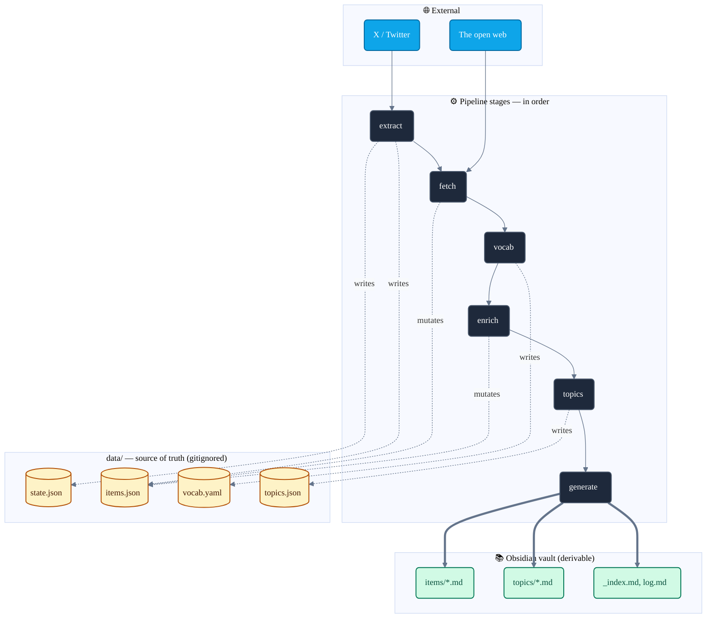

# ARCHITECTURE.md

> **Reference doc.** The README onboards you (what XBrain is, how to install and run it). This document explains **how the system is shaped and why** — the pipeline stages, the artifacts they produce, the rubrics and validator, the executor model, and the invariants that hold it all together.
>
> Read this when you want to extend XBrain, debug a stage, or understand why a piece of state lives where it does.

---

## Table of contents

- [The shape of the system](#the-shape-of-the-system)
- [The pipeline](#the-pipeline)
  - [extract](#extract)
  - [fetch](#fetch)
  - [vocab](#vocab)
  - [enrich](#enrich)
  - [topics](#topics)
  - [generate](#generate)
- [Artifacts: the data layer](#artifacts-the-data-layer)
- [Rubrics: the prompt layer](#rubrics-the-prompt-layer)
- [Validator and guardrails](#validator-and-guardrails)
- [Executors: where the LLM call actually happens](#executors-where-the-llm-call-actually-happens)
- [Invariants](#invariants)
- [Where things live](#where-things-live)

---

## The shape of the system

XBrain takes your X bookmarks and your own posts and turns them into an Obsidian wiki. The wiki has three layers:

- **Items** — one note per saved post, with original text, links, fetched articles, topics and a Spanish summary.
- **Topic pages** — one note per topic (~30-45 topics for the whole corpus), with a synthesized overview of what that topic looks like *across your saves*, plus links to every post filed under it.
- **Index** — the map into both.

The system is built around one principle: **the JSON store is the source of truth, and the wiki is a rendering of it.** Every transformation reads structured data, writes structured data, and never depends on the markdown output. You can delete the entire wiki and regenerate it bit-for-bit from `data/` — that is a property the architecture protects on purpose.



The diagram shows **what each stage writes**: solid arrows for the pipeline
order, dashed arrows for the writes/mutations into `data/`, thick arrows for
the final render into the vault. **Reads are intentionally omitted** — they
fan out from `items.json` to almost every later stage; see the Step-by-step
below for the per-stage read/write detail.

Each stage is a separate command (`xbrain extract`, `xbrain fetch`, …). You can run them individually or chain them. The pipeline is intentionally idempotent at every step: re-running a stage on a corpus that already has its outputs is a cheap no-op except where you explicitly ask for regeneration.

---

## The pipeline

### Step by step

A full run, in the order the stages execute. The diagram above is the *architectural* view (what reads what); the one below is the *temporal* view (what happens, in sequence, when you start from an empty install and end with a wiki).

> **Start:** fresh install — empty `data/`, fresh Obsidian vault.

<table>
<tr><td>

#### 0 · `xbrain login` — setup

One-time browser auth. Opens X in a Playwright window; you log in manually.

- **Reads:** *(nothing)*
- **Writes:** `auth/storage_state.json`

</td></tr>
<tr><td>

#### 1 · `xbrain extract` — mechanical

Drives the logged-in browser, intercepts X's internal GraphQL, pulls
bookmarks + own tweets. Slow scrolls with random 5-12s pauses (anti-ban).

- **Reads:** `state.json` (cursors per source)
- **Writes:** `items.json` (merged by id) + `state.json` (updated cursors)
- **Incremental** — stops at the last known id per source.

</td></tr>
<tr><td>

#### 2 · `xbrain fetch` — mechanical

For each item with links, downloads the article body (HTTP + Trafilatura,
optional Firecrawl fallback, Playwright for x.com).

- **Reads:** `items.json`
- **Writes:** `items.json` — each item's `content` + `content_source[]`
- **Cached** — already-fetched items are skipped (use `--force` to refetch).
- **Transient retries** — items whose only previous failures were `timeout` / `dns_error` are re-fetched on the next run without `--force`. Terminal failures (`not_found`, `paywall`, `forbidden`, `js_required`, `empty_content`) stay skipped until `--force`.
- **Failures recorded as evidence** — `http_status` + `failure_reason`, never silently dropped.
- **Snapshots `data/` before `--force`** — recovery path if a forced refetch makes things worse.

</td></tr>
<tr><td>

#### 3 · `xbrain vocab` — LLM

Reads the whole corpus, induces a closed taxonomy of ~30-45 topics. Map
step proposes candidates per chunk; reduce step consolidates to `target_count`.

- **Reads:** `items.json`
- **Writes:** `vocab.yaml` (slug + description list)
- **Always includes a `misc` topic** for posts with no thematic core.
- **Snapshots `data/` before `--regenerate`** — a vocab rewrite forces re-enrichment, so it is the most destructive op.

</td></tr>
<tr><td>

#### 4 · `xbrain enrich` — LLM

Per item: writes a summary, chooses `primary_topic` + 0-3 secondaries from
the vocab.

- **Reads:** `items.json` + `vocab.yaml`
- **Writes:** `items.json` — each item's `enriched` field (`Enrichment` record)
- **Only LLM judgment** — no identifiers, no wikilinks (validator rejects them).
- **Skips already-enriched** — run `vocab --regenerate` (it clears enrichments) after vocab or rubric changes.

</td></tr>
<tr><td>

#### 5 · `xbrain topics` — LLM

Synthesizes one topic page per slug: 1-3 paragraph overview + up to 15
notes.

- **Reads:** `items.json` + `vocab.yaml` + `topics.json` (to detect stale pages)
- **Writes:** `topics.json` — one `TopicPage` per slug
- **Plain prose only** — the post lists are added later by `generate`, not the LLM.
- **Derived staleness** — a page is stale when `live_count > post_count_at_synth + threshold`.
- **Snapshots `data/` before `--resynth`** — re-synthesising every stale overview overwrites `topics.json` in place.

</td></tr>
<tr><td>

#### 6 · `xbrain generate` — mechanical

Renders every item note, topic page and the index into the vault.

- **Reads:** `items.json` + `topics.json` + `vocab.yaml`
- **Writes:** `vault/learnings/x-knowledge/{items,topics,_index.md,log.md}`
- **Deterministic** — no LLM, no network.
- **Your tail is preserved** — content below the `xbrain:generated:end` marker is left untouched.

</td></tr>
</table>

> **Done:** wiki ready in Obsidian. Open `_index.md` to start.

Three extra ops sit outside the main loop:

- **`xbrain import-archive <zip>`** — imports your X data archive (the official ZIP export from `x.com/settings/your_archive`) to backfill historical own-tweets beyond what `extract` can reach via the live browser. It shares the same media parsing as `extract` (via `extract/video.py`), so archived videos capture the playable stream + poster thumbnail + bitrate/duration too.
- **`xbrain sync`** — convenience: runs `extract → fetch → generate` back-to-back. No enrichment (which is the expensive LLM step you run on your own cadence).
- **`xbrain status`** — read-only diagnostics: item counts, how many have links / content / enrichment, last extraction time per source.

### Per-stage detail

The numbered stages above are summarised; the sections below cover each one in depth.

### extract

**What it does.** Drives a real browser (Playwright + your logged-in session) to pull your bookmarks and own posts from X. Listens to X's internal GraphQL traffic — the same calls the X web app makes to itself — and parses the responses. No public API, no scraping of rendered HTML, no API key.

**Reads.** `data/state.json` (the last-seen item id per source) — so re-running is incremental.

**Writes.** `data/items.json` (new `Item` records, merged with existing ones by `id`); `data/state.json` (updated cursors).

**Media capture.** Photo entries become pending URLs. Video and animated-GIF entries capture the **playable stream** — the highest-bitrate progressive `video/mp4` from `video_info.variants`, falling back to the HLS (`.m3u8`) manifest when no mp4 is offered — plus the poster image as `thumbnail_url` and the chosen `bitrate` + `duration_millis` (so a later download can estimate size without fetching bytes). The video URL is the stream, never the poster. The same media parser (`extract/video.py`) is shared by the archive importer, so `import-archive` captures video identically.

**Article-entity detection (#39 PR 2).** A long-form **Article** is an *entity* on the tweet result, not a text URL in `entities.urls`, so a **directly-bookmarked** Article was previously never captured. `graphql._extract_article_link` detects it — anchoring on the stable keys `article` → `article_results` → `result` → `rest_id` via the null-safe `_dig` walk (a shape drift degrades to *no link*, never a wrong one) — and synthesizes the canonical `https://x.com/i/article/<rest_id>` link onto the item (deduped against `entities.urls`). That URL is shaped so the **existing** `fetch` x.com path (`is_x_url` + `_classify_x_url` → the rendered-article branch) fires for it with no routing change. Extract only *synthesizes the link*: fetching the ordered article body (fetch → PR 3), downloading its inline images (media → PR 4) and rendering it as a blogpost (generate → PR 5) complete the chain end-to-end. *Fixture note:* the Article key path is pinned against a **constructed** fixture (`tests/test_graphql.py`), not a recorded live payload — validate it against a real bookmarked-Article GraphQL response before production reliance. X may **also** surface an Article via a `card`/`unified_card` variant; PR 2 does not parse that path (it degrades safely to *no link*) — a conscious deferral folded into the same real-payload validation step.

**Why it is shaped like this.** The extractor anchors to **operation names** (`Bookmarks`, `UserTweets`) rather than query identifiers, because X rotates the identifiers constantly and anything that depends on them breaks within weeks. It scrolls slowly with randomized 5-12s pauses — fast scripts get rate-limited or banned.

### fetch

**What it does.** For every item with external links, downloads the full article text behind the URL so a saved link becomes a saved article. Handles four kinds of content sources:

- `external_article` — a regular web page, fetched via HTTP + Trafilatura extraction, optional Firecrawl fallback.
- `x_article` — an `x.com/i/article/...` long-form post. `fetch` first tries the **structured path** (#39 PR 3): it intercepts the article-content GraphQL response (the same `page.on("response", …)` interception `_fetch_tweet` uses for `TweetDetail`, matching a GraphQL URL whose op name contains `article`) and parses its Draft.js `content_state` (`extract/article.py`, a pure `parse_article_content_state`) into an **ordered** `blocks` body — `ArticleTextBlock` text runs and `ArticleImageBlock` inline images (each a `MediaPhotoPending`, downloaded later by [`media`](#media)) IN DOCUMENT ORDER. The flattened `text` is set to the exact `"".join` of the text-run texts (data-model invariant #12), so `enrich`/`topics` consume it unchanged. **Fallback:** on any interception/parse miss the fetch degrades to the retained `trafilatura.extract(html)` text-only path (`blocks == []`) — never a crash, never a partial/wrong block set masquerading as complete; a genuinely empty article still records the `empty_content` failure. The parser anchors only on stable Draft.js key names and the article op name is UNCONFIRMED against a live payload — validate before production reliance (RFC #39 open-Q #4). The media download of those images is #39 PR 4 ([media](#media)); the blogpost render — the ordered text+image note — is #39 PR 5 ([generate](#generate)).
- `thread` — a `x.com/<user>/status/...` link, fetched by reusing the GraphQL `TweetDetail` interception proven in the extractor.
- `quoted_tweet` — embedded from the parent post's content.

A fifth `ContentKind`, `x_video`, exists on the same `ContentSource` union but is **not** produced by `fetch` — it is manufactured by [`digest-video`](#digest-video) from a video transcript. `fetch` never emits or consumes it.

**Reads.** `data/items.json`.

**Writes.** `data/items.json` — each `Item.content` is populated with one or more `ContentSource` records.

**On failure, the failure is recorded as evidence, not silently dropped.** Every `ContentSource` carries `ok`, `http_status`, `failure_reason` (one of: `not_found`, `forbidden`, `paywall`, `timeout`, `dns_error`, `js_required`, `empty_content`) and `attempts`. The wiki later renders `⚠ Enlace roto` for failed sources rather than pretending they were never there.

**Caching.** `fetch` is cached per item id — it does not re-fetch items that already have a `ContentSource` (success or recorded failure). Use `--force` to re-fetch everything. (Selective retry of transient failures is a planned improvement — issue #19.)

**`content.fetched_at` = last *material* change, not last attempt.** When `fetch_item` re-fetches an item, it stamps a fresh `fetched_at` only if the new source set differs materially from the existing one. The material fingerprint (`_source_signature`) is the whole source model minus fetch bookkeeping (`attempts`/`error`) — a model-derived deny-list, so every content-bearing field (`title`, `text`, `failure_reason`, `http_status`, the `x_video` transcript/`frames`, the `x_article` `blocks`, …) is compared automatically and a future field is not silently dropped. This keeps the [`enrich` re-enrichment trigger](#enrich) honest for a persistently-failing transient link that `_should_refetch` retries every run — see the invariant note there. **The x.com-link path applies the same rule (#39 PR 3):** `fetch_x._attach_x_sources` reuses `_sources_materially_equal` to bump `fetched_at` only when the replaced `x_article` source set changed materially — so an Article that gains a richer structured `blocks` body re-triggers enrich, while an idempotent re-fetch does not churn.

### media

**What it does.** Downloads X-post photos referenced in `Item.media` **and the inline images of an X long-form Article** (#39 PR4) and persists the bytes locally so the wiki can render them inline. Photos only; videos remain in `video_pending` for a future iteration (their playable stream URL + poster thumbnail + bitrate/duration were already captured at extract/import time). Walks every `MediaPhotoPending` entry, downloads from `pbs.twimg.com` with a cascading size fallback (`name=orig` → `name=large` → `name=medium`), validates the bytes with Pillow, and atomically writes the file under `data/media/<item-id>/<index>.<ext>`.

**Inline Article images (#39 PR4).** Beyond `Item.media`, the same walk advances the inline images of an `x_article` `ContentSourceSuccess.blocks` — each `ArticleImageBlock.media` (a `MediaPhotoPending` emitted by `fetch`) living **outside** `item.media`. `_iter_eligible_article_images` mirrors the photo iterator (`_iter_eligible_attempts`): it applies the **same** `_is_eligible` cascade and yields `(item_id, block, image_index, entry)`; the orchestrator downloads each through the **same** `_download_one` engine (size cascade, Pillow validation, throttle, failure classification) and swaps the result **in place** onto `block.media` — `MediaPhotoPending` → `MediaPhotoDownloaded`/`MediaPhotoFailed`. The model is not `validate_assignment`, so the swap does not re-run `_text_matches_blocks` (images do not contribute to `text`, so the invariant is untouched). Article images write to a **namespaced** path `data/media/<item-id>/article/<n>.<ext>` (`_local_path(..., subdir="article")`) so they never collide with the item's own `<id>/<n>` photos — the `<n>` is a per-item running index over the image blocks (stable across download state, so an already-downloaded block 0 never shifts a pending block 1 down to `article/0`). Article-image bytes are the `MediaEntry` photo-state union, so the download engine, the `_reject_local_path_traversal`/`_require_utc_aware` validators, and (future) `describe` apply with **no new plumbing**; the blogpost **render** — mirroring these bytes into the vault and embedding them inline in the note — is `generate`'s job (#39 PR5, [generate](#generate)), not `media`'s.

**`--force` re-download semantics (#39 PR4, documented decision).** `xbrain fetch --force` **rebuilds** an `x_article` source from scratch, discarding a prior download's `MediaPhotoDownloaded` and re-emitting fresh `MediaPhotoPending` image blocks. Article-image state is therefore **not carried forward** across a forced re-fetch — the next `xbrain media` run re-downloads the images. This is the **conscious, consistent choice** (mirroring `fetch --force` = "redo from scratch" and the photo `--force` = "re-download" semantics), not an accident: the article's image set can itself change on a rebuild, so matching old bytes to new blocks would be fragile special-casing that contradicts the rebuild contract. `xbrain media --force` (without a re-fetch) likewise re-downloads an already-`MediaPhotoDownloaded` article image, exactly like a photo.

**Reads.** `data/items.json` (the URLs to download).

**Writes.** `data/items.json` (each photo entry → `MediaPhotoDownloaded`/`MediaPhotoFailed`; each `x_article` `ArticleImageBlock.media` likewise, swapped in place) and `data/media/<item-id>/<index>.<ext>` (photo bytes) + `data/media/<item-id>/article/<n>.<ext>` (article-image bytes).

**State machine.** Each `xbrain media` run advances eligible photo **and article-image** entries:
- `Pending` → `Downloaded` (bytes on disk, dimensions + size recorded).
- `Pending` → `Failed(reason)` (no bytes; reason categorised).

`Failed(transient)` is not a terminal state — the next run auto-retries it. A subsequent run re-attempts `Failed` entries whose reason is in `_TRANSIENT_MEDIA_FAILURES` (`http_5xx`, `timeout`, `unknown_error`) — same retry contract as `fetch`. Permanent failures (`http_4xx`, `format_error`) only retry with `--force`. Already-downloaded photos/images are skipped unless `--force`.

**Observability + total-failure guard.** `MediaReport` carries dedicated `article_images_{attempted,downloaded,failed_permanent,failed_transient,skipped}` counters (already-downloaded article images bump the **dedicated** `article_images_skipped` — kept distinct from the photo skip counter so the two never contaminate each other; every failure lands in the shared `per_item_failures` list + a `logger.warning`), and the `SUMMARY` line surfaces `article_downloaded`/`article_failed_*`/`article_skipped` so article activity is **never** folded silently into the photo counts. The "everything failed → `RuntimeError`" short-circuit keys on the **combined** (photos + article images) attempted-vs-downloaded totals: a run that downloads 0 photos but N article images (or vice-versa) is a partial success, not a total failure. `--limit` is a **combined** per-run budget threaded into `_iter_eligible_article_images` exactly as into the photo generator `_iter_eligible_attempts` — the budget is checked at the top of each iteration, so once it is spent the walk stops **and stops counting skips** (no scanning-past a spent budget and miscounting images it never reached); photos consume it first, article images take whatever slots remain.

**Storage layout.** Photo bytes live under `data/media/<item-id>/<index>.<ext>` and article-image bytes under `data/media/<item-id>/article/<n>.<ext>` (both gitignored). The atomic write uses a sibling `<n>.<ext>.part` tmp file; orphan `.part` files left by SIGKILL/OOM are swept on the next `download_all` entry. The vault mirror at `<output_subdir>/_media/<item-id>/<index>.<ext>` is written by `generate`, not by `media` — so the photo bytes stay in sync with whichever subset of items `--since`/`--until` is regenerating. The article-image bytes mirror the same way: `generate._mirror_item_article_images` copies each downloaded `x_article` inline image into `<output_subdir>/_media/<item-id>/article/<n>.<ext>` at render time and the blogpost renderer embeds it inline in the note (#39 PR 5, [generate](#generate)).

**Ctrl-C safety.** The orchestrator calls a per-image `on_progress` callback (fired after every photo **and** every article-image transition) that writes `items.json` atomically between downloads. A Ctrl-C mid-batch leaves a coherent store and the next run picks up where it left off.

**Snapshot trigger.** `xbrain media` always snapshots `data/` first (label `pre-media`), mirroring the destructive-op recovery boundary — **inline Article images add no new command and no new snapshot boundary; they ride this existing one** (#39 PR4). The snapshot covers `items.json` / `state.json` / `vocab.yaml` / `topics.json` only — the binary photo/article-image bytes under `data/media/` are NOT included; re-downloading via `xbrain media` is the recovery path.

### describe

**What it does.** Sends every downloaded photo to a Claude vision model, asks for a 1-3 sentence prose description plus a `is_decorative` classification, and persists the prose on the entry. The entry transitions from `MediaPhotoDownloaded` to `MediaPhotoDescribed` (a new variant on the `MediaEntry` union). Decorative photos (avatars, reaction memes, abstract backgrounds) are classified as such with an empty description so downstream prompts can filter them out without re-classifying.

**Reads.** `data/items.json` + `data/media/<id>/<n>.<ext>` (the bytes the downloader wrote).

**Writes.** `data/items.json` — each described photo entry carries `is_decorative` + `description` + `description_lang` + `description_version` + `described_at`. No new on-disk binary state; the bytes from the prior `MediaPhotoDownloaded` are inherited verbatim.

**State machine.** Each `xbrain describe` run advances eligible photo entries:
- `Downloaded` → `Described` (description on the entry, bytes unchanged).
- `Described` (stale version OR stale language) → `Described` (current version + current language), automatically.
- `Described` (current version + current language) → no-op (skipped) unless `--force`.

Eligibility ignores `Pending` / `Failed` / `VideoPending`: describe only runs on photos with bytes on disk. The description-version tag is the rubric-evolution lever: bumping `[describe].version` in `config.toml` invalidates persisted entries so the next run re-describes them without `--force`. The `description_lang` check is the mixed-vault guard: switching `[paths].output_language` from Spanish → English (or back) marks every previously-described entry stale so the enrich prompt never splices the wrong-language prose into a new vault.

**Batching.** Default batch size is 5 images per API call (the spec's quality / cost sweet spot — ~12-15 % token saving vs per-image, modest added complexity). Override with `--batch-size N`.

**Refusals.** Vision refusals (faces, NSFW) are NOT a hard failure: the entry is persisted as decorative with an empty description, and the run continues. The same `is_decorative` flag downstream consumers already use for "no topic signal" handles the refusal uniformly.

**Failure isolation.** Per-batch error isolation: one failing API call does not abort the run. A total-failure run (every batch errored) raises `RuntimeError` so the CLI surfaces non-zero exit. The orchestrator's `on_progress` callback writes `items.json` between batches so Ctrl-C mid-run leaves the store coherent — same recovery contract as `media`.

**Snapshot trigger.** `xbrain describe` always snapshots `data/` first (label `pre-describe`), mirroring `media`'s recovery boundary. A botched run — wrong model, runaway prompt — can be undone with `xbrain snapshot restore`.

**Feeds the LLM stages.** Once described, the prose is consumed automatically — through **both** the API and the worksheet (`claude-code` / `manual`) tracks, so the descriptions reach the LLM input regardless of which executor runs the stage ([#34](https://github.com/VGonPa/xbrain/issues/34)):
- `xbrain enrich`: the `api` executor (`executors/api.py:_user_prompt`) splices an `Images in this post:` section between the post body and the links/article block when the item has content-bearing described photos; the worksheet export (`worksheet.py`, an `image_descriptions` field per item) carries the same non-decorative selection (reusing `executors/api._content_image_descriptions`, the same seam) so the claude-code enrich track sees identical visual signal. Decoratives are filtered.
- `xbrain topics`: the `api` track (`topic_synth.py:_user_prompt`) appends the flat list of content-bearing image descriptions across every post in a topic, after the per-post summaries; the worksheet export (`topic_synth.py:export_topic_worksheet`, an `image_descriptions` field per topic) carries the same list from the `TopicInput` already computed by `build_topic_inputs`, and the claude-code consumers surface it — the `resynth-topic-overviews` workflow prints an `Images across …` block in each per-topic extraction and the `enriching-x-knowledge` skill lists the field for a hand-run session.

This is how a tweet that is mostly a screenshot of a paper becomes searchable by what the screenshot was actually about — on either track.

**Propagating onto already-enriched items.** This is *wiring*: the descriptions flow whenever `enrich` / `topics` next run for an item. Items already enriched before the describe pass are skipped by the normal idempotency guard, so a one-time forced re-run (real LLM cost, run deliberately) is what back-fills them: `xbrain vocab --regenerate` (clears enrichments) then `xbrain enrich` re-enriches every item with its image descriptions, and `xbrain topics --resynth` re-synthesizes the overviews with the image (and video-transcript) evidence.

### refresh-media

**Why it exists.** `extract` is incremental — `extract_source` stops at the first known id, and `store.merge_items` "adds, never overwrites". The playable-video capture (`extract/video.py`: highest-bitrate mp4 / HLS fallback + poster + bitrate + duration) only runs at *capture* time, so every video already in the store before that capability landed is **poster-era**: its `MediaVideoPending.url` is the poster image and `bitrate` / `duration_millis` are unset. A normal `extract` will never revisit those items, so they would stay poster-era forever. `refresh-media` is the backfill that fixes them.

**What it does.** Re-captures the **full** X history (logged in) and rewrites the VIDEO media on items already in the store, in place. For each re-seen item, it scrolls with an **empty `known_ids` set** so `extract_source` does not stop early and the whole timeline is walked, then hands the freshly-parsed items to the pure `refresh.refresh_video_media`: each existing `MediaVideoPending` is swapped positionally for the corresponding fresh video entry (playable URL + bitrate + duration), while every photo entry (`Pending` / `Downloaded` / `Failed` / `Described`) and every enrichment / description / fetch field is left **exactly** as-is. Fresh items not already in the store are skipped — this is a backfill of known items, not a new extraction. The `state.json` cursors are deliberately **not** advanced: this is a backfill, not an incremental extract.

**Upgrade-only, never degrade.** This is the repo's first *overwriting* store path, so the swap is guarded. `build_video_media` falls back to the poster image (`url == thumbnail_url`, no metadata) when X serves no usable `video_info.variants` — a drift symptom. `refresh.refresh_video_media` replaces a stored video **only** when the fresh entry is a real stream (`url != thumbnail_url`); a poster-fallback fresh entry keeps the existing record and is not counted as refreshed. Without this, a second run during a drift window would silently downgrade an already-good playable URL back to a poster.

**Empty-capture guard.** `extract_source` returns `[]` (it does **not** raise) when the session is logged in but the GraphQL parser drifts or the scroll is interrupted. Re-seeing **0** known items against a non-empty store is therefore a likely-broken run, not success: `refresh-media` warns loudly and aborts **non-zero without saving** (the merge was a no-op, so `items.json` is byte-identical and the pre-snapshot already fired). `--force` downgrades this to a warning and proceeds. An empty store (fresh project) and any non-zero capture (monotonic, re-runnable progress) save normally — the guard is specifically `items_seen == 0` on a non-empty store.

**Reads.** `data/items.json` + live X (via the logged-in Playwright session).

**Writes.** `data/items.json` — video entries only. Photos, content, enrichment and descriptions are untouched. `state.json` is not touched.

**Size estimate, no download.** `refresh-media` does NOT download video (that is the job of `download-videos`, below). It prints a pre-flight estimate from `refresh.estimate_download_size`: `Σ bitrate × duration_millis / 1000 / 8` over every stored video, treating `bitrate ∈ {None, 0}` (animated GIFs always report `0`) or a missing duration as *unknown* — excluded from the byte sum and counted separately, never as 0 bytes.

**Snapshot trigger.** `refresh-media` always snapshots `data/` first (label `pre-refresh-media`) — it rewrites `items.json` in place, so it is destructive by the same definition as `vocab --regenerate`. The snapshot is taken *before* the (slow, many-minutes) capture; a snapshot failure aborts the command before any X traffic.

**Reporting.** The end-of-run summary prints the `RefreshReport` counts — known items re-seen, items refreshed, videos updated, and video items NOT re-seen (still poster-era, i.e. how much is left to backfill) — followed by the size estimate (`~X.X GB across N videos; M with unknown size`).

### download-videos

**What it does.** The file-download counterpart to `media` (photos): it downloads the actual mp4 bytes for the playable videos `refresh-media` backfilled, and embeds them in the notes. Lives in `video_media.py` (a sibling of `media.py`), which **reuses** `media.py`'s shared download primitives — the retry classification (`_classify_status` / `_TRANSIENT_MEDIA_FAILURES`), the browser User-Agent + per-request throttle, the atomic `tmp + rename` write, the `.part`-orphan sweep, and the error formatter — rather than re-implementing them, so the photo and video downloaders stay consistent and the photo path is untouched. Videos need no Pillow decode: the orchestrator writes the bytes and records `bytes_size`.

**Scope — mp4 only (this stage).** `download_videos` walks every `MediaVideoPending` and classifies its URL (`_video_class`): a **real mp4 stream** (host `video.twimg.com`, or an `.mp4` path before the query — and `url != thumbnail_url`) is downloaded; an **HLS `.m3u8` manifest** is *skipped and counted* — muxing HLS into a playable file needs ffmpeg, which is a separate follow-up (a code comment + a `logger.info` mark the deferral); a **poster-era** entry (`url == thumbnail_url`, or a legacy record whose URL is neither mp4 nor HLS — i.e. not yet backfilled) is skipped silently and counted (run `refresh-media` first). The `.m3u8` check is ordered *before* the host check, because HLS is also served from `video.twimg.com`.

**State machine.** Each downloadable mp4 advances `MediaVideoPending → MediaVideoDownloaded` (bytes under `data/media/<id>/<n>.mp4`) or `MediaVideoFailed` (categorised). The transient/permanent retry contract mirrors `media`: `http_5xx` / `timeout` / `unknown_error` auto-retry on the next run; `http_4xx` is permanent (only retried with `--force`). Already-downloaded videos are skipped unless `--force`; the run is idempotent and a Ctrl-C between videos leaves `items.json` coherent (the `on_progress` callback persists between transitions). A 2xx with an empty body is bucketed as a transient `unknown_error` rather than persisted as a zero-byte "download".

**Content validation.** A 200 status is not trust — a CDN/captcha/auth-wall interstitial or an edge-cache HTML/JSON error page can arrive as 200 with a non-video body. Mirroring the photo path's Pillow guard, `download_videos` validates the bytes before writing: it accepts a `video/*` `Content-Type` **or** an mp4 container signature (the `ftyp` box at offset 4), but rejects a body that begins with HTML/JSON markup (`<` / `{` / `[`) even under a `video/*` header (the bytes win over a misconfigured header). A non-video body returns `MediaVideoFailed` **without writing the file**, bucketed **transient** (`unknown_error`): these interstitials are usually an X rate-limit JSON (`code 88`) or a session-expiry auth-wall, which clear on their own, so the next run auto-retries (no `--force` needed). This stops a corrupt `.mp4` from being persisted and then hidden forever by idempotency.

**Size gate + `--max-size`.** Before downloading, `plan_video_downloads` replays the exact eligibility walk (no network, no write) and `format_size_gate` prints e.g. `About to download ~1.2 GB across 8 videos (3 HLS skipped, 1 already downloaded).` (`Σ bitrate × duration / 1000 / 8` over the eligible mp4 set only; eligible mp4s with no bitrate/duration are surfaced as `+N of unknown size`, never summed as 0). The run requires an interactive `typer.confirm` unless `--yes` is passed — this is the "warning of X GB" before a multi-GB fetch. `--max-size` (parsed by `parse_size_to_bytes`: `500MB` / `2GB` decimal units, a bare number = MB) caps the **estimated** per-video size: an over-cap mp4 is skipped and counted (`skipped_too_large`), and — because an unknown-size video can't be proven to fit — a no-bitrate/duration mp4 is also skipped under the cap (`skipped_size_unknown`); without `--max-size` those unknown-size videos download normally. The gate estimate and "N videos / ~X GB" line reflect only the under-cap to-download set.

**Reads.** `data/items.json` (the playable URLs to download).

**Writes.** `data/items.json` (each downloaded mp4 transitions to `MediaVideoDownloaded` / `MediaVideoFailed`) and `data/media/<id>/<n>.mp4` (the bytes). The vault mirror at `<output_subdir>/_media/<id>/<n>.mp4` is written by `generate`, not here — exactly like photos.

**Memory + mid-download drops.** Each body is buffered fully (`response.content`) — streaming is deferred to the large-file/ffmpeg follow-up, with the `--max-size` cap bounding the risk in the meantime. The body read is done INSIDE the same network-error guard as `session.get`, because over a multi-GB batch the common failure is a connection drop *at the body read* (`ChunkedEncodingError` / `ConnectionError`), not at the request — bucketing it transient there is what lets the batch continue instead of aborting on a raw traceback. A `MemoryError` buffering a too-large body is caught locally too (recorded as a transient failure with a clear message), so the run carries on rather than dying; it is deliberately NOT in the CLI's global operator-error set (a global catch would swallow OOM stacks for every command).

**Snapshot trigger.** `download-videos` snapshots `data/` first (label `pre-download-videos`), the same recovery boundary as `media`. The snapshot is taken *after* the size-gate confirmation (a declined run never writes, so it leaves no stray snapshot) but always before the first byte lands; a snapshot failure propagates and aborts.

**Scope flags.** `--source bookmarks|tweets|all` scopes the run to bookmark / own-tweet items; `--items <a,b,c>` and `--limit N` narrow it further; `--max-size <size>` caps per-video estimated size; `--force` re-downloads and retries permanent failures; `--yes` skips the confirmation. The end-of-run summary (and the `SUMMARY:` stderr line — emitted even on a skip-only run, for monitor parity with `media`) prints downloaded / failed / skipped-HLS / skipped-poster-era / already-downloaded / skipped-too-large / skipped-size-unknown.

### list-videos / fetch-video

**Why they exist.** `download-videos` persists the mp4 into the store to embed it inline; that is the wrong shape when the goal is to *process* a video (e.g. transcribe a 72-minute talk into a digest) — the corpus is ~140 GB and must not live on disk. `list-videos` + `fetch-video` are the **agent-driven, ephemeral** read/fetch surface: xbrain stays **mechanical** (list + fetch), and the heavy ML (ASR/vision) is **external / agent-side**, never bundled into the CLI (no bundled MLX/CoreML/ML *library* in core — ffmpeg and the vision model are shelled out as external subprocesses, required only for `--frames`). They are the selection/fetch dependency of the long-form video digest module ([#44](https://github.com/VGonPa/xbrain/issues/44)).

**`list-videos` — read-only catalog.** `video_select.list_video_entries(store, *, topic, status, max_size_bytes, source, limit) -> list[VideoRow]` derives one `VideoRow` (`id, url, state, topic, size_bytes, mp4_url, text`) per video media entry. `state` is `downloaded` / `failed` from the variant, else `pending` for a real-mp4-or-HLS pending, else `poster-era` for an un-backfilled pending (`url == thumbnail_url`); `mp4_url` is the resolved stream URL, `None` for poster-era. `size_bytes` is the exact on-disk size for a downloaded entry, else the shared `_estimated_bytes` (`bitrate × duration`) estimate, else `None`. The mp4/HLS/poster discriminator (`_video_class`) and the estimator are **reused** from `video_media`, so the catalog agrees with the downloader on "what is a real mp4" and "how big is it". Filters compose; with `--max-size`, unknown-size rows are excluded (same conservative rule as `download-videos`, so list and fetch select the same under-cap set). **Reads** `data/items.json`; **writes nothing**, takes no snapshot. `--json` emits the stable machine array an agent parses to pick videos.

**`fetch-video` — ephemeral fetch.** `video_fetch.fetch_videos(store, ids, dest_dir, *, max_size_bytes, limit) -> FetchReport` downloads each selected item's first real mp4 to `<dest_dir>/<id>.mp4`, de-duplicating repeated ids. The GET body is validated and classified by the **reused** `video_media._read_validated_body` (the `video/*` / `ftyp` container check + HTML/JSON interstitial rejection) and `media._classify_status`, and written by the shared atomic `media._write_bytes` (with the `_sweep_part_orphans` sweep of the dest dir); HLS and poster-era items are skipped and counted, and a failed download is recorded (never fatal — the batch continues). `--ids` and/or `--topic` (resolved via `list_video_entries`, scoped by `--source`) select; `--max-size` / `--limit` bound the run. **Reads** `data/items.json`; **writes only** `<--to>/<id>.mp4`.

**Deliberately non-persisting / non-snapshotting.** `fetch-video` NEVER mutates `items.json`, NEVER takes a snapshot, and NEVER writes to `data/media/` — there is no `MediaVideoPending → MediaVideoDownloaded` transition, and a test asserts `items.json` is byte-identical before/after a fetch. It is intentionally **absent** from the destructive auto-snapshot set (Invariant 8): with nothing destructive to protect, a snapshot would be noise. This mirrors the worksheet hand-off — the mechanical CLI produces bytes for an external tool and stays out of the store's write path.

### digest-video

**Why it exists.** A bookmarked 72-minute talk is the worst-case "graveyard" item — high value, highest re-entry cost, never reopened. `digest-video` turns it into text: it **manufactures a transcript** and attaches it to the item as a content source, so the once-unwatchable video flows through the *existing* `enrich → topics → generate` pipeline and becomes a topic-linked note ([#44](https://github.com/VGonPa/xbrain/issues/44)). xbrain stays **mechanical** — the heavy ASR is external.

**The stage.** `digest.digest_videos(store, item_ids, *, force, fetch_fn, transcribe_fn) -> DigestReport` orchestrates, per selected video: **ephemeral fetch** (reusing PR1's `video_fetch.fetch_videos` into a `TemporaryDirectory`) → **external transcribe** (`transcribe.transcribe_media`) → **attach** (`digest.attach_transcript`) → **discard** the bytes. Selection is `--ids` / `--topic` / `--all-pending` (resolved via `list_video_entries`), scoped by `--source`, bounded by `--limit`. **Reads + writes** `data/items.json`.

**External transcriber, no ML in core (locked #44 architecture).** `transcribe.py` shells out to the operator-configured `[transcribe].command` (default `parakeet-mlx`; whisper / faster-whisper is the portable fallback) as a **subprocess**: `<command> [--model M] --output-format json --output-dir <TMPDIR> <mediapath>`. The real `parakeet-mlx` writes its transcript to a **file** at `<TMPDIR>/<stem>.json` (it does NOT emit JSON on stdout and does NOT accept `--language`), so `transcribe.py` reads the produced file (stdout is a fallback for a wrapper) and parses it into a `Transcript` (`text`, `segments` of `start/end/text`, `language`, `has_speech`, and an optional `title` passed through to the `x_video` source when the ASR surfaces one). It imports **no** MLX/CoreML/torch/whisper library — a test asserts it. The command is `shlex`-split (a multi-token wrapper works) and run **without** a shell. A **missing / non-executable binary** raises a clear operator error (`TranscriberNotFound`, clean CLI exit-1), never a crash. **No-speech is a JSON signal, never an absence of output:** `{"text": ""}` / empty segments / `has_speech: false` → graceful no-speech, but exit-0-with-no-output raises `TranscriberFailed` (inferring silence there would silently lose the transcript).

**The `x_video` ContentKind.** The transcript is attached as a `ContentSourceSuccess(kind="x_video")` — the fifth `ContentKind`, additive to the union so existing `items.json` and every existing `ContentSource` variant load unchanged. `text` carries the transcript; the optional `has_speech` / `language` fields are the video markers (`None` on a non-video source), and the optional `frames` list carries the key-frame slides (empty on every non-`--frames` source — see the visual layer below). The optional `digest: str = ""` field carries the **long-form readable synthesis** of the transcript + frames written by [`video-digest`](#video-digest) — optional + additive (`""` = "no digest yet"), so every pre-digest `x_video` source (and every article source) loads unchanged. It sits on `Item.content.sources` exactly like an `external_article` body, so `generate`/`enrich` consume it via the existing machinery.

**Visual layer — content-type-aware key-frame slides (`--frames`, opt-in, PR4).** For a slide/screen/demo-heavy talk the visual carries as much as the audio; for an interview the scene frames are camera cuts = noise. So the layer is **content-aware** and **fully opt-in** (`--frames`, default off; a normal run never touches ffmpeg/vision and is byte-unchanged). When enabled, per fetched video `digest`:

- **Extracts key frames** with the **external** `ffmpeg` CLI (`video_frames.extract_key_frames`, a subprocess with `shlex`-split argv, no shell — the `transcribe.py` shape; `video_frames.py` imports **no** ML/vision lib, only Pillow for classic image processing, and a test asserts it). The ffmpeg `select` expression combines scene-change detection with a **periodic interval term** keyed on `prev_selected_t`, so a long **static tail** (e.g. a 30-min static Q&A after a slide deck) is still sampled — coverage spans the WHOLE video, guarding the "scene detection stops mid-video" gap in one pass with no duration probe. An over-`max_frames` result is subsampled **evenly** across the timeline (front + tail), never truncated to the first N (which would re-open the same gap).
- **Classifies** the frame set as `slides` vs `talking_head` (`video_frames.classify_visual`) from the fraction of frames with high **edge density** (text/sharp lines → high FIND_EDGES energy; smooth faces/bokeh → low). A talking-head video **skips** the visual layer and **logs the reason** (`"visual layer skipped (talking-head)"`) — never a silent drop, and no vision call is wasted.
- **Describes** each kept slide via the **external** vision model (`vision.describe_image`, a subprocess on `[vision].command`; mirrors `transcribe.py` — no bundled default, `VisionNotFound` on a missing/unconfigured binary aborts the run, exit-0-empty is a `VisionFailed` not a silent empty). The descriptions are recorded on the `x_video` source's `frames` list; the slide **images** are persisted under `data/media/<id>/frames/<n>.png` so `generate` mirrors them into the vault's `_media/` tree and embeds them exactly like downloaded photos. All non-kept frames are discarded (ephemeral, reclaimed by the enclosing `TemporaryDirectory`).

A per-video `FrameExtractionFailed` (bad mp4) or `VisionFailed` drops the visual layer for that video (logged) while the transcript still attaches — the audio digest is independent of the visual layer. A missing ffmpeg (`FrameExtractionToolNotFound`) or missing/unconfigured vision binary (`VisionNotFound`) is a global config error that aborts the run, exactly like a missing transcriber. A silent slide deck (no speech) still gets its slides — that is where a screen-only video carries its content.

**Dedup by video identity.** The full mp4 URL is unstable (`?tag=` + rotating signing/filename), so the dedup **`VideoKey`** is the stable id parsed from the URL *path* — `amplify_video/<id>` (or `ext_tw_video`/`tweet_video`), with a query-stripped `<netloc><path>` fallback for an unrecognised pattern. `digest.group_items_by_video` groups the selection by that key; each video is fetched + transcribed **once** and the resulting source is attached to **every** referencing item (`digest.attach_transcript` returns the count). N bookmarks of the same video → one transcript linked to all.

**No-speech is data, not failure.** Many X videos are silent / screen-only. A `has_speech=False` transcript (empty text) is attached as an `x_video` source with the marker — `generate` can render "silent video" and `enrich` can skip it — never a hard failure. A per-video malformed-output `TranscriberFailed` is recorded and the batch continues; only a missing binary aborts the run.

**Ephemeral, one video at a time.** Each video is fetched into a temp dir, transcribed, then its bytes are unlinked immediately; the whole `TemporaryDirectory` is removed even when transcription raises. Never more than one video on disk — the ~140 GB corpus never lands in the store.

**Snapshot trigger.** `digest-video` is destructive (it rewrites `items.json`), so it **auto-snapshots** `data/` (label `pre-digest-video`) before the store write — but only when it is about to write (a pure already-digested / no-fetchable-video run attaches nothing and takes no snapshot). A snapshot failure propagates and aborts before any change lands. Idempotent: an item already carrying an `x_video` source is skipped unless `--force` (which replaces the stale source in place).

### video-digest

**Why it exists.** `digest-video` attaches the raw transcript + slide-frame descriptions, but a wall of raw transcript is not a *readable* note. `video-digest` closes that gap: an LLM reads the transcript + frame descriptions and writes a **long-form readable digest** — "what it is · key points · why it matters" — persisted on the `x_video` source so `generate` can lead the note with it ([#44](https://github.com/VGonPa/xbrain/issues/44), PR [#78](https://github.com/VGonPa/xbrain/pull/78)). It is a **separate** stage, not folded into `digest-video`, so the mechanical transcript attach and the LLM synthesis stay independently runnable and snapshot-able.

**The stage.** Worksheet hand-off, mirroring `enrich` (`video_digest.py`): `export_video_digest_worksheet` writes `data/video-digest-worksheet.json` with every video pending a digest — an `x_video` source that carries digestible content (`items_pending_video_digest`) but an empty `digest` — plus the `rubric-video-digest.md` rubric. You fill the `judgments` array (a Claude Code session or by hand), then `xbrain video-digest --apply <file>` imports it (`import_video_digest_worksheet`) and `apply_video_digest_judgments` writes each `source.digest` back.

**Executor.** `--executor manual|claude-code`, defaulting to `[enrich].executor`. It has **no** config section of its own and (like [`verify`](#verify)) runs **only** the worksheet tracks, never `api`.

**Reads + writes.** `data/items.json` (each `x_video` source's `digest`). The **apply** branch is destructive (it mutates the store) so it **auto-snapshots** (label `pre-video-digest-apply`); the export branch only writes the worksheet JSON and takes no snapshot.

### vocab

**What it does.** Induces a closed taxonomy of ~30-45 topics from the whole corpus. Map step: chunks the corpus, asks an LLM to propose candidate topics per chunk. Reduce step: asks the LLM to consolidate the union of candidates down to `vocab.target_count` topics. Always includes a `misc` topic for posts with no thematic core.

**Reads.** `data/items.json`.

**Writes.** `data/vocab.yaml` — a list of `Topic` records, each with a kebab-case `slug` and a one-sentence `description`.

**Why a closed vocabulary?** Letting the LLM invent topics per-item gives you four hundred topics, each with three notes. Useless. A closed vocab forces the next stage (`enrich`) to pick from a fixed set, which is what makes the topic pages dense enough to be worth reading.

### enrich

**What it does.** Per item: assigns one `primary_topic` and 0-3 secondary topics from `vocab.yaml`, and writes a 1-3 sentence summary. The hard rule: **the LLM produces only judgment** (slugs and prose). It does not emit identifiers, wikilinks, filenames or any structural artifact — those are the code's job.

**Reads.** `data/items.json`, `data/vocab.yaml`.

**Writes.** `data/items.json` — each `Item.enriched` is populated with an `Enrichment` record (summary + primary_topic + topics[] + executor + enriched_at).

**Video transcripts + frame descriptions feed the prompt (#44, #75).** When an item carries an `x_video` content source (attached by [`digest-video`](#digest-video)), the enrich prompt splices the transcript in under a clearly-labelled `Video transcript:` block — the same reuse pattern as the `Images in this post:` block for described photos — and, when `--frames` recorded slide descriptions, a `Video frames:` block of what the video *shows* (#75). A no-speech source (`has_speech=False`, empty text) is skipped: it carries no topic signal and would only add noise. **The two tracks differ on transcript length.** The `api` executor (`executors/api.py:_video_transcript_section`) truncates to `TRANSCRIPT_CHAR_LIMIT` (**12000 chars ≈ the first ~13 min of a talk**, in `rubrics.py` next to `ARTICLE_CHAR_LIMIT`) so a single 72-min talk (~68k chars) can't blow the per-item API prompt. The worksheet export (`worksheet.py:_video_transcript`, a dedicated `video_transcript` field, never mislabelled as an `article`) sends the **FULL untruncated** transcript — a full-context Claude Code agent judges it, so it sees the whole talk — plus a `video_frame_descriptions` field carrying the frame signal (the api track's `Video frames:` and the worksheet's `video_frame_descriptions` share `_video_frame_descriptions`, the same non-decorative seam). **This is why video items used to show topic `"—"`:** before the transcript was attached, enrich only saw the ~2-line tweet and had nothing to topic; the transcript gives it real content, so the video gets a real `primary_topic`.

**Skips items it has already enriched — except when their content is newer.** Normally an item with an `Enrichment` is skipped; `vocab --regenerate` clears every enrichment so the next `enrich` re-processes everything (e.g. after the vocab changes, or after you edit a rubric). But an item whose content **materially changed after** its last enrichment is treated as pending again (`enrich._needs_reenrichment`: `content.fetched_at > enriched.enriched_at`). This is the **re-enrichment trigger** for a video enriched from its tweet *before* the transcript landed: `digest-video`'s `attach_transcript` bumps `content.fetched_at` to attach time, so the freshly-attached transcript is not mistaken for already-processed and the video finally leaves topic `"—"`. The normal order (fetch → enrich) leaves `fetched_at` before `enriched_at`, so nothing re-enriches spuriously.

> **Invariant — re-enrich only on a *material* content change.** `content.fetched_at` records the last time the fetched content actually *changed*, not the last fetch attempt. `fetch.fetch_item` preserves the prior `fetched_at` when a re-fetch reproduces a materially-equivalent source set — fingerprinted (`_source_signature`) as the whole source model minus fetch bookkeeping (`attempts`/`error`), a model-derived deny-list that captures every content-bearing field (`title`, `text`, `failure_reason`, `http_status`, the `x_video` transcript/`frames`, …) and fails safe on a future field — and advances it only on a real change. This closes a data-safety gap: `fetch_pending` re-fetches a persistently-failing **transient** link (dead/slow domain, or an extractor that throws → `unknown_error`) on *every* run — its refetch decision (`_should_refetch`) keys on source **state**, not on `fetched_at` — so an unconditional timestamp bump would re-trip this trigger forever, burning one identical LLM call per stuck item per cycle (and re-asking the worksheet track to re-enrich it every export). A `fetch --force` refresh likewise re-enriches only when it changed the content. **Note for the broken-link render:** `generate`'s `⚠ Enlace roto … (verificado <date>)` line borrows `content.fetched_at`; for a persistently-failing link the date now shows the last *material* change (typically the first failure, or the last time its reason/status changed) rather than the most recent silent retry — arguably more honest, since the evidence has not changed since that date.

### topics

**What it does.** Builds the topic pages — one per slug in the vocab. Each page has:

- **Mechanical post lists** (code-generated): "Primary" (items where this is `primary_topic`) and "Also relevant" (items where this is a secondary topic). These are exact wiki-linked lists.
- **Synthesized overview** (LLM-generated): 1-3 paragraphs of plain prose describing what this topic looks like across the items filed under it. Zero wikilinks, zero identifiers — the LLM does not see post ids, only summaries.
- **Notes**: up to 15 short prose strings, each one important pattern or claim in the topic.

**Video transcripts feed the synthesis prompt (#44).** `build_topic_inputs` collects, alongside the per-post summaries and the described-photo prose, a **bounded** transcript excerpt for every with-speech `x_video` source in the topic's posts (`topics._collect_video_transcripts`). Each excerpt is trimmed to `TOPIC_TRANSCRIPT_CHAR_LIMIT` (**2000 chars/video**, tighter than the enrich cap because a topic can gather many talks) so the total token cost stays bounded even for a video-heavy topic; `topic_synth._user_prompt` renders them under a `Video transcripts across the N videos …` block. No-speech sources contribute nothing — the same skip enrich applies.

**Reads.** `data/items.json`, `data/vocab.yaml`, `data/topics.json` (to know which overviews are stale).

**Writes.** `data/topics.json` — one `TopicPage` record per slug, with `overview`, `notes`, `synthesized_at`, and `post_count_at_synth`.

**Staleness is derived, not stored.** A topic page is "stale" when the live item count under that slug exceeds `post_count_at_synth + resynth_threshold` (default 25). The store does not carry a stale flag — flags can desync; counts cannot. `xbrain topics --resynth` re-synthesizes every stale page in one pass.

### generate

**What it does.** Renders the data layer into the Obsidian vault. Pure code — no LLM, no network, deterministic.

**Reads.** `data/items.json`, `data/topics.json`, `data/vocab.yaml`.

**Writes.** Inside the vault's `output_subdir` (default `learnings/x-knowledge/`):

- `items/<id>-<slug>.md` — one note per item, with frontmatter (`id`, `source`, `author`, `tags`), the post text, the fetched article(s), the summary, and `**Temas:** [[topic-a]] · [[topic-b]]` wiki-links to the topic pages.
- `topics/<slug>.md` — one note per topic, with frontmatter (`tags: [x-knowledge-topic, <slug>]`), the synthesized overview and notes, then the mechanical "Primary" and "Also relevant" wiki-linked lists.

**Video digest section (#44 PR3/PR4, long-form headline #78).** An `x_video` content source renders as a `## Video digest: <title>` section (`generate._video_digest_lines`) rather than a generic `## Content:` block. **With a long-form `digest`** (written by [`video-digest`](#video-digest)) that readable synthesis is the **headline** of the section, and the raw evidence — the transcript text plus each `VideoFrame` embed — is **demoted into a collapsible `<details><summary>…</summary>` block** (`i18n.Strings.video_evidence_header`, "Frames + transcript" / "Frames y transcripción") so the note leads with the readable digest, not a 40-frame wall of noise. **With an empty `digest`** (the default, before `video-digest` has run) it falls back to the **old inline layout** — transcript text then frame embeds, no `<details>` — so shipping the render change was safe before any digest existed (back-compat). A no-speech source (`has_speech=False`) with no frames renders a single localised silent-video line (`i18n.Strings.silent_video`) instead of an empty digest. The heading, silent-video and evidence-header strings are localised in `i18n.py` alongside the other wiki headers. **Slide embeds (`--frames`, PR4):** each `VideoFrame` on the source is embedded as an `![[_media/<id>/frames/<n>.png]]` wikilink — the **same** `_media/` mirroring + embed path as a downloaded photo (`_mirror_item_frames` copies the bytes at render time, sharing `_mirror_file` with the photo block) — with its vision description as a caption; in the digest layout the embeds live inside the `<details>` evidence block, in the fallback they render inline. A silent slide deck (no speech, but with frames) still renders the heading + slides. A source with an empty `frames` list (the default, non-`--frames` path) adds no stray embed lines. Rendering is deterministic — a regen produces the byte-identical note and the user tail below the marker is untouched.

**Article blogpost render (#39 PR5).** An `x_article` content source with a non-empty structured `blocks` body renders as an ordered blogpost under a `## Content: <title>` heading (`generate._article_blocks_lines`): it walks `source.blocks` IN AUTHORED ORDER, emitting each `ArticleTextBlock` as a body paragraph and each `ArticleImageBlock` as an inline `![[_media/<id>/article/<n>.<ext>]]` embed exactly where the author placed it — text and images interleaved, reading as a blogpost. Each text block's baked `\n\n` inter-paragraph separator (PR3 bakes it into every non-first text run so the flattened `text` == the ordered concatenation, invariant #12) is **stripped** at render (`str.removeprefix(_ARTICLE_PARAGRAPH_SEP)`) so block-by-block rendering re-supplies its own paragraph spacing and the separator never leaks as a stray blank line. Inline images follow the **same** photo convention as `_render_media_lines`: a `MediaPhotoDownloaded`/`MediaPhotoDescribed` renders the embed (plus the author's `alt` and a described image's vision description as `> …` caption lines), a `MediaPhotoFailed` renders a one-line `> ⚠ Imagen no disponible (<reason>): <url>` blockquote (visible evidence, never a silent drop), a `MediaPhotoPending` is silent (a future `xbrain media` run advances it). When every block renders to nothing — e.g. an image-only Article whose sole image is still `MediaPhotoPending`, the normal post-`fetch`/pre-`media` state — the bare `## Content:` heading is suppressed (no empty section), the same way `_video_digest_lines` avoids an empty digest block. The image bytes are mirrored into the self-contained vault by `_mirror_item_article_images` — the **same** `_mirror_file` the photo/frame blocks use, keyed by the STORED `local_path` (`<id>/article/<n>.<ext>`, no per-source index recompute) — so a missing byte renders a broken embed, never a crash. An `x_article` with **empty** `blocks` (the trafilatura text-only fallback, or a pre-#39 record) renders the plain `source.text` block exactly as before — byte-unchanged, no regression. Rendering is deterministic — a regen produces the byte-identical note and the user tail below the marker is untouched.

**Staleness-aware verification badge (#79, follow-up of the verification layer).** When `verify --apply --write-verdicts` has stamped a verdict onto an item, `generate` may render a **badge** line right under the judged output — `> ❌ **Verification: FAIL** — <top flag>` for a FAIL, `> ⚠️ **Verification: REVIEW**` for a REVIEW (a **PASS is never badged** — the note stays clean). The verdict lives on the **additive, back-compatible** `Item.verification` field: `dict[str, VerificationVerdict]` keyed by target (`summary` | `topics` | `digest`), defaulting to `{}` so every legacy `items.json` loads unchanged. Each `VerificationVerdict` carries `verdict`, `faithfulness`/`adherence` (all three `Literal["PASS","REVIEW","FAIL"]` via a shared `Verdict` alias), `flags`, `verified_at`, and — the staleness key — an **`output_fingerprint`: the sha256 hex of the exact output text that was judged** (`Field(pattern=r"^[0-9a-f]{64}$")`, so a hand-edited/garbage hash is rejected at load). The correctness rule is the **fingerprint recompute**: `generate._verdict_badge` calls `verification.fingerprint_output(item, target)` on the item's CURRENT summary/topics/digest and badges **only when it equals the stored fingerprint**. A verdict whose output was re-generated since (a different fingerprint) is **silently STALE and never badged** — so an output that was fixed after a FAIL never shows a ❌.

**The fingerprint is captured at worksheet EXPORT, not at write.** `export_verify_worksheet` stamps each entry with `fingerprint_output(item, target)` — the fingerprint of the output the judge actually sees — and the filled worksheet carries it through; on `--write-verdicts`, `import_verify_fingerprints` reads it back (keyed by `item_id`+`target`) and `apply_verdicts_to_store` stores THAT, never a recompute against the live store. This closes the export→judge→write window: if the summary/digest/topics is regenerated while judges fill the worksheet, the stored fingerprint is still the JUDGED one, so `generate`'s current-fingerprint compare detects the change in EITHER window (a fixed output never gets a bogus ❌, and a stale FAIL is never shown as current). So `fingerprint_output` is the *single* canonicalization shared by the export stamp and the reader (`generate`); the writer only passes the export-time value through. **The same stamp survives the longer audit window.** `stamp_record_fingerprints` carries it onto the aggregated records into `verify-report.json`; `export_audit_worksheet` copies it from the record (it deliberately does NOT re-fingerprint the live store, which may already hold a regenerated output); `merge_audit` preserves it on the merged record; and the post-audit write reads it off the merged RECORDS (`record_fingerprints`) — they are what the report being written describes — using the applied audit worksheet only as a CROSS-CHECK (`cross_check_fingerprints`): a disagreeing stamp DROPS the key fail-safe (hand-edited artifact → the record is skipped), but it can never SUPPLY one. It is deliberately **not a union**: nothing binds a worksheet to the report it is applied against (there is no run-id), so a union would let a stale worksheet introduce a fingerprint the record never carried — binding the verdict to a text those judges never read. An unstamped record simply stays unwritable. The write path is defensive: a record with no item, unknown target, bad verdict, or missing/garbage judged fingerprint is skipped with a tallied reason (surfaced in the CLI's written/skipped echo), never silently dropped. The badge label is localised via `i18n.Strings` (`verify_badge_fail` / `verify_badge_review`); a multi-line flag issue has its newlines collapsed so it can't break out of the single-line `> …` blockquote; the digest badge sits directly under the `## Video digest` heading, the summary/topics badge under their respective lines. A verdict under an unknown target, or one whose output has vanished, is defensively ignored.
- `_index.md` — the map.
- `log.md` — what happened in this run.

**The user-content boundary.** Every generated note has a marker block:

```markdown
<!-- xbrain:generated:start -->
... regenerated bit-for-bit on every run ...
<!-- xbrain:generated:end -->

... anything below this line is yours and is preserved across regeneration ...
```

You can annotate, link, and write below the marker — `generate` never touches your tail.

### verify

**Why it exists.** The enrichment stages emit LLM judgment — a summary, a video `digest`, a topics assignment — and nothing checks it. `verify` is a **report-only** QA layer: an ensemble of LLM judges scores each output for **faithfulness** (is it grounded in its source?) and **adherence** (does it follow its generation rubric?), so a hallucinated summary or an off-rubric digest is surfaced for a human before it misleads ([#79](https://github.com/VGonPa/xbrain/issues/79), PR [#80](https://github.com/VGonPa/xbrain/pull/80)). It mirrors the `cv-guardrail` judges → aggregate → report shape.

**The stage.** `verification.py`. `items_for_verification` collects every `(item, target)` pair that has an output to judge, for `--target summary|digest|topics|all` (`digest` reads the `x_video` `source.digest`; `summary`/`topics` read `item.enriched`). `export_verify_worksheet` writes `data/verify-worksheet.json` with, per pair, the source, the generated output, its **generation** rubric *and* the `rubric-verify.md` verify rubric. You copy the worksheet **once per judge**, fill each independently, then `xbrain verify --apply ws1.json --apply ws2.json …` passes all of them at once. `aggregate_verify_judgments` combines the N judges per `(item, target)`: faithfulness is **unforgiving** (one judge's `faithfulness=FAIL` sinks the group), adherence takes the worst, a raw `verdict=FAIL` also sinks the group, judge disagreement sets a `divergent` flag, and flags are unioned + de-duplicated.

**Audit (`--audit`, verifier-audit).** An opt-in judge≠party second pass over ONLY the consequential (FAIL/divergent) verdicts (`verification_audit.py`): `verify --audit` exports an audit worksheet for a single independent auditor to CONFIRM/REVOKE each flag with a `confidence` + cited `reason`, and `verify --audit --apply audit.json` **deterministically re-verdicts** — a verdict lowers only when the specific cited evidence that produced it is explicitly revoked; guards only escalate. Three code-enforced backstops hold: a confidence gate (a REVOKE applies only at `confidence ≥ 0.7`), axis scoping (revoking an adherence note never clears a faithfulness FAIL), and a mass-revocation guard (a run clearing a suspiciously high share of the FAILs is suppressed). Single pass; a second `--audit --apply` on an already-audited report is refused without `--force` — and **`--force` cannot be combined with `--write-verdicts`**, because a forced re-audit re-renders the report from the merged records, shrinking the FAIL set until N single-revoke runs launder every FAIL into the store without the mass-revocation guard (which needs ≥2 FAILs) ever tripping. Forced re-audits remain available report-only. An **absent `audits` key raises** (ABSENT ≠ EMPTY: it would pass every record through un-audited, persisting the PRE-audit aggregate), and a `--write-verdicts` run whose audit matched no record while consequential verdicts remain is refused. The store is written **before** the report, so a failed store write never leaves the report marked `audited` — which would strand the retry behind the now-forbidden `--force`. **The AUDITED verdict is the one that reaches the store**: `verify --audit --apply audit.json --write-verdicts` persists the MERGED post-audit records (a REVOKED FAIL lands as the lowered verdict and badges nothing; a CONFIRMED — or auditor-ADDED — failure lands as FAIL with its confirmed flags). The write consumes `merge_audit`'s output, so the monotonic floor, the confidence gate, the mass-revocation guard and the anti-washing logic all still stand between the auditor and the store — it never re-derives a verdict. Before this, only the PRE-audit verdicts could be persisted: exactly the set the auditor overturns.

**Executor.** `--executor manual|claude-code`, defaulting to `[enrich].executor`; **no** config section of its own, worksheet tracks only (no `api`), same as [`video-digest`](#video-digest).

**Reads + writes.** Reads `data/items.json`; writes `data/verify-report.json` + `data/verify-report.md` (the markdown leads with the FAIL/REVIEW verdicts + their flagged claims; clean passes stay in the JSON). **Report-only by default — it does not mutate the store and takes no snapshot** (the report is derived output, nothing reads it back). **Opt-in `--write-verdicts`** (valid only alongside `--apply`, on either the plain or the `--audit` path) additionally persists each FINAL verdict onto its item as `Item.verification` so `generate` can badge it — the aggregate on the plain path, the **merged post-audit records** on the audit path (the authoritative ones). That path *does* mutate `items.json` and auto-snapshots `data/` first (label `pre-verify-write-verdicts`); see the [staleness-aware verification badge](#generate) above.

---

## Artifacts: the data layer

Everything XBrain knows lives in four files inside `data/` (gitignored). They are JSON or YAML, plain text, human-readable, and small enough that you can `jq` them. Binary assets (photo bytes from `xbrain media`) live alongside under `data/media/<id>/`.

| File | Format | What it is | Mutated by |
|------|--------|------------|------------|
| `items.json` | JSON array of `Item` | The source of truth — every post XBrain has ever seen, with all fetched content, enrichment, per-photo vision descriptions, video transcripts, (with `digest-video --frames`) key-frame slide descriptions, and (with `video-digest`) the long-form per-video `digest`, and (with `verify --write-verdicts`) per-target `Item.verification` verdicts | `extract`, `fetch`, `enrich`, `media`, `describe`, `refresh-media`, `download-videos`, `digest-video`, `video-digest`, `verify --write-verdicts` |
| `state.json` | JSON | Extractor cursors (`last_seen_id`, `last_run`) per source, archive-import marker | `extract`, `import-archive` |
| `vocab.yaml` | YAML list of `Topic` | The controlled topic taxonomy — closed list of slugs + descriptions | `vocab` |
| `topics.json` | JSON dict of `TopicPage` | The synthesized topic-page overviews and notes, keyed by slug | `topics` |
| `media/<id>/<n>.<ext>` | binary (jpg/png/webp) | Downloaded photo bytes for each `MediaPhotoDownloaded` entry in `items.json` | `media` |
| `media/<id>/article/<n>.<ext>` | binary (jpg/png/webp) | Downloaded inline-image bytes for each `MediaPhotoDownloaded` `ArticleImageBlock` on an `x_article` source (#39 PR4) — namespaced under `article/` so it never collides with the item's own photos | `media` |
| `media/<id>/<n>.mp4` | binary (mp4) | Downloaded video bytes for each `MediaVideoDownloaded` entry in `items.json` | `download-videos` |
| `verify-report.{json,md}` | JSON + Markdown | The LLM-as-judge verification report — one aggregated verdict (PASS/REVIEW/FAIL + faithfulness + adherence) per `(item, target)`, with flagged claims and the judged `output_fingerprint`. **Report only** (never part of the store), but it IS read back — by `verify --audit`, which re-verdicts on top of it and, with `--write-verdicts`, persists the merged result | `verify` |

The shapes are defined as pydantic models in [`src/xbrain/models.py`](src/xbrain/models.py). Reading those is the fastest way to understand the data layer in full.

**Why JSON instead of a database.** The corpus is small (a few MB total for ~2k items with full article text). Plain files are diff-able, snapshot-able with `cp`, and survive a tool rewrite. A database would buy nothing here and cost transparency.

---

## Rubrics: the prompt layer

The LLM-driven stages (`vocab`, `enrich`, `topics`, `describe`, `video-digest`, `verify`) do not have their instructions buried in Python strings. They live in declarative markdown files under [`src/xbrain/rubrics/`](src/xbrain/rubrics/), one per task:

| Rubric | Used by | What it instructs |
|--------|---------|-------------------|
| `rubric-vocab.md` | `vocab` | Induce a topic taxonomy: map step proposes candidates, reduce step consolidates to `target_count` |
| `rubric-topics.md` | `enrich` | Assign one `primary_topic` + 0-3 secondaries from the closed vocab. Never invent slugs |
| `rubric-summary.md` | `enrich` | Write a 1-3 sentence summary, faithful to the post and the fetched article, no hallucination |
| `rubric-topic-page.md` | `topics` | Synthesize 1-3 paragraphs of plain prose + up to 15 short notes per topic, zero wikilinks |
| `rubric-describe-image.md` | `describe` | Classify each photo as decorative vs content-bearing and describe content-bearing ones in 1-3 sentences. Refusals fall through as decorative with empty description |
| `rubric-video-digest.md` | `video-digest` | Synthesize the long-form per-video `digest` (What it is · Key points · Why it matters) from the transcript + frame descriptions — faithful, no hype; build from frames alone for a mute video |
| `rubric-verify.md` | `verify` | Judge one enrichment output against its source + generation rubric on two axes — faithfulness (every claim grounded; one unsupported claim FAILs) and adherence (obeys its own rubric); default skeptical |

**Why a separate file per rubric.** Changing how XBrain summarizes posts is editing one markdown file, not chasing a string through the codebase. The rubric is the *contract* between code and LLM; the code only handles structure, transport and validation.

**LLM-emits-only-judgment.** This is the architectural rule that every rubric enforces. The LLM produces slugs, summaries and prose. It never emits identifiers (`[[item-2025-01-10-...]]`), filenames, note titles, or anything structural — the validator rejects outputs that violate this and the wiki links are added by the code, post-hoc. Without this rule, hallucinated wikilinks would break the graph (we lost 73 links once before this rule was enforced).

**Output language.** Rubrics carry a `{language}` placeholder (in `rubric-summary.md`, `rubric-topic-page.md`, `rubric-vocab.md`). `load_rubric(name, language=...)` substitutes it at prompt-assembly time. The output language is read from `[output].language` in `config.toml` (default `English`; `Spanish` also supported) and propagated through every LLM call-site. The wiki's *generator-emitted* section headers (`Topics:`, `Content:`, `Summary`, `Primary posts`, `Also relevant`) live in [`src/xbrain/i18n.py`](src/xbrain/i18n.py) keyed by language — see the "Adding a language" note in CONTRIBUTING.md.

---

## Validator and guardrails

**[`guardrails.yaml`](src/xbrain/guardrails.yaml) — declarative rules.** Mechanical, structural constraints checked by code, never judged by an LLM:

```yaml
enrichment:
  topics_must_be_in_vocab: true
  primary_topic_must_be_in_topics: true
  topics_min: 1
  topics_max: 4
  summary_required: true

topic_overview:
  overview_required: true
  notes_min: 0
  notes_max: 15
```

**[`validate.py`](src/xbrain/validate.py) — the per-run gate.** Every LLM output passes through the validator before it is written to the store. Invalid outputs are rejected, not silently saved. The validator is the line between "LLM emitted JSON" and "the store accepted the judgment".

**Why this is not the same as evaluation.** The validator is per-run, pass/fail, structural. It does not judge whether a summary is *good* — only whether it is structurally legal (non-empty, topics from the vocab, primary_topic in topics, etc.). Quality measurement is a separate concern — see WS3 (issue #8).

---

## Executors: where the LLM call actually happens

The LLM-driven stages do not call any particular model directly. They go through an **executor** abstraction, so the same rubric can be served by different LLM providers / sessions:

| Executor | Mechanism | When to use |
|----------|-----------|-------------|
| `api` | One call per item to the Anthropic API ([`executors/api.py`](src/xbrain/executors/api.py)) — pay per token, runs unattended | Production runs at scale, or with `--schedule` (issue #7) |
| `claude-code` | Worksheet handoff: the stage exports a JSON worksheet, a Claude Code session (with the corresponding skill) fills it, `--apply` imports it back | Default. No API cost; uses the Claude Code subscription. The pipeline runs end-to-end without an API key |
| `manual` | Same worksheet as `claude-code` but filled by hand | Fallback / inspection |

The executor protocol is in [`executors/base.py`](src/xbrain/executors/base.py): an executor receives `Item`s and the `Topic` vocabulary, returns one `EnrichmentJudgment` per item. The worksheet track (`claude-code` / `manual`) is a different code path entirely — see [`worksheet.py`](src/xbrain/worksheet.py) — because it splits the LLM step from the data-store step across two CLI invocations.

The same executor model is used by `vocab` (with [`vocab.py`](src/xbrain/vocab.py) doing the worksheet plumbing) and `topics` (via [`topic_synth.py`](src/xbrain/topic_synth.py)).

---

## Snapshot diffing

`xbrain diff <snap-a> [snap-b]` (default `snap-b` = live `data/`) compares two snapshot data directories and answers one question: **what moved between these two states?** Built on top of the snapshot lifecycle from issue #17 — without snapshots there is nothing to diff.

The module ([`src/xbrain/diff.py`](src/xbrain/diff.py)) is a **pure orchestrator**: the only I/O is the three loader calls at entry (`load_store`, `load_vocab`, `load_topic_pages`); everything else is in-memory pydantic dataclasses. The CLI is the only thing that touches `typer.echo` — `diff_snapshots` returns a `DiffReport` and lets the caller render it.

The report has four sections, each pinning a different axis of change:

- **Items** — how many items were reassigned (`primary_topic` differs between A and B, both sides enriched), top N most-frequent transitions (`ai-coding → software-engineering: 12 items`), `None → topic` rows when an item gained enrichment between the two snapshots.
- **Topics** — per-topic membership delta (added / removed / unchanged item ids), plus an overview-drift classification (`identical` / `similar` / `different` / `not_comparable`) using a pure-Python TF cosine over the two topic-page overview texts.
- **Vocab** — slugs added, slugs removed, count of unchanged slugs. Rename detection is out of scope for v1 (a `delta` of `+1` added and `+1` removed is the user's cue).
- **Summary** — top-level counts (items in both, enriched in both, reassigned, reassigned_pct, vocab churn, topic-page counts) — same fields the JSON-format consumers anchor on.

**Pure-Python TF cosine**, not embeddings, not TF-IDF. Two reasons: (1) zero new dependencies (no scikit-learn, no sentence-transformers); (2) IDF degenerates on N=2 documents anyway, so plain TF gives the same `identical / similar / different` bucketing without the noise. The tokenizer covers Latin-1 accented characters (`à-ÿ`) so Spanish / French overviews compare correctly. Topics with fewer than 5 members never trigger a growth flag — a 2→3 jump is 50% growth but statistically meaningless on a tiny topic.

**Output:** `--format text` (default, human-readable section blocks) or `--format json` (pydantic `model_dump_json`, stable schema for downstream consumers — the WS3 eval harness in issue #8 will read this).

`xbrain diff` is also the foundation for **drift monitoring** between runs: take a snapshot, re-enrich, diff. A jump in `reassigned_pct` on a small corpus change is a signal that the prompt or model output is unstable; that is the eval-by-comparison question WS3 will formalise.

---

## Invariants

These are the rules the rest of the architecture rests on. Breaking any of them produces silent data corruption or makes the system unreproducible.

1. **`data/items.json` is the source of truth.** The wiki is derivable. Drop the wiki, run `xbrain generate`, get the same wiki back.
2. **Each stage reads from the previous ones and writes to its own artifact.** No hidden state, no inter-stage globals. The CLI verbs are the only seams.
3. **The LLM emits only judgment.** No identifiers, no filenames, no wikilinks. The code adds those, post-hoc. The validator enforces it.
4. **User content below `<!-- xbrain:generated:end -->` is preserved across regeneration.** `generate` only rewrites the block above the marker.
5. **Failed fetches are recorded as structured evidence**, not silently dropped. A broken link is demonstrable (`http_status`, `failure_reason`), not assumed.
6. **`fetch` is cached per item id.** Re-runs do not re-hit the network without `--force` (or, in the future, transient-retry — issue #19).
7. **Operation names, not query ids.** The extractor anchors to X GraphQL operation names because X rotates the ids. Anything that hardcodes an id will break.
8. **Destructive ops are reversible.** Every command that overwrites a `data/` artifact (`vocab --regenerate`, `topics --resynth`, `fetch --force`, `media`, `describe`, `refresh-media`, `download-videos`, `digest-video`, `video-digest --apply`) snapshots `data/` first to `data/snapshots/<ts>-pre-<command>/` via `_auto_snapshot`. `xbrain snapshot restore <name>` is the recovery path. A snapshot failure aborts the destructive op (never `try/except`-swallowed). `download-videos` takes its snapshot *after* the interactive size-gate confirmation — a declined run writes nothing and leaves no snapshot — but always before the first byte lands; `digest-video` snapshots *only when it is about to write* the transcript (a pure already-digested / no-fetchable-video run attaches nothing and takes no snapshot) — but always before the first store write; `video-digest` snapshots on the **`--apply`** branch (the one that writes each `source.digest`), never on plain worksheet export. (`verify` writes only its report and is **not** destructive — no snapshot.)
9. **Fetch records are tagged unions.** A `ContentSource` on `items.json` is either a `Success` (with required `text`) or a `Failure` (with required `failure_reason`). Mixed shapes are not representable — pydantic rejects them at construction, and mypy rejects them statically (via the `pydantic.mypy` plugin). Legacy records with `ok: bool` (pre-#20) are normalised on read by a `BeforeValidator` on the union, so existing `data/items.json` files keep working without a manual migration. The static contract is pinned by `tests/type_probes/illegal_states.py`.
10. **The heavy ML lives outside xbrain core.** xbrain stays **mechanical**: it carries **no** MLX / CoreML / torch / vision-model dependency. The transcriber (`digest-video`), the frame extractor (`digest-video --frames` → `ffmpeg`) and the vision model (`digest-video --frames` → `[vision].command`) are all invoked as **external subprocesses** (argv `shlex`-split, run without a shell), located via config/PATH. `transcribe.py`, `video_frames.py` and `vision.py` each import no ML/vision library — tests assert it (`video_frames.py` uses Pillow only for classic edge-density image processing, not a model). A missing/unconfigured external tool is a clear operator error that aborts the run; a per-video tool failure is recorded and the batch continues. This is the locked #44 architecture — the `--frames` visual layer is **fully opt-in** and never runs on the default path.

11. **Media variants are mutually exclusive states.** A `MediaEntry` on `items.json` is one of the four photo states (`MediaPhotoPending` / `MediaPhotoDownloaded` / `MediaPhotoFailed` / `MediaPhotoDescribed`) or the three video states (`MediaVideoPending` / `MediaVideoDownloaded` / `MediaVideoFailed`), discriminated by `kind`. The photo states form a linear pipeline: `Pending → Downloaded → Described` (with `Failed` as the off-ramp from `Pending`); the video states mirror it: `VideoPending → VideoDownloaded` (with `VideoFailed` as the off-ramp). State transitions happen only via `xbrain media` (advances photo `Pending`, retries photo `Failed`), `xbrain describe` (advances photo `Downloaded` to `Described`), `xbrain refresh-media` (replaces a poster-era `MediaVideoPending` with the freshly-captured playable one, in place — video entries only, photo states untouched), and `xbrain download-videos` (advances a real-mp4 `MediaVideoPending` to `MediaVideoDownloaded` / `MediaVideoFailed`; HLS and poster-era entries are skipped, never advanced). `MediaVideoPending` carries the **playable** stream URL (highest-bitrate mp4, or the HLS manifest) plus the poster as `thumbnail_url` and the chosen `bitrate` + `duration_millis` — populated at extract/import-archive time by the shared `extract/video.py` helper, never the poster stored as the URL; `MediaVideoDownloaded` / `MediaVideoFailed` carry those same fields forward so a record stays self-describing. Items captured before that helper existed stay poster-era until `refresh-media` backfills them (see the `### refresh-media` section above). The variants are a tagged union, **not** a Liskov hierarchy — `isinstance` checks mean "exactly this state", so the new video variants re-declare their carried fields rather than subclassing `MediaVideoPending`. Legacy records with the flat `{type, url}` shape are normalised on read by a `BeforeValidator` on the union — no manual migration needed. (See the `### media`, `### describe`, `### refresh-media` and `### download-videos` sections above for the per-stage contracts.)

12. **An `x_article` source carries an ordered body as additive `blocks` (#39).** A `ContentSourceSuccess` for `kind="x_article"` may carry `blocks: list[ArticleBlock]` — the article's body as an **ordered** sequence so a long-form Article renders as a blogpost with inline images where the author placed them. `ArticleBlock` is a `kind`-discriminated union (same tagged-union style as `MediaEntry` / `ContentSource`): `ArticleTextBlock` (`kind="text"`, a flattened text run) and `ArticleImageBlock` (`kind="image"`, an optional `alt`, and a `media` that **wraps the existing `MediaEntry` photo-state union**). Wrapping `MediaEntry` — rather than a new image type — means the photo download engine, the `_reject_local_path_traversal` / `_require_utc_aware` validators, the `_media/` mirror and a future `describe` path all apply to article images with **no new plumbing**; the producer only ever emits `MediaPhotoPending`, and the existing `xbrain media` engine drives pending → downloaded/failed. **`text` stays the source of truth for the flattened body:** when `blocks` is non-empty, `text` equals the concatenation of the `ArticleTextBlock` texts (in order), so `enrich`/`topics`/`generate`'s fallback consume `text` **unchanged** — #39 adds no enrich/topics change. This invariant is **enforced at the type boundary** by a `ContentSourceSuccess` `model_validator(mode="after")` (`_text_matches_blocks`, #39 PR 3, mirroring `MediaPhotoDescribed._decorative_implies_empty_description`): a non-empty `blocks` whose text runs do not `"".join` to `text` is rejected at construction AND on load, so a producer bug or a hand-edited store cannot silently ship an inconsistent body; empty `blocks` imposes no constraint (back-compat). The field is **optional + additive** (`default_factory=list`): every existing `items.json` loads unchanged (no `blocks` key → `[]`), and a re-dump's `blocks: []` is the same one-time backward-compatible churn as `frames`/`has_speech`/`language`. The model seam lands in [#39](https://github.com/VGonPa/xbrain/issues/39) PR 1; the producer (`fetch` — GraphQL interception + Draft.js `content_state` parse, trafilatura fallback) and the `text`==concat validator land in PR 3; the download walk (`media` — advances each `ArticleImageBlock.media` `Pending → Downloaded/Failed` to `data/media/<id>/article/<n>.<ext>`, reusing the photo engine) lands in PR 4; the blogpost renderer (`generate._article_blocks_lines` — walks the ordered `blocks`, emitting text paragraphs and inline `![[_media/<id>/article/<n>]]` embeds, mirroring the bytes via `_mirror_item_article_images`) lands in PR 5, closing the chain end-to-end.

---

## Where things live

```
xbrain/
├── ARCHITECTURE.md          ← this file
├── README.md                ← onboarding (install, run, what you get)
├── CONTRIBUTING.md          ← contributor guide
├── CLAUDE.md                ← AI-assistant context
├── LICENSE                  ← MIT
├── config.toml.example      ← config template (copy to config.toml)
├── pyproject.toml           ← deps, ruff, mypy, pytest config
│
├── src/xbrain/              ← the package
│   ├── cli.py               ← typer CLI — one command per stage
│   ├── models.py            ← pydantic data models — the shapes
│   ├── config.py            ← config.toml loader
│   │
│   ├── extract/             ← X traffic interception
│   │   ├── browser.py       ← Playwright session + login
│   │   ├── extractor.py     ← GraphQL operation interception
│   │   ├── threads.py       ← TweetDetail thread expansion
│   │   ├── graphql.py       ← response parsers
│   │   ├── article.py       ← Draft.js content_state → ordered ArticleBlocks (#39)
│   │   └── video.py         ← video-variant selection (shared w/ archive)
│   │
│   ├── fetch.py             ← article fetch (HTTP + Trafilatura + Firecrawl)
│   ├── fetch_x.py           ← x.com article (structured blocks + trafilatura fallback) + status fetch
│   ├── archive.py           ← X data archive (ZIP) import
│   │
│   ├── vocab.py             ← vocab induction + worksheet export/import
│   ├── enrich.py            ← per-item enrichment orchestration
│   ├── topics.py            ← topic-page assembly + post lists
│   ├── topic_synth.py       ← topic overview synthesis (api + worksheet)
│   ├── generate.py          ← wiki rendering
│   ├── notes_io.py          ← per-note read/write + user-tail preservation
│   ├── store.py             ← items.json / topics.json / state.json I/O
│   ├── refresh.py           ← refresh-media backfill: video media swap + size estimate
│   ├── video_media.py       ← download-videos: mp4 byte download (reuses media.py)
│   ├── video_select.py      ← list-videos: read-only video catalog (VideoRow)
│   ├── video_fetch.py       ← fetch-video: ephemeral mp4 fetch, non-persisting (reuses video_media.py)
│   ├── transcribe.py        ← digest-video: external transcriber subprocess (no ML in core)
│   ├── video_frames.py      ← digest-video --frames: ffmpeg key-frame extraction + classify (no ML)
│   ├── vision.py            ← digest-video --frames: external vision subprocess (no ML in core)
│   ├── digest.py            ← digest-video: fetch → transcribe (+ optional --frames) → attach x_video
│   ├── snapshot.py          ← data/ snapshot lifecycle (create/list/restore/prune)
│   ├── diff.py              ← structured diff between two snapshot data dirs
│   ├── worksheet.py         ← enrich worksheet export/import
│   ├── validate.py          ← guardrails enforcement
│   ├── llm_json.py          ← extract JSON from LLM responses
│   │
│   ├── guardrails.yaml      ← declarative validation rules
│   ├── rubrics.py           ← rubric loader
│   ├── rubrics/             ← LLM prompts, one per task
│   │   ├── rubric-vocab.md
│   │   ├── rubric-topics.md
│   │   ├── rubric-summary.md
│   │   └── rubric-topic-page.md
│   │
│   └── executors/           ← LLM-call backends
│       ├── base.py          ← EnrichmentExecutor protocol
│       └── api.py           ← Anthropic API executor
│
├── auth/                    ← Playwright storage state (gitignored)
│   └── storage_state.json
│
├── data/                    ← source of truth (gitignored)
│   ├── items.json
│   ├── state.json
│   ├── vocab.yaml
│   └── topics.json
│
├── scripts/                 ← one-off helpers
│   ├── import_chrome_session.py
│   ├── import_safari_session.py
│   └── check.sh             ← quality gate
│
└── tests/                   ← pytest suite
```

---

## Further reading

- **README.md** — install, configure, run the pipeline end-to-end.
- **CONTRIBUTING.md** — local setup, the quality gate (`uv run poe check`), PR workflow.
- **Open issues** ([github.com/VGonPa/xbrain/issues](https://github.com/VGonPa/xbrain/issues)) — planned work: scheduled runs, eval harness, snapshots, drift comparison, configurable output language.
