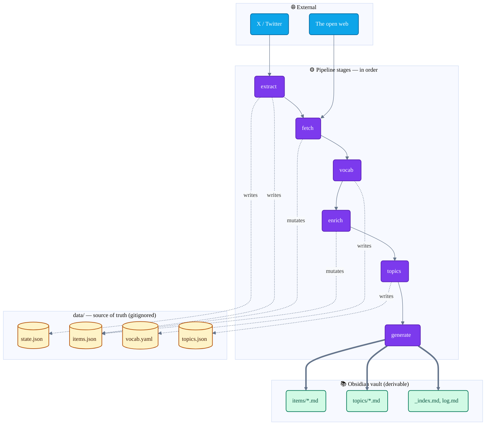

# ARCHITECTURE.md

> **Reference doc.** The README onboards you (what XBrain is, how to install and run it). This document explains **how the system is shaped and why** — the pipeline stages, the artifacts they produce, the rubrics and validator, the executor model, and the invariants that hold it all together.
>
> Read this when you want to extend XBrain, debug a stage, or understand why a piece of state lives where it does.

---

## Table of contents

- [The shape of the system](#the-shape-of-the-system)
- [The pipeline](#the-pipeline)
  - [extract](#extract)
  - [fetch](#fetch)
  - [vocab](#vocab)
  - [enrich](#enrich)
  - [topics](#topics)
  - [generate](#generate)
- [Artifacts: the data layer](#artifacts-the-data-layer)
- [Rubrics: the prompt layer](#rubrics-the-prompt-layer)
- [Validator and guardrails](#validator-and-guardrails)
- [Executors: where the LLM call actually happens](#executors-where-the-llm-call-actually-happens)
- [Invariants](#invariants)
- [Where things live](#where-things-live)

---

## The shape of the system

XBrain takes your X bookmarks and your own posts and turns them into an Obsidian wiki. The wiki has three layers:

- **Items** — one note per saved post, with original text, links, fetched articles, topics and a Spanish summary.
- **Topic pages** — one note per topic (~30-45 topics for the whole corpus), with a synthesized overview of what that topic looks like *across your saves*, plus links to every post filed under it.
- **Index** — the map into both.

The system is built around one principle: **the JSON store is the source of truth, and the wiki is a rendering of it.** Every transformation reads structured data, writes structured data, and never depends on the markdown output. You can delete the entire wiki and regenerate it bit-for-bit from `data/` — that is a property the architecture protects on purpose.



The diagram shows **what each stage writes**: solid arrows for the pipeline
order, dashed arrows for the writes/mutations into `data/`, thick arrows for
the final render into the vault. **Reads are intentionally omitted** — they
fan out from `items.json` to almost every later stage; see the Step-by-step
below for the per-stage read/write detail.

Each stage is a separate command (`xbrain extract`, `xbrain fetch`, …). You can run them individually or chain them. The pipeline is intentionally idempotent at every step: re-running a stage on a corpus that already has its outputs is a cheap no-op except where you explicitly ask for regeneration.

---

## The pipeline

### Step by step

A full run, in the order the stages execute. The diagram above is the *architectural* view (what reads what); the one below is the *temporal* view (what happens, in sequence, when you start from an empty install and end with a wiki).

> **Start:** fresh install — empty `data/`, fresh Obsidian vault.

<table>
<tr><td>

#### 0 · `xbrain login` — setup

One-time browser auth. Opens X in a Playwright window; you log in manually.

- **Reads:** *(nothing)*
- **Writes:** `auth/storage_state.json`

</td></tr>
<tr><td>

#### 1 · `xbrain extract` — mechanical

Drives the logged-in browser, intercepts X's internal GraphQL, pulls
bookmarks + own tweets. Slow scrolls with random 5-12s pauses (anti-ban).

- **Reads:** `state.json` (cursors per source)
- **Writes:** `items.json` (merged by id) + `state.json` (updated cursors)
- **Incremental** — stops at the last known id per source.

</td></tr>
<tr><td>

#### 2 · `xbrain fetch` — mechanical

For each item with links, downloads the article body (HTTP + Trafilatura,
optional Firecrawl fallback, Playwright for x.com).

- **Reads:** `items.json`
- **Writes:** `items.json` — each item's `content` + `content_source[]`
- **Cached** — already-fetched items are skipped (use `--force` to refetch).
- **Failures recorded as evidence** — `http_status` + `failure_reason`, never silently dropped.

</td></tr>
<tr><td>

#### 3 · `xbrain vocab` — LLM

Reads the whole corpus, induces a closed taxonomy of ~30-45 topics. Map
step proposes candidates per chunk; reduce step consolidates to `target_count`.

- **Reads:** `items.json`
- **Writes:** `vocab.yaml` (slug + description list)
- **Always includes a `misc` topic** for posts with no thematic core.

</td></tr>
<tr><td>

#### 4 · `xbrain enrich` — LLM

Per item: writes a summary, chooses `primary_topic` + 0-3 secondaries from
the vocab.

- **Reads:** `items.json` + `vocab.yaml`
- **Writes:** `items.json` — each item's `enriched` field (`Enrichment` record)
- **Only LLM judgment** — no identifiers, no wikilinks (validator rejects them).
- **Skips already-enriched** — use `--regenerate` after vocab or rubric changes.

</td></tr>
<tr><td>

#### 5 · `xbrain topics` — LLM

Synthesizes one topic page per slug: 1-3 paragraph overview + up to 15
notes.

- **Reads:** `items.json` + `vocab.yaml` + `topics.json` (to detect stale pages)
- **Writes:** `topics.json` — one `TopicPage` per slug
- **Plain prose only** — the post lists are added later by `generate`, not the LLM.
- **Derived staleness** — a page is stale when `live_count > post_count_at_synth + threshold`.

</td></tr>
<tr><td>

#### 6 · `xbrain generate` — mechanical

Renders every item note, topic page and the index into the vault.

- **Reads:** `items.json` + `topics.json` + `vocab.yaml`
- **Writes:** `vault/learnings/x-knowledge/{items,topics,_index.md,log.md}`
- **Deterministic** — no LLM, no network.
- **Your tail is preserved** — content below the `xbrain:generated:end` marker is left untouched.

</td></tr>
</table>

> **Done:** wiki ready in Obsidian. Open `_index.md` to start.

Three extra ops sit outside the main loop:

- **`xbrain import-archive <zip>`** — imports your X data archive (the official ZIP export from `x.com/settings/your_archive`) to backfill historical own-tweets beyond what `extract` can reach via the live browser.
- **`xbrain sync`** — convenience: runs `extract → fetch → generate` back-to-back. No enrichment (which is the expensive LLM step you run on your own cadence).
- **`xbrain status`** — read-only diagnostics: item counts, how many have links / content / enrichment, last extraction time per source.

### Per-stage detail

The numbered stages above are summarised; the sections below cover each one in depth.

### extract

**What it does.** Drives a real browser (Playwright + your logged-in session) to pull your bookmarks and own posts from X. Listens to X's internal GraphQL traffic — the same calls the X web app makes to itself — and parses the responses. No public API, no scraping of rendered HTML, no API key.

**Reads.** `data/state.json` (the last-seen item id per source) — so re-running is incremental.

**Writes.** `data/items.json` (new `Item` records, merged with existing ones by `id`); `data/state.json` (updated cursors).

**Why it is shaped like this.** The extractor anchors to **operation names** (`Bookmarks`, `UserTweets`) rather than query identifiers, because X rotates the identifiers constantly and anything that depends on them breaks within weeks. It scrolls slowly with randomized 5-12s pauses — fast scripts get rate-limited or banned.

### fetch

**What it does.** For every item with external links, downloads the full article text behind the URL so a saved link becomes a saved article. Handles four kinds of content sources:

- `external_article` — a regular web page, fetched via HTTP + Trafilatura extraction, optional Firecrawl fallback.
- `x_article` — an `x.com/i/article/...` long-form post, fetched via Playwright-rendered HTML.
- `thread` — a `x.com/<user>/status/...` link, fetched by reusing the GraphQL `TweetDetail` interception proven in the extractor.
- `quoted_tweet` — embedded from the parent post's content.

**Reads.** `data/items.json`.

**Writes.** `data/items.json` — each `Item.content` is populated with one or more `ContentSource` records.

**On failure, the failure is recorded as evidence, not silently dropped.** Every `ContentSource` carries `ok`, `http_status`, `failure_reason` (one of: `not_found`, `forbidden`, `paywall`, `timeout`, `dns_error`, `js_required`, `empty_content`) and `attempts`. The wiki later renders `⚠ Enlace roto` for failed sources rather than pretending they were never there.

**Caching.** `fetch` is cached per item id — it does not re-fetch items that already have a `ContentSource` (success or recorded failure). Use `--force` to re-fetch everything. (Selective retry of transient failures is a planned improvement — issue #19.)

### vocab

**What it does.** Induces a closed taxonomy of ~30-45 topics from the whole corpus. Map step: chunks the corpus, asks an LLM to propose candidate topics per chunk. Reduce step: asks the LLM to consolidate the union of candidates down to `vocab.target_count` topics. Always includes a `misc` topic for posts with no thematic core.

**Reads.** `data/items.json`.

**Writes.** `data/vocab.yaml` — a list of `Topic` records, each with a kebab-case `slug` and a one-sentence `description`.

**Why a closed vocabulary?** Letting the LLM invent topics per-item gives you four hundred topics, each with three notes. Useless. A closed vocab forces the next stage (`enrich`) to pick from a fixed set, which is what makes the topic pages dense enough to be worth reading.

### enrich

**What it does.** Per item: assigns one `primary_topic` and 0-3 secondary topics from `vocab.yaml`, and writes a 1-3 sentence summary. The hard rule: **the LLM produces only judgment** (slugs and prose). It does not emit identifiers, wikilinks, filenames or any structural artifact — those are the code's job.

**Reads.** `data/items.json`, `data/vocab.yaml`.

**Writes.** `data/items.json` — each `Item.enriched` is populated with an `Enrichment` record (summary + primary_topic + topics[] + executor + enriched_at).

**Skips items it has already enriched.** Use `--regenerate` to re-enrich everything (e.g. after the vocab changes, or after you edit a rubric).

### topics

**What it does.** Builds the topic pages — one per slug in the vocab. Each page has:

- **Mechanical post lists** (code-generated): "Primary" (items where this is `primary_topic`) and "Also relevant" (items where this is a secondary topic). These are exact wiki-linked lists.
- **Synthesized overview** (LLM-generated): 1-3 paragraphs of plain prose describing what this topic looks like across the items filed under it. Zero wikilinks, zero identifiers — the LLM does not see post ids, only summaries.
- **Notes**: up to 15 short prose strings, each one important pattern or claim in the topic.

**Reads.** `data/items.json`, `data/vocab.yaml`, `data/topics.json` (to know which overviews are stale).

**Writes.** `data/topics.json` — one `TopicPage` record per slug, with `overview`, `notes`, `synthesized_at`, and `post_count_at_synth`.

**Staleness is derived, not stored.** A topic page is "stale" when the live item count under that slug exceeds `post_count_at_synth + resynth_threshold` (default 25). The store does not carry a stale flag — flags can desync; counts cannot. `xbrain topics --resynth` re-synthesizes every stale page in one pass.

### generate

**What it does.** Renders the data layer into the Obsidian vault. Pure code — no LLM, no network, deterministic.

**Reads.** `data/items.json`, `data/topics.json`, `data/vocab.yaml`.

**Writes.** Inside the vault's `output_subdir` (default `learnings/x-knowledge/`):

- `items/<id>-<slug>.md` — one note per item, with frontmatter (`id`, `source`, `author`, `tags`), the post text, the fetched article(s), the summary, and `**Temas:** [[topic-a]] · [[topic-b]]` wiki-links to the topic pages.
- `topics/<slug>.md` — one note per topic, with frontmatter (`tags: [x-knowledge-topic, <slug>]`), the synthesized overview and notes, then the mechanical "Primary" and "Also relevant" wiki-linked lists.
- `_index.md` — the map.
- `log.md` — what happened in this run.

**The user-content boundary.** Every generated note has a marker block:

```markdown
<!-- xbrain:generated:start -->
... regenerated bit-for-bit on every run ...
<!-- xbrain:generated:end -->

... anything below this line is yours and is preserved across regeneration ...
```

You can annotate, link, and write below the marker — `generate` never touches your tail.

---

## Artifacts: the data layer

Everything XBrain knows lives in four files inside `data/` (gitignored). They are JSON or YAML, plain text, human-readable, and small enough that you can `jq` them.

| File | Format | What it is | Mutated by |
|------|--------|------------|------------|
| `items.json` | JSON array of `Item` | The source of truth — every post XBrain has ever seen, with all fetched content and enrichment | `extract`, `fetch`, `enrich` |
| `state.json` | JSON | Extractor cursors (`last_seen_id`, `last_run`) per source, archive-import marker | `extract`, `import-archive` |
| `vocab.yaml` | YAML list of `Topic` | The controlled topic taxonomy — closed list of slugs + descriptions | `vocab` |
| `topics.json` | JSON dict of `TopicPage` | The synthesized topic-page overviews and notes, keyed by slug | `topics` |

The shapes are defined as pydantic models in [`src/xbrain/models.py`](src/xbrain/models.py). Reading those is the fastest way to understand the data layer in full.

**Why JSON instead of a database.** The corpus is small (a few MB total for ~2k items with full article text). Plain files are diff-able, snapshot-able with `cp`, and survive a tool rewrite. A database would buy nothing here and cost transparency.

---

## Rubrics: the prompt layer

The LLM-driven stages (`vocab`, `enrich`, `topics`) do not have their instructions buried in Python strings. They live in declarative markdown files under [`src/xbrain/rubrics/`](src/xbrain/rubrics/), one per task:

| Rubric | Used by | What it instructs |
|--------|---------|-------------------|
| `rubric-vocab.md` | `vocab` | Induce a topic taxonomy: map step proposes candidates, reduce step consolidates to `target_count` |
| `rubric-topics.md` | `enrich` | Assign one `primary_topic` + 0-3 secondaries from the closed vocab. Never invent slugs |
| `rubric-summary.md` | `enrich` | Write a 1-3 sentence summary, faithful to the post and the fetched article, no hallucination |
| `rubric-topic-page.md` | `topics` | Synthesize 1-3 paragraphs of plain prose + up to 15 short notes per topic, zero wikilinks |

**Why a separate file per rubric.** Changing how XBrain summarizes posts is editing one markdown file, not chasing a string through the codebase. The rubric is the *contract* between code and LLM; the code only handles structure, transport and validation.

**LLM-emits-only-judgment.** This is the architectural rule that every rubric enforces. The LLM produces slugs, summaries and prose. It never emits identifiers (`[[item-2025-01-10-...]]`), filenames, note titles, or anything structural — the validator rejects outputs that violate this and the wiki links are added by the code, post-hoc. Without this rule, hallucinated wikilinks would break the graph (we lost 73 links once before this rule was enforced).

**Output language.** Today the summary and topic-page rubrics hardcode Spanish in the output. The plan is to make it a `config.language` parameter (issue #16).

---

## Validator and guardrails

**[`guardrails.yaml`](src/xbrain/guardrails.yaml) — declarative rules.** Mechanical, structural constraints checked by code, never judged by an LLM:

```yaml
enrichment:
  topics_must_be_in_vocab: true
  primary_topic_must_be_in_topics: true
  topics_min: 1
  topics_max: 4
  summary_required: true

topic_overview:
  overview_required: true
  notes_min: 0
  notes_max: 15
```

**[`validate.py`](src/xbrain/validate.py) — the per-run gate.** Every LLM output passes through the validator before it is written to the store. Invalid outputs are rejected, not silently saved. The validator is the line between "LLM emitted JSON" and "the store accepted the judgment".

**Why this is not the same as evaluation.** The validator is per-run, pass/fail, structural. It does not judge whether a summary is *good* — only whether it is structurally legal (non-empty, topics from the vocab, primary_topic in topics, etc.). Quality measurement is a separate concern — see WS3 (issue #8).

---

## Executors: where the LLM call actually happens

The LLM-driven stages do not call any particular model directly. They go through an **executor** abstraction, so the same rubric can be served by different LLM providers / sessions:

| Executor | Mechanism | When to use |
|----------|-----------|-------------|
| `api` | One call per item to the Anthropic API ([`executors/api.py`](src/xbrain/executors/api.py)) — pay per token, runs unattended | Production runs at scale, or with `--schedule` (issue #7) |
| `claude-code` | Worksheet handoff: the stage exports a JSON worksheet, a Claude Code session (with the corresponding skill) fills it, `--apply` imports it back | Default. No API cost; uses the Claude Code subscription. The pipeline runs end-to-end without an API key |
| `manual` | Same worksheet as `claude-code` but filled by hand | Fallback / inspection |

The executor protocol is in [`executors/base.py`](src/xbrain/executors/base.py): an executor receives `Item`s and the `Topic` vocabulary, returns one `EnrichmentJudgment` per item. The worksheet track (`claude-code` / `manual`) is a different code path entirely — see [`worksheet.py`](src/xbrain/worksheet.py) — because it splits the LLM step from the data-store step across two CLI invocations.

The same executor model is used by `vocab` (with [`vocab.py`](src/xbrain/vocab.py) doing the worksheet plumbing) and `topics` (via [`topic_synth.py`](src/xbrain/topic_synth.py)).

---

## Invariants

These are the rules the rest of the architecture rests on. Breaking any of them produces silent data corruption or makes the system unreproducible.

1. **`data/items.json` is the source of truth.** The wiki is derivable. Drop the wiki, run `xbrain generate`, get the same wiki back.
2. **Each stage reads from the previous ones and writes to its own artifact.** No hidden state, no inter-stage globals. The CLI verbs are the only seams.
3. **The LLM emits only judgment.** No identifiers, no filenames, no wikilinks. The code adds those, post-hoc. The validator enforces it.
4. **User content below `<!-- xbrain:generated:end -->` is preserved across regeneration.** `generate` only rewrites the block above the marker.
5. **Failed fetches are recorded as structured evidence**, not silently dropped. A broken link is demonstrable (`http_status`, `failure_reason`), not assumed.
6. **`fetch` is cached per item id.** Re-runs do not re-hit the network without `--force` (or, in the future, transient-retry — issue #19).
7. **Operation names, not query ids.** The extractor anchors to X GraphQL operation names because X rotates the ids. Anything that hardcodes an id will break.

---

## Where things live

```
xbrain/
├── ARCHITECTURE.md          ← this file
├── README.md                ← onboarding (install, run, what you get)
├── CONTRIBUTING.md          ← contributor guide
├── CLAUDE.md                ← AI-assistant context
├── LICENSE                  ← MIT
├── config.toml.example      ← config template (copy to config.toml)
├── pyproject.toml           ← deps, ruff, mypy, pytest config
│
├── src/xbrain/              ← the package
│   ├── cli.py               ← typer CLI — one command per stage
│   ├── models.py            ← pydantic data models — the shapes
│   ├── config.py            ← config.toml loader
│   │
│   ├── extract/             ← X traffic interception
│   │   ├── browser.py       ← Playwright session + login
│   │   ├── extractor.py     ← GraphQL operation interception
│   │   ├── threads.py       ← TweetDetail thread expansion
│   │   └── graphql.py       ← response parsers
│   │
│   ├── fetch.py             ← article fetch (HTTP + Trafilatura + Firecrawl)
│   ├── fetch_x.py           ← x.com article + status fetch
│   ├── archive.py           ← X data archive (ZIP) import
│   │
│   ├── vocab.py             ← vocab induction + worksheet export/import
│   ├── enrich.py            ← per-item enrichment orchestration
│   ├── topics.py            ← topic-page assembly + post lists
│   ├── topic_synth.py       ← topic overview synthesis (api + worksheet)
│   ├── generate.py          ← wiki rendering
│   ├── notes_io.py          ← per-note read/write + user-tail preservation
│   ├── store.py             ← items.json / topics.json / state.json I/O
│   ├── worksheet.py         ← enrich worksheet export/import
│   ├── validate.py          ← guardrails enforcement
│   ├── llm_json.py          ← extract JSON from LLM responses
│   │
│   ├── guardrails.yaml      ← declarative validation rules
│   ├── rubrics.py           ← rubric loader
│   ├── rubrics/             ← LLM prompts, one per task
│   │   ├── rubric-vocab.md
│   │   ├── rubric-topics.md
│   │   ├── rubric-summary.md
│   │   └── rubric-topic-page.md
│   │
│   └── executors/           ← LLM-call backends
│       ├── base.py          ← EnrichmentExecutor protocol
│       └── api.py           ← Anthropic API executor
│
├── auth/                    ← Playwright storage state (gitignored)
│   └── storage_state.json
│
├── data/                    ← source of truth (gitignored)
│   ├── items.json
│   ├── state.json
│   ├── vocab.yaml
│   └── topics.json
│
├── scripts/                 ← one-off helpers
│   ├── import_chrome_session.py
│   ├── import_safari_session.py
│   └── check.sh             ← quality gate
│
└── tests/                   ← pytest suite
```

---

## Further reading

- **README.md** — install, configure, run the pipeline end-to-end.
- **CONTRIBUTING.md** — local setup, the quality gate (`uv run poe check`), PR workflow.
- **Open issues** ([github.com/VGonPa/xbrain/issues](https://github.com/VGonPa/xbrain/issues)) — planned work: scheduled runs, eval harness, snapshots, drift comparison, configurable output language.
