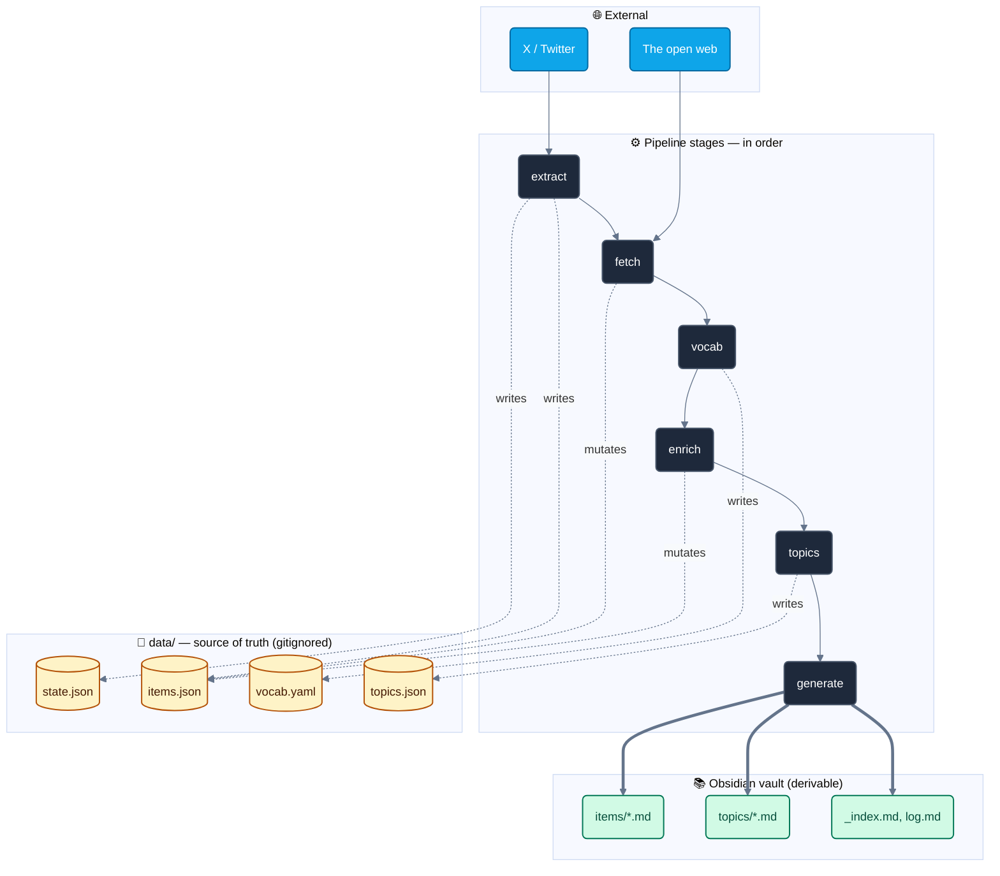

# ARCHITECTURE.md

> **Reference doc.** The README onboards you (what XBrain is, how to install and run it). This document explains **how the system is shaped and why** — the pipeline stages, the artifacts they produce, the rubrics and validator, the executor model, and the invariants that hold it all together.
>
> Read this when you want to extend XBrain, debug a stage, or understand why a piece of state lives where it does.

---

## Table of contents

- [The shape of the system](#the-shape-of-the-system)
- [The pipeline](#the-pipeline)
  - [extract](#extract)
  - [payloads](#payloads)
  - [refetch-truncated](#refetch-truncated)
  - [fetch](#fetch)
  - [fetch: retry-failed and revalidate](#fetch-retry-failed-and-revalidate)
  - [media](#media)
  - [describe](#describe)
  - [refresh-quoted](#refresh-quoted)
  - [refresh-media](#refresh-media)
  - [download-videos](#download-videos)
  - [list-videos / fetch-video](#list-videos--fetch-video)
  - [digest-video](#digest-video)
  - [video-digest](#video-digest)
  - [redescribe-frames](#redescribe-frames)
  - [vocab](#vocab)
  - [enrich](#enrich)
  - [topics](#topics)
  - [generate](#generate)
  - [dashboard](#dashboard)
  - [evidence](#evidence)
  - [verify](#verify)
  - [verify-entities](#verify-entities)
- [The knowledge layer](#the-knowledge-layer)
- [Artifacts: the data layer](#artifacts-the-data-layer)
- [Rubrics: the prompt layer](#rubrics-the-prompt-layer)
- [Validator and guardrails](#validator-and-guardrails)
- [The CI gate auditor](#the-ci-gate-auditor)
- [Executors: where the LLM call actually happens](#executors-where-the-llm-call-actually-happens)
- [Snapshot diffing](#snapshot-diffing)
- [Invariants](#invariants)
- [Where things live](#where-things-live)

---

## The shape of the system

XBrain takes your X bookmarks and your own posts and turns them into an Obsidian wiki. The wiki has three layers:

- **Items** — one note per saved post, with original text, links, fetched articles, topics and a Spanish summary.
- **Topic pages** — one note per topic (~30-45 topics for the whole corpus), with a synthesized overview of what that topic looks like *across your saves*, plus links to every post filed under it.
- **Index** — the map into both.

The system is built around one principle: **the JSON store is the source of truth, and the wiki is a rendering of it.** Every transformation reads structured data, writes structured data, and never depends on the markdown output. You can delete the entire wiki and regenerate it bit-for-bit from `data/` — that is a property the architecture protects on purpose.


```mermaid
%%{init: {
  'theme': 'base',
  'themeVariables': {
    'fontFamily': 'ui-sans-serif, system-ui, -apple-system, sans-serif',
    'fontSize': '14px',
    'lineColor': '#64748b',
    'background': 'transparent',
    'edgeLabelBackground': '#f8fafc'
  }
}}%%
flowchart TB
    subgraph Sources["🌐 External"]
        direction LR
        X(X / Twitter)
        Web(The open web)
    end

    subgraph Pipeline["⚙️ Pipeline stages — in order"]
        direction LR
        E(extract) --> F(fetch) --> V(vocab) --> En(enrich) --> T(topics) --> G(generate)
    end

    subgraph Data["💾 data/ — source of truth (gitignored)"]
        direction LR
        State[(state.json)]
        Items[(items.json)]
        Vocab[(vocab.yaml)]
        Topics[(topics.json)]
    end

    subgraph Wiki["📚 Obsidian vault (derivable)"]
        direction LR
        ItemNotes("items/*.md")
        TopicNotes("topics/*.md")
        Index("_index.md, log.md")
    end

    X --> E
    Web --> F

    E -.writes.-> State
    E -.writes.-> Items
    F -.mutates.-> Items
    V -.writes.-> Vocab
    En -.mutates.-> Items
    T -.writes.-> Topics

    G ==> ItemNotes
    G ==> TopicNotes
    G ==> Index

    classDef ext fill:#0ea5e9,stroke:#0369a1,stroke-width:1.5px,color:#fff,font-weight:500
    classDef stage fill:#1e293b,stroke:#475569,stroke-width:1.5px,color:#fff,font-weight:500
    classDef artifact fill:#fef3c7,stroke:#b45309,stroke-width:1.5px,color:#451a03
    classDef wiki fill:#d1fae5,stroke:#047857,stroke-width:1.5px,color:#064e3b
    class X,Web ext
    class E,F,V,En,T,G stage
    class State,Items,Vocab,Topics artifact
    class ItemNotes,TopicNotes,Index wiki
```

The diagram shows **what each stage writes**: solid arrows for the pipeline
order, dashed arrows for the writes/mutations into `data/`, thick arrows for
the final render into the vault. **Reads are intentionally omitted** — they
fan out from `items.json` to almost every later stage; see the Step-by-step
below for the per-stage read/write detail.

Each stage is a separate command (`xbrain extract`, `xbrain fetch`, …). You can run them individually or chain them. The pipeline is intentionally idempotent at every step: re-running a stage on a corpus that already has its outputs is a cheap no-op except where you explicitly ask for regeneration.

---

## The pipeline

### Step by step

A full run, in the order the stages execute. The diagram above is the *architectural* view (what reads what); the one below is the *temporal* view (what happens, in sequence, when you start from an empty install and end with a wiki).

> **Start:** fresh install — empty `data/`, fresh Obsidian vault.

<table>
<tr><td>

#### 0 · `xbrain login` — setup

One-time browser auth. Opens X in a Playwright window; you log in manually.

- **Reads:** *(nothing)*
- **Writes:** `auth/storage_state.json`

</td></tr>
<tr><td>

#### 1 · `xbrain extract` — mechanical

Drives the logged-in browser, intercepts X's internal GraphQL, pulls
bookmarks + own tweets. Slow scrolls with random 5-12s pauses (anti-ban).

- **Reads:** `state.json` (cursors per source)
- **Writes:** `items.json` (merged by id) + `state.json` (updated cursors)
- **Incremental** — stops at the last known id per source.

</td></tr>
<tr><td>

#### 2 · `xbrain fetch` — mechanical

For each item with links, downloads the article body (HTTP + Trafilatura,
optional Firecrawl fallback, Playwright for x.com).

- **Reads:** `items.json`
- **Writes:** `items.json` — each item's `content` + `content_source[]`
- **Cached** — already-fetched items are skipped (use `--force` to refetch).
- **Transient retries** — items whose only previous failures were `timeout`, `dns_error` or `unknown_error` are re-fetched on the next run without `--force`. `unknown_error` is the uncategorised bucket (an extractor exception, an HTTP 429) and it is **transient by default**: silently classifying every uncaught failure as terminal is the failure mode that rule exists to avoid. The other six reasons (`not_found`, `paywall`, `forbidden`, `js_required`, `empty_content`, `blocked_interstitial`) are terminal and stay skipped until `--force` — or until `fetch --retry-failed`, which targets exactly the ones a retry could repair. Three plus six is the whole of `FailureReason`; nothing falls between the buckets.
- **Failures recorded as evidence** — `http_status` + `failure_reason`, never silently dropped.
- **Snapshots `data/` before `--force`** — recovery path if a forced refetch makes things worse.

</td></tr>
<tr><td>

#### 3 · `xbrain vocab` — LLM

Reads the whole corpus, induces a closed taxonomy of ~30-45 topics. Map
step proposes candidates per chunk; reduce step consolidates to `target_count`.

- **Reads:** `items.json`
- **Writes:** `vocab.yaml` (slug + description list)
- **Always includes a `misc` topic** for posts with no thematic core.
- **Snapshots `data/` before `--regenerate`** — a vocab rewrite forces re-enrichment, so it is the most destructive op.

</td></tr>
<tr><td>

#### 4 · `xbrain enrich` — LLM

Per item: writes a summary, chooses `primary_topic` + 0-3 secondaries from
the vocab.

- **Reads:** `items.json` + `vocab.yaml`
- **Writes:** `items.json` — each item's `enriched` field (`Enrichment` record)
- **Only LLM judgment** — no identifiers, no wikilinks (validator rejects them).
- **Skips already-enriched** — run `vocab --regenerate` (it clears enrichments) after vocab or rubric changes.

</td></tr>
<tr><td>

#### 5 · `xbrain topics` — LLM

Synthesizes one topic page per slug: 1-3 paragraph overview + up to 15
notes.

- **Reads:** `items.json` + `vocab.yaml` + `topics.json` (to detect stale pages)
- **Writes:** `topics.json` — one `TopicPage` per slug
- **Plain prose only** — the post lists are added later by `generate`, not the LLM.
- **Derived staleness** — a page is stale when `live_count > post_count_at_synth + threshold`.
- **Snapshots `data/` before `--resynth`** — re-synthesising every stale overview overwrites `topics.json` in place.

</td></tr>
<tr><td>

#### 6 · `xbrain generate` — mechanical

Renders every item note, topic page and the index into the vault.

- **Reads:** `items.json` + `topics.json` + `vocab.yaml`
- **Writes:** `vault/learnings/x-knowledge/{items,topics,_index.md,log.md}`
- **Deterministic** — no LLM, no network.
- **Your tail is preserved** — content below the `xbrain:generated:end` marker is left untouched.

</td></tr>
</table>

> **Done:** wiki ready in Obsidian. Open `_index.md` to start.

Three extra ops sit outside the main loop:

- **`xbrain import-archive <zip>`** — imports your X data archive (the official ZIP export from `x.com/settings/your_archive`) to backfill historical own-tweets beyond what `extract` can reach via the live browser. It shares the same media parsing as `extract` (via `extract/video.py`), so archived videos capture the playable stream + poster thumbnail + bitrate/duration too.
- **`xbrain sync`** — convenience: runs `extract → fetch → generate` back-to-back. No enrichment (which is the expensive LLM step you run on your own cadence).
- **`xbrain status`** — read-only diagnostics: item counts, how many have links / content / enrichment, last extraction time per source.

A further set of **repair and audit surfaces** also sits outside the loop: they read or rewrite what the loop already produced rather than advancing it. Each has its own section below — [`payloads`](#payloads) (`payload-stats`, `reextract`), [`refetch-truncated`](#refetch-truncated), [`fetch --retry-failed` / `--revalidate`](#fetch-retry-failed-and-revalidate), [`refresh-quoted`](#refresh-quoted), [`verify`](#verify) and [`verify-entities`](#verify-entities).

### Per-stage detail

The numbered stages above are summarised; the sections below cover each one in depth.

### extract

**What it does.** Drives a real browser (Playwright + your logged-in session) to pull your bookmarks and own posts from X. Listens to X's internal GraphQL traffic — the same calls the X web app makes to itself — and parses the responses. No public API, no scraping of rendered HTML, no API key.

**Reads.** `data/state.json` (the last-seen item id per source) — so re-running is incremental.

**Writes.** `data/items.json` (new `Item` records, merged with existing ones by `id`); `data/state.json` (updated cursors); `data/payloads/<shard>/<id>.json.gz` — each tweet's raw GraphQL subtree, persisted **before** anything is parsed (see [`payloads`](#payloads)).

**Media capture.** Photo entries become pending URLs. Video and animated-GIF entries capture the **playable stream** — the highest-bitrate progressive `video/mp4` from `video_info.variants`, falling back to the HLS (`.m3u8`) manifest when no mp4 is offered — plus the poster image as `thumbnail_url` and the chosen `bitrate` + `duration_millis` (so a later download can estimate size without fetching bytes). The video URL is the stream, never the poster. The same media parser (`extract/video.py`) is shared by the archive importer, so `import-archive` captures video identically.

**Article-entity detection (#39 PR 2).** A long-form **Article** is an *entity* on the tweet result, not a text URL in `entities.urls`, so a **directly-bookmarked** Article was previously never captured. `graphql._extract_article_link` detects it — anchoring on the stable keys `article` → `article_results` → `result` → `rest_id` via the null-safe `_dig` walk (a shape drift degrades to *no link*, never a wrong one) — and synthesizes the canonical `https://x.com/i/article/<rest_id>` link onto the item (deduped against `entities.urls`). That URL is shaped so the **existing** `fetch` x.com path (`is_x_url` + `_classify_x_url` → the rendered-article branch) fires for it with no routing change. Extract only *synthesizes the link*: fetching the ordered article body (fetch → PR 3), downloading its inline images (media → PR 4) and rendering it as a blogpost (generate → PR 5) complete the chain end-to-end. *Fixture note:* the Article key path is pinned against a **constructed** fixture (`tests/test_graphql.py`), not a recorded live payload — validate it against a real bookmarked-Article GraphQL response before production reliance. X may **also** surface an Article via a `card`/`unified_card` variant; PR 2 does not parse that path (it degrades safely to *no link*) — a conscious deferral folded into the same real-payload validation step.

**Why it is shaped like this.** The extractor anchors to **operation names** rather than query identifiers, because X rotates the identifiers constantly and anything that depends on them breaks within weeks. It scrolls slowly with randomized 5-12s pauses — fast scripts get rate-limited or banned.

**Operation names are aliases, not literals, and an empty capture fails closed.** X renames the operations too: the own-tweets timeline answered to `UserTweets` until X switched it to `UserOriginalsTimeline` (measured 2026-08-30). `_OPERATIONS` therefore holds a **tuple of aliases per source**, newest first, keeping the old names because X A/B-tests these and rolls them back: `bookmark → ("Bookmarks",)`, `own_tweet → ("UserOriginalsTimeline", "UserTweets")`. The *parser* survives such a rename on its own, since it anchors on the `tweet_results` key rather than a path; the **capture filter** did not, and a stale literal turned a rename into silent data loss — every response filtered out, `captured` empty, and the run reporting `0 nuevos items` with exit 0. So `extract_source` now **raises `OperationNotCaptured`** when it saw zero responses for the operation across a whole scroll. A healthy timeline always answers at least once (an account with zero posts still gets an empty instruction list), so capturing nothing means we were not listening for the right name. The CLI leaves that source's cursor untouched, reports the source as incomplete and exits non-zero; the other source still saves, because a rename hits one operation at a time.

### payloads

**What it does.** `extract` persists each tweet's whole raw GraphQL subtree under `data/payloads/` before it parses anything, so parsing becomes a re-runnable transformation over data we own instead of a one-shot read of a stream that is gone the moment it is consumed (`payloads.py`, wired in `extract/extractor.py:persist_payloads`). Two commands read the store back: `xbrain reextract` re-runs the parser offline, `xbrain payload-stats` measures what it costs.

**Why it exists.** `extract` used to capture X's response in flight, pull an `Item` out of it and throw the original away. When a parse bug surfaced months later — the parser read `legacy.full_text`, which X caps at 280 characters, and never read `note_tweet`, which was present in every payload — the fix was not a re-parse. It was a network round-trip to X: a logged-in browser, rate limits, and tweets that may since have been deleted or protected. Disk is cheap; going back to the source is not. With the payload on disk, a field we misread — or a field nobody read — is fixed offline, with no dependency on the post still existing.

**Reads.** X's GraphQL responses, as `extract` intercepts them.

**Writes.** `data/payloads/<shard>/<item-id>.json.gz` — one gzipped file per item, sharded by the id's last two characters. Per-item files rather than an append-only log: the access pattern is "re-parse item X" and "re-parse everything", both of which a log makes O(n) and needs compaction for. A per-item file is idempotent on re-sync (the same tweet overwrites itself) and lets one item be repaired in isolation; the shard keeps any one directory from holding 100k entries.

**Credential keys are scrubbed at the seam.** `save_payload` runs `scrub` over the subtree before it writes, dropping a fixed deny-list of credential key names (`auth_token`, `authorization`, `cookie`, `ct0`, `session_id`, …). The scrub lives inside the writer, never in the caller — a caller that forgets is exactly how a token reaches disk. It matches **whole key names, never substrings**: the first version matched substrings and `auth` ate `author` / `author_id` / `authors`, deleting the author block on write with the original already discarded.

**`reextract` shows the diff before it applies it.** `reextract_from_payloads` re-parses every stored payload and reports what *would* change across the whole corpus; `--apply` writes it. Only five fields are re-parsed: `text`, `links`, `quoted_id`, `thread`, `author`. **`media` is deliberately excluded** — the store holds enriched media (photos with a vision description, videos with a downloaded `local_path`) while a fresh parse emits pending states, so overwriting would destroy an evidence surface the summary was written from, and nothing would bump `fetched_at`, so it would never be re-enriched. `captured_at` is when *we* saw the tweet, so a re-parse never touches it. Items with no stored payload, and payloads that are present but unparseable, are reported in their own buckets: "cannot be re-extracted" is never allowed to look like "re-extracted cleanly". A dry run on the live store on 2026-08-30 covers 2,360 of 2,404 items, parses all of them, and finds 308 fields it would change: 253 `text`, 51 `author`, 4 `quoted_id` — 214 of those text rewrites are a truncated body becoming a longer one, at zero network cost (see [`refetch-truncated`](#refetch-truncated) for what the rest of that work list turns out to be).

**`payload-stats` measures the store and projects it.** Count, raw bytes, gzipped bytes, per-item mean, and the projection to 10k and 100k items. Re-derived on the live store on **2026-08-30**: 3,423 payloads, 26.5 MB raw, 7.9 MB gzipped, mean **2,320 B/item** — so 10k items project to ~23 MB and 100k to ~232 MB. Of the 2,404 stored items, **2,360 have a payload on disk**; the other 44 predate persistence and are not re-extractable. Coverage grows on its own: every sync re-sees tweets already in the store and overwrites their payload, which is why the pre-persistence backlog keeps shrinking without anyone running a backfill. (The disk figures first quoted for this feature were taken from an X *Article* fixture that contains no tweets at all. This command exists so the number is measured on the real thing.)

**Snapshot trigger.** `reextract --apply` snapshots `data/` first (label `pre-reextract`). The dry run and `payload-stats` write nothing and take no snapshot.

### refetch-truncated

**What it does.** Repairs the items whose tweet text was truncated at ingest. `items_needing_refetch` (`extract/graphql.py`) selects them; `--apply` re-fetches each one from X through a logged-in browser and writes the full text back.

**Why the payloads mostly *do* help here, now — and three docstrings still say they do not.** This repair was written when the flagged items were all pre-persistence captures with nothing on disk to re-parse, so the only path was a network round-trip. That has stopped being true: `extract` re-sees these tweets on later syncs and `save_payload` overwrites, so the payload store has caught up with the backlog. Re-derived on the live store on 2026-08-30: of **707** flagged items, **702 have a stored payload**, and an offline `reextract` dry run (no network at all) rewrites the `text` of **222** of them, **214** to a longer body. **Run [`reextract`](#payloads) first**, because it is free. A payload is not automatically a repair, though — it carries the long-form body only if X sent one at capture time — so see the triage below for what the rest of the list actually is.

Two things follow. First, `items_needing_refetch` flags on the **stored text alone** — it never consults the payload store — so the count is a work list, not a network bill: an item can be flagged while the evidence to repair it is already on disk. Second, the docstrings on `extract/graphql.py:items_needing_refetch`, `cli.py:refetch_truncated_command` and `payloads.py` all still assert that the payloads are not on disk for this population and that a re-fetch is therefore required. That was true when each was written and is false now; this section reflects the measurement, not those docstrings.

**Why it matters.** `legacy.full_text` is capped at 280 characters: X cuts a long post mid-word and appends a `t.co` self-link. An item carrying half a sentence is handed to the generator with an instruction to summarise it, and the generator finishes the sentence itself.

**707 is a work list, not a defect count.** Re-derived on 2026-08-30: **707 of 2,404 items are flagged**. `looks_truncated` decides on **length alone** — ≥274 characters of prose unconditionally, 265-273 only when the text does not end on a terminator, with `:` and `;` deliberately not counting as terminators — and it is biased towards flagging on purpose. Its docstring says why: a missed truncation reproduces the very fabrication the detector exists to catch, while a false flag costs one re-fetch.

**The payloads triage the list into four groups, and only one of them needs the network.** The discriminating field is `note_tweet` — the long-form body, which X sends only when a post exceeds the 280-character `legacy.full_text` cap, and which `_tweet_text` prefers whenever it is present. Reading it off the stored payload settles what the length heuristic cannot:

| Group | What the payload shows | Count | What it needs |
|---|---|---|---|
| Repairable offline | payload holds a **longer** body than the store | **214** | `reextract` — free, no network |
| Already complete | payload's `note_tweet` body **is** what is stored | **358** | nothing |
| Undetermined | **no `note_tweet`**, so the text is the capped `full_text` | **122** | a re-fetch, *if* they are truncated at all |
| Changed, not lengthened | a re-parse rewrites the text without adding to it | **8** | inspect |
| No payload | nothing on disk to compare against | **5** | a re-fetch |

So `reextract` clears 214 for free; the largest group — **358** — needs nothing at all; and **at most ~127** items (the 122 plus the 5) could need the network, against the ~485 an earlier draft of this section claimed. "At most" is doing real work in that sentence: see the ceiling below.

**Why the "already complete" group is a real finding and not the detector agreeing with itself.** The stored text of all 358 is byte-identical to the `note_tweet` body in their payloads: X served the whole post and we stored the whole post, and they are flagged only because a long post is long (median 725 characters, up to 13,173). This is read off a **different field** from the one the flag is computed on, which is what makes it evidence. The `arrives TRUNCATED` warning the re-parse emits is **not** evidence here, and an earlier draft of this section wrongly cited it: `_tweet_to_item` raises that warning by calling `looks_truncated` on the freshly-parsed text, so for an item whose text did not change it re-runs the same predicate over the same string and returns what it returned the first time. A perfect 480-of-480 agreement there is a tautology, not a measurement.

**The ceiling on the 122 cannot be tightened, and the reason is the strongest evidence in this section.** "No `note_tweet`" is consistent with truncation but does not establish it: X omits the field for a post that genuinely fits in 280 characters, and such a post can still trip the 265-273 band. The obvious way to settle it is to ask whether the 122 look like the 214 we *know* were truncated. They do — on both signatures a reader would reach for, at a slightly higher rate:

| | the 214 (known truncated) | the 122 (no `note_tweet`) |
|---|---|---|
| stored prose length, median | 277 | 277 |
| inside the 265-292 band | 212 of 214 | 122 of 122 |
| ends in a trailing `t.co` | 124 of 214 (58%) | 86 of 122 (70%) |

That is a test that **could** have separated them and did not. If the 122 were ordinary complete posts that merely tripped a length band, they should have looked different somewhere — shorter, or without the appended link. So two readings survive and nothing in the store chooses between them: they are truncations whose payload never carried the body (a gap at capture time, not a fact about post length), or they are complete ~277-character posts that happen to end in the author's own link. Treat the 122 as **genuinely undetermined**, not as probably-truncated and not as probably-complete, and read ~127 as a ceiling whose real size nothing we hold can measure.

In the other direction the 358 have their own soft edge: 14 carry a `note_tweet` body under 290 characters, and 52 end in a `t.co` — usually a link the author included rather than a cut, but not checked one by one. **214 remains the only hard number here**: the store disagreeing with its own stored evidence, item by item, on no heuristic at all.

**Reads.** `data/items.json`; with `--apply`, live X through the logged-in Playwright session.

**Writes.** `data/truncated-items.json` — id, url and current text for every affected item, written on every run, dry or not — and, with `--apply`, `data/items.json`.

**Dry run by default, checkpointed on apply.** Without `--apply` it only reports. With it, `refetch_full_texts` (`fetch_x.py`) checkpoints the store every 25 items and again in a `finally`: this is deliberately human-paced browser work, hours of it, and a session expiry partway through must not discard the repairs already made. A failed or empty re-fetch leaves the truncated text alone — half a tweet is bad, blanking the item is worse, and for these items that text is the only evidence there is.

**A repaired text nulls its enrichment.** The summary was written from half a sentence, so a repair sets `item.enriched = None` and the next `xbrain enrich` regenerates it. The normal re-enrichment trigger (`enrich._needs_reenrichment`, `content.fetched_at > enriched.enriched_at`) cannot reach this population: it requires `item.content is not None`, and these items typically have no content block at all. Any stored verification verdict follows automatically — the tweet is part of the source the judge read, so a repaired text changes the item's `contract_fingerprint` and the verdict stops being current (see [`verify`](#verify)).

**Snapshot trigger.** `--apply` snapshots `data/` first (label `pre-refetch-truncated`), before the first repair lands. The dry run writes only the report file and takes no snapshot.

### fetch

**What it does.** For every item with external links, downloads the full article text behind the URL so a saved link becomes a saved article. Handles four kinds of content sources:

- `external_article` — a regular web page, fetched via HTTP + Trafilatura extraction, optional Firecrawl fallback.
- `x_article` — an `x.com/i/article/...` long-form post. `fetch` first tries the **structured path** (#39 PR 3): it intercepts the article-content GraphQL response (the same `page.on("response", …)` interception `_fetch_tweet` uses for `TweetDetail`, matching a GraphQL URL whose op name contains `article`) and parses its Draft.js `content_state` (`extract/article.py`, a pure `parse_article_content_state`) into an **ordered** `blocks` body IN DOCUMENT ORDER: `ArticleTextBlock` text runs, `ArticleImageBlock` inline images (each a `MediaPhotoPending`, downloaded later by [`media`](#media)) and `ArticleVideoBlock` inline videos (a `MediaVideoPending` carrying the playable stream, the poster and the bitrate/duration). **Nothing is dropped silently, and two whole classes used to be** — an `ApiVideo` keeps its poster one level deeper and its bitrate under `bit_rate` rather than `bitrate`, so the photo-shaped lookup returned nothing and the block went to the drop log; and entity-borne text (`MARKDOWN` code listings, `DIVIDER` rules, an embedded `TWEET`) lives in an `atomic` block whose `text` is a single space, which the "no text run means no content" assumption deleted. `_entity_text` recovers those and sweeps unknown entity types carrying `markdown`/`text`/`html` for the same reason the wall detector over-rejects: surfacing something skippable costs a line, dropping content is permanent and invisible. The lead `cover_media` (image or video) is prepended as the first block. The flattened `text` is set to the exact `"".join` of the text-run texts (data-model invariant #12), so `enrich`/`topics` consume it unchanged. **Fallback:** on any interception/parse miss the fetch degrades to the retained `trafilatura.extract(html)` text-only path (`blocks == []`) — never a crash, never a partial/wrong block set masquerading as complete; a genuinely empty article still records the `empty_content` failure. The parser anchors only on stable Draft.js key names and the article op name is UNCONFIRMED against a live payload — validate before production reliance (RFC #39 open-Q #4). The media download of those images is #39 PR 4 ([media](#media)); the blogpost render — the ordered text+image note — is #39 PR 5 ([generate](#generate)).
- `thread` — a `x.com/<user>/status/...` link, fetched by reusing the GraphQL `TweetDetail` interception proven in the extractor.
- `quoted_tweet` — embedded from the parent post's content.

A fifth `ContentKind`, `x_video`, exists on the same `ContentSource` union but is **not** produced by `fetch` — it is manufactured by [`digest-video`](#digest-video) from a video transcript. `fetch` never emits or consumes it.

**Reads.** `data/items.json`.

**Writes.** `data/items.json` — each `Item.content` is populated with one or more `ContentSource` records.

**On failure, the failure is recorded as evidence, not silently dropped.** Every `ContentSource` carries `ok`, `http_status`, `failure_reason` (one of: `not_found`, `forbidden`, `paywall`, `timeout`, `dns_error`, `js_required`, `empty_content`, `blocked_interstitial`, `unknown_error`) and `attempts`. The wiki later renders `⚠ Enlace roto` for failed sources rather than pretending they were never there.

**Caching.** `fetch` is cached per item id — it does not re-fetch items that already have a `ContentSource` (success or recorded failure). Use `--force` to re-fetch everything. Selective retry (issue #19) shipped as `fetch --retry-failed`, and `fetch --revalidate` re-judges bodies already in the store — see [fetch: retry-failed and revalidate](#fetch-retry-failed-and-revalidate).

**`content.fetched_at` = last *material* change, not last attempt.** When `fetch_item` re-fetches an item, it stamps a fresh `fetched_at` only if the new source set differs materially from the existing one. The material fingerprint (`_source_signature`) is the whole source model minus fetch bookkeeping (`attempts`/`error`) — a model-derived deny-list, so every content-bearing field (`title`, `text`, `failure_reason`, `http_status`, the `x_video` transcript/`frames`, the `x_article` `blocks`, …) is compared automatically and a future field is not silently dropped. This keeps the [`enrich` re-enrichment trigger](#enrich) honest for a persistently-failing transient link that `_should_refetch` retries every run — see the invariant note there. **The x.com-link path applies the same rule (#39 PR 3):** `fetch_x._attach_x_sources` reuses `_sources_materially_equal` to bump `fetched_at` only when the replaced `x_article` source set changed materially — so an Article that gains a richer structured `blocks` body re-triggers enrich, while an idempotent re-fetch does not churn.

### fetch: retry-failed and revalidate

Two repair modes on the `fetch` command, neither of which re-hits a link that already worked. Both exist because of one rule.

**A wall is never evidence.** For a long time the only content check was `if not text` — non-empty implied success — and that is how a YouTube footer menu, a Cloudflare challenge and a bare page title became `[Linked article]` evidence: **28 of the store's 189 fetched "articles" (14.8%), measured**. The guardrail cannot fire for them, because they are recorded as successes: `links_content_unfetched` goes False, the `[Links — content NOT fetched]` marker disappears from every LLM surface, `rubric-summary` orders the generator to summarise "the article's substance", and the judge is handed a `[Linked article]` it will pass. A rendered Instagram login wall even contains the word "Instagram", so the entity checker calls that name grounded.

`validate_body` is the fix, and it sits at the **persistence boundary** (`_safe_extract`), so no extractor can write a wall into the store as a success — the ordinary `fetch` path is covered, not just the retry. It rejects on three tests: a **length floor** (a body under 300 characters is not an article), **wall and page-chrome markers** (one wall phrase such as `accept all cookies` or `verify you are human` rejects outright; page chrome such as `cookie policy` is tolerated once and rejected from two markers up, because a real article page can legitimately carry one), and a **title that is the bare domain** ("Instagram", "twitch.tv"). A rejected body becomes a `blocked_interstitial` failure with its evidence named.

The bias is deliberate and asymmetric. Rejecting a good article leaves the honest failure we already had, the guardrail keeps firing and nothing is lost but an opportunity; accepting a wall poisons the evidence. It is tuned against the real corpus rather than guessed — over those 189 successfully-fetched articles it rejects 28, and all 28 are junk. (An earlier list used a bare `log in to`, which is ordinary English prose, and it wrongly rejected three real bodies. A marker that fires on prose is not a wall detector.)

**`fetch --retry-failed`** re-fetches **only the recorded failures a retry could plausibly repair**, which is what makes it different from `--force` (that one re-hits every link in the store, including the ones that already succeeded). `_retryable_now` admits two populations: a **transient** failure (`timeout`, `dns_error`, and the `unknown_error` bucket that catches HTTP 429), which may simply succeed on a better day; and a **fallback-eligible** failure (`js_required`, `empty_content`, `blocked_interstitial`) still at `attempts < 2`, which never actually got the Firecrawl pass, because `_firecrawl_extract` returns `None` with no key configured and the original failure then stands. With a key, the retry brings a genuinely different extractor. Everything else — 404, 403, paywall, or a fallback-eligible failure already at `attempts == 2` — is left alone: retrying reproduces the recorded failure, which is not a repair, it is load on someone's server. The key is resolved once, in one place (`XBRAIN_NO_FIRECRAWL` as a hard opt-out, then `FIRECRAWL_API_KEY`, then the `firecrawl` CLI's own stored credentials), and `--dry-run` prints the plan — including, by name, the items **blocked on a missing key**, which become recoverable the moment one is configured. The end-of-run tally reports what actually landed rather than what was attempted: a retry that "succeeded" into a cookie wall is now recorded as `blocked_interstitial`, not as evidence.

**`fetch --revalidate`** re-judges the bodies **already in the store** and demotes the junk. `--retry-failed` cannot reach these — it selects failures, and an accepted wall is recorded as a success — so without this pass the measured 28 junk bodies keep serving as `[Linked article]` evidence forever. It is purely local: no network, no extractor, it only re-runs `validate_body` over bytes we already hold, so a demotion cannot lose anything (the body was never evidence in the first place). **Report-only by default**, listing the affected items and their domains; `--write` applies the demotions. The rebuilt `Content` keeps the same `content.fetched_at`, so a demotion does not by itself re-trigger enrichment.

**Reads + writes.** `data/items.json`. Both modes are destructive when they write and auto-snapshot first (labels `pre-fetch-retry-failed`, `pre-fetch-revalidate`); `--dry-run` and a report-only `--revalidate` write nothing and take no snapshot. The two modes are mutually exclusive with each other and with `--force`, and the CLI rejects the combination rather than guessing which one was meant.

### media

**What it does.** Downloads X-post photos referenced in `Item.media` **and the inline images of an X long-form Article** (#39 PR4) and persists the bytes locally so the wiki can render them inline. Photos only; videos remain in `video_pending` for a future iteration (their playable stream URL + poster thumbnail + bitrate/duration were already captured at extract/import time). Walks every `MediaPhotoPending` entry, downloads from `pbs.twimg.com` with a cascading size fallback (`name=orig` → `name=large` → `name=medium`), validates the bytes with Pillow, and atomically writes the file under `data/media/<item-id>/<index>.<ext>`.

**Inline Article images (#39 PR4).** Beyond `Item.media`, the same walk advances the inline images of an `x_article` `ContentSourceSuccess.blocks` — each `ArticleImageBlock.media` (a `MediaPhotoPending` emitted by `fetch`) living **outside** `item.media`. `_iter_eligible_article_images` mirrors the photo iterator (`_iter_eligible_attempts`): it applies the **same** `_is_eligible` cascade and yields `(item_id, block, image_index, entry)`; the orchestrator downloads each through the **same** `_download_one` engine (size cascade, Pillow validation, throttle, failure classification) and swaps the result **in place** onto `block.media` — `MediaPhotoPending` → `MediaPhotoDownloaded`/`MediaPhotoFailed`. The model is not `validate_assignment`, so the swap does not re-run `_text_matches_blocks` (images do not contribute to `text`, so the invariant is untouched). Article images write to a **namespaced** path `data/media/<item-id>/article/<n>.<ext>` (`_local_path(..., subdir="article")`) so they never collide with the item's own `<id>/<n>` photos — the `<n>` is a per-item running index over the image blocks (stable across download state, so an already-downloaded block 0 never shifts a pending block 1 down to `article/0`). Article-image bytes are the `MediaEntry` photo-state union, so the download engine, the `_reject_local_path_traversal`/`_require_utc_aware` validators, and (future) `describe` apply with **no new plumbing**; the blogpost **render** — mirroring these bytes into the vault and embedding them inline in the note — is `generate`'s job (#39 PR5, [generate](#generate)), not `media`'s.

**`--force` re-download semantics (#39 PR4, documented decision).** `xbrain fetch --force` **rebuilds** an `x_article` source from scratch, discarding a prior download's `MediaPhotoDownloaded` and re-emitting fresh `MediaPhotoPending` image blocks. Article-image state is therefore **not carried forward** across a forced re-fetch — the next `xbrain media` run re-downloads the images. This is the **conscious, consistent choice** (mirroring `fetch --force` = "redo from scratch" and the photo `--force` = "re-download" semantics), not an accident: the article's image set can itself change on a rebuild, so matching old bytes to new blocks would be fragile special-casing that contradicts the rebuild contract. `xbrain media --force` (without a re-fetch) likewise re-downloads an already-`MediaPhotoDownloaded` article image, exactly like a photo.

**Reads.** `data/items.json` (the URLs to download).

**Writes.** `data/items.json` (each photo entry → `MediaPhotoDownloaded`/`MediaPhotoFailed`; each `x_article` `ArticleImageBlock.media` likewise, swapped in place) and `data/media/<item-id>/<index>.<ext>` (photo bytes) + `data/media/<item-id>/article/<n>.<ext>` (article-image bytes).

**State machine.** Each `xbrain media` run advances eligible photo **and article-image** entries:
- `Pending` → `Downloaded` (bytes on disk, dimensions + size recorded).
- `Pending` → `Failed(reason)` (no bytes; reason categorised).

`Failed(transient)` is not a terminal state — the next run auto-retries it. A subsequent run re-attempts `Failed` entries whose reason is in `_TRANSIENT_MEDIA_FAILURES` (`http_5xx`, `timeout`, `unknown_error`) — same retry contract as `fetch`. Permanent failures (`http_4xx`, `format_error`) only retry with `--force`. Already-downloaded photos/images are skipped unless `--force`.

**Observability + total-failure guard.** `MediaReport` carries dedicated `article_images_{attempted,downloaded,failed_permanent,failed_transient,skipped}` counters (already-downloaded article images bump the **dedicated** `article_images_skipped` — kept distinct from the photo skip counter so the two never contaminate each other; every failure lands in the shared `per_item_failures` list + a `logger.warning`), and the `SUMMARY` line surfaces `article_downloaded`/`article_failed_*`/`article_skipped` so article activity is **never** folded silently into the photo counts. The "everything failed → `RuntimeError`" short-circuit keys on the **combined** (photos + article images) attempted-vs-downloaded totals: a run that downloads 0 photos but N article images (or vice-versa) is a partial success, not a total failure. `--limit` is a **combined** per-run budget threaded into `_iter_eligible_article_images` exactly as into the photo generator `_iter_eligible_attempts` — the budget is checked at the top of each iteration, so once it is spent the walk stops **and stops counting skips** (no scanning-past a spent budget and miscounting images it never reached); photos consume it first, article images take whatever slots remain.

**Storage layout.** Photo bytes live under `data/media/<item-id>/<index>.<ext>` and article-image bytes under `data/media/<item-id>/article/<n>.<ext>` (both gitignored). The atomic write uses a sibling `<n>.<ext>.part` tmp file; orphan `.part` files left by SIGKILL/OOM are swept on the next `download_all` entry. The vault mirror at `<output_subdir>/_media/<item-id>/<index>.<ext>` is written by `generate`, not by `media` — so the photo bytes stay in sync with whichever subset of items `--since`/`--until` is regenerating. The article-image bytes mirror the same way: `generate._mirror_item_article_images` copies each downloaded `x_article` inline image into `<output_subdir>/_media/<item-id>/article/<n>.<ext>` at render time and the blogpost renderer embeds it inline in the note (#39 PR 5, [generate](#generate)).

**Ctrl-C safety.** The orchestrator calls a per-image `on_progress` callback (fired after every photo **and** every article-image transition) that writes `items.json` atomically between downloads. A Ctrl-C mid-batch leaves a coherent store and the next run picks up where it left off.

**Snapshot trigger.** `xbrain media` always snapshots `data/` first (label `pre-media`), mirroring the destructive-op recovery boundary — **inline Article images add no new command and no new snapshot boundary; they ride this existing one** (#39 PR4). The snapshot covers `items.json` / `state.json` / `vocab.yaml` / `topics.json` only — the binary photo/article-image bytes under `data/media/` are NOT included; re-downloading via `xbrain media` is the recovery path.

### describe

**What it does.** Sends every downloaded photo to a Claude vision model, asks for a 1-3 sentence prose description plus a `is_decorative` classification, and persists the prose on the entry. The entry transitions from `MediaPhotoDownloaded` to `MediaPhotoDescribed` (a new variant on the `MediaEntry` union). Decorative photos (avatars, reaction memes, abstract backgrounds) are classified as such with an empty description so downstream prompts can filter them out without re-classifying.

**Reads.** `data/items.json` + `data/media/<id>/<n>.<ext>` (the bytes the downloader wrote).

**Writes.** `data/items.json` — each described photo entry carries `is_decorative` + `description` + `description_lang` + `description_version` + `described_at`. No new on-disk binary state; the bytes from the prior `MediaPhotoDownloaded` are inherited verbatim.

**State machine.** Each `xbrain describe` run advances eligible photo entries:
- `Downloaded` → `Described` (description on the entry, bytes unchanged).
- `Described` (stale version OR stale language) → `Described` (current version + current language), automatically.
- `Described` (current version + current language) → no-op (skipped) unless `--force`.

Eligibility ignores `Pending` / `Failed` / `VideoPending`: describe only runs on photos with bytes on disk. The description-version tag is the rubric-evolution lever: bumping `[describe].version` in `config.toml` invalidates persisted entries so the next run re-describes them without `--force`. The `description_lang` check is the mixed-vault guard: switching `[paths].output_language` from Spanish → English (or back) marks every previously-described entry stale so the enrich prompt never splices the wrong-language prose into a new vault.

**Batching.** Default batch size is 5 images per API call (the spec's quality / cost sweet spot — ~12-15 % token saving vs per-image, modest added complexity). Override with `--batch-size N`.

**Refusals.** Vision refusals (faces, NSFW) are NOT a hard failure: the entry is persisted as decorative with an empty description, and the run continues. The same `is_decorative` flag downstream consumers already use for "no topic signal" handles the refusal uniformly.

**Failure isolation.** Per-batch error isolation: one failing API call does not abort the run. A total-failure run (every batch errored) raises `RuntimeError` so the CLI surfaces non-zero exit. The orchestrator's `on_progress` callback writes `items.json` between batches so Ctrl-C mid-run leaves the store coherent — same recovery contract as `media`.

**Snapshot trigger.** `xbrain describe` always snapshots `data/` first (label `pre-describe`), mirroring `media`'s recovery boundary. A botched run — wrong model, runaway prompt — can be undone with `xbrain snapshot restore`.

**Feeds the LLM stages.** Once described, the prose is consumed automatically — through **both** the API and the worksheet (`claude-code` / `manual`) tracks, so the descriptions reach the LLM input regardless of which executor runs the stage ([#34](https://github.com/VGonPa/xbrain/issues/34)):
- `xbrain enrich`: the `api` executor (`executors/api.py:_user_prompt`) splices an `Images in this post:` section between the post body and the links/article block when the item has content-bearing described photos; the worksheet export (`worksheet.py`, an `image_descriptions` field per item) carries the same non-decorative selection (reusing `executors/api._content_image_descriptions`, the same seam) so the claude-code enrich track sees identical visual signal. Decoratives are filtered.
- `xbrain topics`: the `api` track (`topic_synth.py:_user_prompt`) appends the flat list of content-bearing image descriptions across every post in a topic, after the per-post summaries; the worksheet export (`topic_synth.py:export_topic_worksheet`, an `image_descriptions` field per topic) carries the same list from the `TopicInput` already computed by `build_topic_inputs`, and the claude-code consumers surface it — the `resynth-topic-overviews` workflow prints an `Images across …` block in each per-topic extraction and the `enriching-x-knowledge` skill lists the field for a hand-run session.

This is how a tweet that is mostly a screenshot of a paper becomes searchable by what the screenshot was actually about — on either track.

**Propagating onto already-enriched items.** This is *wiring*: the descriptions flow whenever `enrich` / `topics` next run for an item. Items already enriched before the describe pass are skipped by the normal idempotency guard, so a one-time forced re-run (real LLM cost, run deliberately) is what back-fills them: `xbrain vocab --regenerate` (clears enrichments) then `xbrain enrich` re-enriches every item with its image descriptions, and `xbrain topics --resynth` re-synthesizes the overviews with the image (and video-transcript) evidence.

### refresh-quoted

**Why it exists.** A quote-tweet stored only its `quoted_id`. The quoted post's body and its author were dropped, so the generator saw a bare reaction ("Read this and you'll understand") with nothing to summarise, and filled the gap by inventing. It also broke attribution: without knowing who wrote the quoted words, neither the judge nor the entity checker can tell a correct third-party attribution from a wrong one. `refresh-quoted` backfills the quoted post onto quote-tweets already in the store.

**Two modes, cheapest first.**

- **`--from-store`** — no browser, no network. A quote-tweet's `quoted_id` often names a post we captured in its own right, so the evidence is one lookup away (`refresh.backfill_quoted_from_store`). Instant, free and re-runnable. Start here; then re-capture for what it could not reach.
- **The full re-capture** — scrolls the whole X history with an empty `known_ids` set through the shared `_recapture_history` harness (the same one [`refresh-media`](#refresh-media) uses, so a second backfill cannot drift into its own subtly different ingest path) and re-parses. **It makes no extra request per item:** X embeds the quoted post — body *and* author — in the same timeline payload as the tweet quoting it. The `state.json` cursors are deliberately not advanced; this is a backfill, not an incremental extract.

**Only `quoted_tweet` sources are touched.** Article bodies, transcripts, threads and every enrichment, description and media state are preserved. It is idempotent: a readable quoted post already on the item is left alone, a failed one is retried.

**`fetched_at` moves only on new evidence.** `_attach_quoted` compares exactly what the LLM surfaces read from the quoted post — `quoted_source(item)`, i.e. the body plus the author, the same selector every surface asks — and bumps `content.fetched_at` **only when that pair actually changed**. So the next `xbrain enrich` regenerates exactly the summaries that gained evidence, and a quoted post recorded as unreadable is stored as evidence of the gap without re-triggering enrichment.

**Reads.** `data/items.json`, plus live X on the re-capture path.

**Writes.** `data/items.json` — `quoted_tweet` content sources only.

**Empty-capture guard.** Re-seeing **0 known items** against a non-empty store is a likely-broken run rather than success, so the re-capture path warns loudly and aborts non-zero without saving; `--force` downgrades it to a warning and proceeds. That is the *items-re-seen* guard. A scroll that captured no GraphQL response at all now raises `OperationNotCaptured` inside `extract_source` before this point — see [`extract`](#extract).

**Snapshot trigger.** Both modes rewrite `items.json` in place, so both auto-snapshot `data/` first (labels `pre-refresh-quoted-from-store` and `pre-refresh-quoted`), before any capture or write.

**Measured on the live store (2026-08-30).** 831 items carry a `quoted_id`; 826 now carry a `quoted_tweet` content source.

### refresh-media

**Why it exists.** `extract` is incremental — `extract_source` stops at the first known id, and `store.merge_items` "adds, never overwrites". The playable-video capture (`extract/video.py`: highest-bitrate mp4 / HLS fallback + poster + bitrate + duration) only runs at *capture* time, so every video already in the store before that capability landed is **poster-era**: its `MediaVideoPending.url` is the poster image and `bitrate` / `duration_millis` are unset. A normal `extract` will never revisit those items, so they would stay poster-era forever. `refresh-media` is the backfill that fixes them.

**What it does.** Re-captures the **full** X history (logged in) and rewrites the VIDEO media on items already in the store, in place. For each re-seen item, it scrolls with an **empty `known_ids` set** so `extract_source` does not stop early and the whole timeline is walked, then hands the freshly-parsed items to the pure `refresh.refresh_video_media`: each existing `MediaVideoPending` is swapped positionally for the corresponding fresh video entry (playable URL + bitrate + duration), while every photo entry (`Pending` / `Downloaded` / `Failed` / `Described`) and every enrichment / description / fetch field is left **exactly** as-is. Fresh items not already in the store are skipped — this is a backfill of known items, not a new extraction. The `state.json` cursors are deliberately **not** advanced: this is a backfill, not an incremental extract.

**Upgrade-only, never degrade.** This is the repo's first *overwriting* store path, so the swap is guarded. `build_video_media` falls back to the poster image (`url == thumbnail_url`, no metadata) when X serves no usable `video_info.variants` — a drift symptom. `refresh.refresh_video_media` replaces a stored video **only** when the fresh entry is a real stream (`url != thumbnail_url`); a poster-fallback fresh entry keeps the existing record and is not counted as refreshed. Without this, a second run during a drift window would silently downgrade an already-good playable URL back to a poster.

**Empty-capture guard.** A scroll can come back having captured responses but nothing we already hold — the GraphQL parser drifts, or the scroll is interrupted. Re-seeing **0** known items against a non-empty store is therefore a likely-broken run, not success: `refresh-media` warns loudly and aborts **non-zero without saving** (the merge was a no-op, so `items.json` is byte-identical and the pre-snapshot already fired). `--force` downgrades this to a warning and proceeds. An empty store (fresh project) and any non-zero capture (monotonic, re-runnable progress) save normally — the guard is specifically `items_seen == 0` on a non-empty store. The *other* empty case, a scroll that saw no response for the operation at all, is caught earlier and harder: `extract_source` raises `OperationNotCaptured` and never returns (see [`extract`](#extract)).

**Reads.** `data/items.json` + live X (via the logged-in Playwright session).

**Writes.** `data/items.json` — video entries only. Photos, content, enrichment and descriptions are untouched. `state.json` is not touched.

**Size estimate, no download.** `refresh-media` does NOT download video (that is the job of `download-videos`, below). It prints a pre-flight estimate from `refresh.estimate_download_size`: `Σ bitrate × duration_millis / 1000 / 8` over every stored video, treating `bitrate ∈ {None, 0}` (animated GIFs always report `0`) or a missing duration as *unknown* — excluded from the byte sum and counted separately, never as 0 bytes.

**Snapshot trigger.** `refresh-media` always snapshots `data/` first (label `pre-refresh-media`) — it rewrites `items.json` in place, so it is destructive by the same definition as `vocab --regenerate`. The snapshot is taken *before* the (slow, many-minutes) capture; a snapshot failure aborts the command before any X traffic.

**Reporting.** The end-of-run summary prints the `RefreshReport` counts — known items re-seen, items refreshed, videos updated, and video items NOT re-seen (still poster-era, i.e. how much is left to backfill) — followed by the size estimate (`~X.X GB across N videos; M with unknown size`).

### download-videos

**What it does.** The file-download counterpart to `media` (photos): it downloads the actual mp4 bytes for the playable videos `refresh-media` backfilled, and embeds them in the notes. Lives in `video_media.py` (a sibling of `media.py`), which **reuses** `media.py`'s shared download primitives — the retry classification (`_classify_status` / `_TRANSIENT_MEDIA_FAILURES`), the browser User-Agent + per-request throttle, the atomic `tmp + rename` write, the `.part`-orphan sweep, and the error formatter — rather than re-implementing them, so the photo and video downloaders stay consistent and the photo path is untouched. Videos need no Pillow decode: the orchestrator writes the bytes and records `bytes_size`.

**Scope — mp4 only (this stage).** `download_videos` walks every `MediaVideoPending` and classifies its URL (`_video_class`): a **real mp4 stream** (host `video.twimg.com`, or an `.mp4` path before the query — and `url != thumbnail_url`) is downloaded; an **HLS `.m3u8` manifest** is *skipped and counted* — muxing HLS into a playable file needs ffmpeg, which is a separate follow-up (a code comment + a `logger.info` mark the deferral); a **poster-era** entry (`url == thumbnail_url`, or a legacy record whose URL is neither mp4 nor HLS — i.e. not yet backfilled) is skipped silently and counted (run `refresh-media` first). The `.m3u8` check is ordered *before* the host check, because HLS is also served from `video.twimg.com`.

**State machine.** Each downloadable mp4 advances `MediaVideoPending → MediaVideoDownloaded` (bytes under `data/media/<id>/<n>.mp4`) or `MediaVideoFailed` (categorised). The transient/permanent retry contract mirrors `media`: `http_5xx` / `timeout` / `unknown_error` auto-retry on the next run; `http_4xx` is permanent (only retried with `--force`). Already-downloaded videos are skipped unless `--force`; the run is idempotent and a Ctrl-C between videos leaves `items.json` coherent (the `on_progress` callback persists between transitions). A 2xx with an empty body is bucketed as a transient `unknown_error` rather than persisted as a zero-byte "download".

**Content validation.** A 200 status is not trust — a CDN/captcha/auth-wall interstitial or an edge-cache HTML/JSON error page can arrive as 200 with a non-video body. Mirroring the photo path's Pillow guard, `download_videos` validates the bytes before writing: it accepts a `video/*` `Content-Type` **or** an mp4 container signature (the `ftyp` box at offset 4), but rejects a body that begins with HTML/JSON markup (`<` / `{` / `[`) even under a `video/*` header (the bytes win over a misconfigured header). A non-video body returns `MediaVideoFailed` **without writing the file**, bucketed **transient** (`unknown_error`): these interstitials are usually an X rate-limit JSON (`code 88`) or a session-expiry auth-wall, which clear on their own, so the next run auto-retries (no `--force` needed). This stops a corrupt `.mp4` from being persisted and then hidden forever by idempotency.

**Size gate + `--max-size`.** Before downloading, `plan_video_downloads` replays the exact eligibility walk (no network, no write) and `format_size_gate` prints e.g. `About to download ~1.2 GB across 8 videos (3 HLS skipped, 1 already downloaded).` (`Σ bitrate × duration / 1000 / 8` over the eligible mp4 set only; eligible mp4s with no bitrate/duration are surfaced as `+N of unknown size`, never summed as 0). The run requires an interactive `typer.confirm` unless `--yes` is passed — this is the "warning of X GB" before a multi-GB fetch. `--max-size` (parsed by `parse_size_to_bytes`: `500MB` / `2GB` decimal units, a bare number = MB) caps the **estimated** per-video size: an over-cap mp4 is skipped and counted (`skipped_too_large`), and — because an unknown-size video can't be proven to fit — a no-bitrate/duration mp4 is also skipped under the cap (`skipped_size_unknown`); without `--max-size` those unknown-size videos download normally. The gate estimate and "N videos / ~X GB" line reflect only the under-cap to-download set.

**Reads.** `data/items.json` (the playable URLs to download).

**Writes.** `data/items.json` (each downloaded mp4 transitions to `MediaVideoDownloaded` / `MediaVideoFailed`) and `data/media/<id>/<n>.mp4` (the bytes). The vault mirror at `<output_subdir>/_media/<id>/<n>.mp4` is written by `generate`, not here — exactly like photos.

**Memory + mid-download drops.** Each body is buffered fully (`response.content`) — streaming is deferred to the large-file/ffmpeg follow-up, with the `--max-size` cap bounding the risk in the meantime. The body read is done INSIDE the same network-error guard as `session.get`, because over a multi-GB batch the common failure is a connection drop *at the body read* (`ChunkedEncodingError` / `ConnectionError`), not at the request — bucketing it transient there is what lets the batch continue instead of aborting on a raw traceback. A `MemoryError` buffering a too-large body is caught locally too (recorded as a transient failure with a clear message), so the run carries on rather than dying; it is deliberately NOT in the CLI's global operator-error set (a global catch would swallow OOM stacks for every command).

**Snapshot trigger.** `download-videos` snapshots `data/` first (label `pre-download-videos`), the same recovery boundary as `media`. The snapshot is taken *after* the size-gate confirmation (a declined run never writes, so it leaves no stray snapshot) but always before the first byte lands; a snapshot failure propagates and aborts.

**Scope flags.** `--source bookmarks|tweets|all` scopes the run to bookmark / own-tweet items; `--items <a,b,c>` and `--limit N` narrow it further; `--max-size <size>` caps per-video estimated size; `--force` re-downloads and retries permanent failures; `--yes` skips the confirmation. The end-of-run summary (and the `SUMMARY:` stderr line — emitted even on a skip-only run, for monitor parity with `media`) prints downloaded / failed / skipped-HLS / skipped-poster-era / already-downloaded / skipped-too-large / skipped-size-unknown.

### list-videos / fetch-video

**Why they exist.** `download-videos` persists the mp4 into the store to embed it inline; that is the wrong shape when the goal is to *process* a video (e.g. transcribe a 72-minute talk into a digest) — the corpus is ~140 GB and must not live on disk. `list-videos` + `fetch-video` are the **agent-driven, ephemeral** read/fetch surface: xbrain stays **mechanical** (list + fetch), and the heavy ML (ASR/vision) is **external / agent-side**, never bundled into the CLI (no bundled MLX/CoreML/ML *library* in core — ffmpeg and the vision model are shelled out as external subprocesses, required only for `--frames`). They are the selection/fetch dependency of the long-form video digest module ([#44](https://github.com/VGonPa/xbrain/issues/44)).

**`list-videos` — read-only catalog.** `video_select.list_video_entries(store, *, topic, status, max_size_bytes, source, limit) -> list[VideoRow]` derives one `VideoRow` (`id, url, state, topic, size_bytes, mp4_url, text`) per video media entry. `state` is `downloaded` / `failed` from the variant, else `pending` for a real-mp4-or-HLS pending, else `poster-era` for an un-backfilled pending (`url == thumbnail_url`); `mp4_url` is the resolved stream URL, `None` for poster-era. `size_bytes` is the exact on-disk size for a downloaded entry, else the shared `_estimated_bytes` (`bitrate × duration`) estimate, else `None`. The mp4/HLS/poster discriminator (`_video_class`) and the estimator are **reused** from `video_media`, so the catalog agrees with the downloader on "what is a real mp4" and "how big is it". Filters compose; with `--max-size`, unknown-size rows are excluded (same conservative rule as `download-videos`, so list and fetch select the same under-cap set). **Reads** `data/items.json`; **writes nothing**, takes no snapshot. `--json` emits the stable machine array an agent parses to pick videos.

**`fetch-video` — ephemeral fetch.** `video_fetch.fetch_videos(store, ids, dest_dir, *, max_size_bytes, limit) -> FetchReport` downloads each selected item's first real mp4 to `<dest_dir>/<id>.mp4`, de-duplicating repeated ids. The GET body is validated and classified by the **reused** `video_media._read_validated_body` (the `video/*` / `ftyp` container check + HTML/JSON interstitial rejection) and `media._classify_status`, and written by the shared atomic `media._write_bytes` (with the `_sweep_part_orphans` sweep of the dest dir); HLS and poster-era items are skipped and counted, and a failed download is recorded (never fatal — the batch continues). `--ids` and/or `--topic` (resolved via `list_video_entries`, scoped by `--source`) select; `--max-size` / `--limit` bound the run. **Reads** `data/items.json`; **writes only** `<--to>/<id>.mp4`.

**Deliberately non-persisting / non-snapshotting.** `fetch-video` NEVER mutates `items.json`, NEVER takes a snapshot, and NEVER writes to `data/media/` — there is no `MediaVideoPending → MediaVideoDownloaded` transition, and a test asserts `items.json` is byte-identical before/after a fetch. It is intentionally **absent** from the destructive auto-snapshot set (Invariant 8): with nothing destructive to protect, a snapshot would be noise. This mirrors the worksheet hand-off — the mechanical CLI produces bytes for an external tool and stays out of the store's write path.

### digest-video

**Why it exists.** A bookmarked 72-minute talk is the worst-case "graveyard" item — high value, highest re-entry cost, never reopened. `digest-video` turns it into text: it **manufactures a transcript** and attaches it to the item as a content source, so the once-unwatchable video flows through the *existing* `enrich → topics → generate` pipeline and becomes a topic-linked note ([#44](https://github.com/VGonPa/xbrain/issues/44)). xbrain stays **mechanical** — the heavy ASR is external.

**The stage.** `digest.digest_videos(store, item_ids, *, force, fetch_fn, transcribe_fn) -> DigestReport` orchestrates, per selected video: **ephemeral fetch** (reusing PR1's `video_fetch.fetch_videos` into a `TemporaryDirectory`) → **external transcribe** (`transcribe.transcribe_media`) → **attach** (`digest.attach_transcript`) → **discard** the bytes. Selection is `--ids` / `--topic` / `--all-pending` (resolved via `list_video_entries`), scoped by `--source`, bounded by `--limit`. **Reads + writes** `data/items.json`.

**External transcriber, no ML in core (locked #44 architecture).** `transcribe.py` shells out to the operator-configured `[transcribe].command` (default `parakeet-mlx`; whisper / faster-whisper is the portable fallback) as a **subprocess**: `<command> [--model M] --output-format json --output-dir <TMPDIR> <mediapath>`. The real `parakeet-mlx` writes its transcript to a **file** at `<TMPDIR>/<stem>.json` (it does NOT emit JSON on stdout and does NOT accept `--language`), so `transcribe.py` reads the produced file (stdout is a fallback for a wrapper) and parses it into a `Transcript` (`text`, `segments` of `start/end/text`, `language`, `has_speech`, and an optional `title` passed through to the `x_video` source when the ASR surfaces one). It imports **no** MLX/CoreML/torch/whisper library — a test asserts it. The command is `shlex`-split (a multi-token wrapper works) and run **without** a shell. A **missing / non-executable binary** raises a clear operator error (`TranscriberNotFound`, clean CLI exit-1), never a crash. **No-speech is a JSON signal, never an absence of output:** `{"text": ""}` / empty segments / `has_speech: false` → graceful no-speech, but exit-0-with-no-output raises `TranscriberFailed` (inferring silence there would silently lose the transcript).

**The transcriber can be a language router (`scripts/xbrain-transcribe-auto`).** `[transcribe].command` still defaults to the bare `parakeet-mlx`, and on a **multilingual corpus that default is wrong** — point the setting at `xbrain-transcribe-auto` instead. It is a wrapper honouring the same contract, which detects the language on the first 30 s and dispatches. **English goes to parakeet** (`xbrain-transcribe`, parakeet-mlx — fast on Apple Silicon). **Anything else, and any uncertainty at all, goes to whisper** — `xbrain-transcribe-mlx` (mlx-whisper, on the Apple GPU) first, falling back to `xbrain-transcribe-whisper` (the portable Whisper CLI on CPU, ~25× slower) when the GPU backend cannot run. The two were verified to produce a character-identical transcript on a real clip, so the fallback trades only time. All three honour the same `--output-dir` / JSON-file contract `transcribe.py` expects, so xbrain's side is unchanged.

**Why route at all: parakeet-tdt does not fail on Spanish, it fabricates.** Verified 2026-07-17 against an es-ES clip — it exits 0 and emits fluent, broken English that never reproduces what was said. A noisy failure is visible in a log; this one passes the whole pipeline and lands in a note as a quotation, and by then you can no longer tell "the video said that" from "parakeet made it up". So the backend has to be chosen *before* transcription, not judged after it. Detection slices the first `XBRAIN_ASR_DETECT_SECONDS` (default 30) with `ffmpeg` and asks `whisper` with no `--language`, so it reports what it detected; the detection model defaults to `base` (~19 s per clip, measured on an M-series machine over one real es-ES and one real en-US clip — `tiny` halves that and identified both correctly, but two samples are not enough evidence to trade accuracy on the axis where being wrong means a fabricated transcript). **Everything fails toward whisper:** no ffmpeg, no whisper, a non-zero exit, an unreadable result, an undetected language. A genuinely silent clip short-circuits before any of it (`ffprobe` positively confirms no audio stream — unknown is never treated as silent) and yields the empty-speech JSON both wrappers already agree on. `XBRAIN_ASR_FORCE=parakeet|whisper` skips detection entirely.

**The `x_video` ContentKind.** The transcript is attached as a `ContentSourceSuccess(kind="x_video")` — the fifth `ContentKind`, additive to the union so existing `items.json` and every existing `ContentSource` variant load unchanged. `text` carries the transcript; the optional `has_speech` / `language` fields are the video markers (`None` on a non-video source), and the optional `frames` list carries the key-frame slides (empty on every non-`--frames` source — see the visual layer below). The optional `digest: str = ""` field carries the **long-form readable synthesis** of the transcript + frames written by [`video-digest`](#video-digest) — optional + additive (`""` = "no digest yet"), so every pre-digest `x_video` source (and every article source) loads unchanged. It sits on `Item.content.sources` exactly like an `external_article` body, so `generate`/`enrich` consume it via the existing machinery.

**Visual layer — content-type-aware key-frame slides (`--frames`, opt-in, PR4).** For a slide/screen/demo-heavy talk the visual carries as much as the audio; for an interview the scene frames are camera cuts = noise. So the layer is **content-aware** and **fully opt-in** (`--frames`, default off; a normal run never touches ffmpeg/vision and is byte-unchanged). When enabled, per fetched video `digest`:

- **Extracts key frames** with the **external** `ffmpeg` CLI (`video_frames.extract_key_frames`, a subprocess with `shlex`-split argv, no shell — the `transcribe.py` shape; `video_frames.py` imports **no** ML/vision lib, only Pillow for classic image processing, and a test asserts it). The ffmpeg `select` expression combines scene-change detection with a **periodic interval term** keyed on `prev_selected_t`, so a long **static tail** (e.g. a 30-min static Q&A after a slide deck) is still sampled — coverage spans the WHOLE video, guarding the "scene detection stops mid-video" gap in one pass with no duration probe. An over-`max_frames` result is subsampled **evenly** across the timeline (front + tail), never truncated to the first N (which would re-open the same gap).
- **Classifies** the frame set as `slides` vs `talking_head` (`video_frames.classify_visual`) from the fraction of frames with high **edge density** (text/sharp lines → high FIND_EDGES energy; smooth faces/bokeh → low). A talking-head video **skips** the visual layer and **logs the reason** (`"visual layer skipped (talking-head)"`) — never a silent drop, and no vision call is wasted.
- **Describes** each kept slide via the **external** vision model (`vision.describe_image`, a subprocess on `[vision].command`; mirrors `transcribe.py` — no bundled default, `VisionNotFound` on a missing/unconfigured binary aborts the run, exit-0-empty is a `VisionFailed` not a silent empty). The descriptions are recorded on the `x_video` source's `frames` list; the slide **images** are persisted under `data/media/<id>/frames/<n>.png` so `generate` mirrors them into the vault's `_media/` tree and embeds them exactly like downloaded photos. All non-kept frames are discarded (ephemeral, reclaimed by the enclosing `TemporaryDirectory`).

A per-video `FrameExtractionFailed` (bad mp4) or `VisionFailed` drops the visual layer for that video (logged) while the transcript still attaches — the audio digest is independent of the visual layer. A missing ffmpeg (`FrameExtractionToolNotFound`) or missing/unconfigured vision binary (`VisionNotFound`) is a global config error that aborts the run, exactly like a missing transcriber. A silent slide deck (no speech) still gets its slides — that is where a screen-only video carries its content.

**Frame-extraction config (`[frames]`).** The visual layer's knobs live in `config.toml`; the defaults live in `video_frames.py` and `config.py` validates every one of them at load:

| Key | Default | What it does |
|-----|---------|--------------|
| `max_frames` | 60 | Safety ceiling applied **after** dedup, for a pathological continuous-motion clip. Must be ≥ 1 |
| `scene_threshold` | 0.4 | ffmpeg scene-change sensitivity; higher means fewer cuts. Must be in `[0.0, 1.0]` |
| `interval_seconds` | 15 | Also keep a frame every N seconds — this is what covers a long static tail. Must be > 0 |
| `dedupe` | `true` | Perceptual-hash near-duplicate removal |
| `dedupe_distance` | 6 | Max dHash Hamming distance (0-64) at which two frames count as the same slide |

The pipeline is **extract → dedupe → cap**, and **dedupe is the real reducer**: it drops the near-identical frames a held slide produces, so the budget is spent on *distinct* slides. `max_frames` is a ceiling, not the selection mechanism.

**Dedup by video identity.** The full mp4 URL is unstable (`?tag=` + rotating signing/filename), so the dedup **`VideoKey`** is the stable id parsed from the URL *path* — `amplify_video/<id>` (or `ext_tw_video`/`tweet_video`), with a query-stripped `<netloc><path>` fallback for an unrecognised pattern. `digest.group_items_by_video` groups the selection by that key; each video is fetched + transcribed **once** and the resulting source is attached to **every** referencing item (`digest.attach_transcript` returns the count). N bookmarks of the same video → one transcript linked to all.

**No-speech is data, not failure.** Many X videos are silent / screen-only. A `has_speech=False` transcript (empty text) is attached as an `x_video` source with the marker — `generate` can render "silent video" and `enrich` can skip it — never a hard failure. A per-video malformed-output `TranscriberFailed` is recorded and the batch continues; only a missing binary aborts the run.

**Ephemeral, one video at a time.** Each video is fetched into a temp dir, transcribed, then its bytes are unlinked immediately; the whole `TemporaryDirectory` is removed even when transcription raises. Never more than one video on disk — the ~140 GB corpus never lands in the store.

**Snapshot trigger.** `digest-video` is destructive (it rewrites `items.json`), so it **auto-snapshots** `data/` (label `pre-digest-video`) before the store write — but only when it is about to write (a pure already-digested / no-fetchable-video run attaches nothing and takes no snapshot). A snapshot failure propagates and aborts before any change lands. Idempotent: an item already carrying an `x_video` source is skipped unless `--force` (which replaces the stale source in place).

### video-digest

**Why it exists.** `digest-video` attaches the raw transcript + slide-frame descriptions, but a wall of raw transcript is not a *readable* note. `video-digest` closes that gap: an LLM reads the transcript + frame descriptions and writes a **long-form readable digest** — "what it is · key points · why it matters" — persisted on the `x_video` source so `generate` can lead the note with it ([#44](https://github.com/VGonPa/xbrain/issues/44), PR [#78](https://github.com/VGonPa/xbrain/pull/78)). It is a **separate** stage, not folded into `digest-video`, so the mechanical transcript attach and the LLM synthesis stay independently runnable and snapshot-able.

**The stage.** Worksheet hand-off, mirroring `enrich` (`video_digest.py`): `export_video_digest_worksheet` writes `data/video-digest-worksheet.json` with every video pending a digest — an `x_video` source that carries digestible content (`items_pending_video_digest`) but an empty `digest` — plus the `rubric-video-digest.md` rubric. You fill the `judgments` array (a Claude Code session or by hand), then `xbrain video-digest --apply <file>` imports it (`import_video_digest_worksheet`) and `apply_video_digest_judgments` writes each `source.digest` back.

**Executor.** `--executor manual|claude-code`, defaulting to `[enrich].executor`. It has **no** config section of its own and (like [`verify`](#verify)) runs **only** the worksheet tracks, never `api`.

**Reads + writes.** `data/items.json` (each `x_video` source's `digest`). The **apply** branch is destructive (it mutates the store) so it **auto-snapshots** (label `pre-video-digest-apply`); the export branch only writes the worksheet JSON and takes no snapshot.

### redescribe-frames

**Why it exists.** The frame-caption RUBRIC can change — it did in [#90](https://github.com/VGonPa/xbrain/issues/90), when frame captions were found to be translating on-screen text (slide labels, code identifiers, chart axes) into the output language instead of transcribing it verbatim — but the pixels a stale caption was drawn from never changed: they already sit on disk at `data/media/<id>/frames/<n>.png`. Re-fetching a video just to re-run the vision model over frames it already extracted would cost a browser session, ffmpeg, and (on the corpus that motivated this) X access to videos that may no longer even be downloadable. `redescribe-frames` re-describes those bytes directly: **zero network, zero ffmpeg, zero X.**

**Staleness is a contract comparison, not a timestamp.** Every `x_video` source carries `caption_contract` (`ContentSourceSuccess.caption_contract`, `""` for every record produced before #90) — the value of `models.FRAME_CAPTION_CONTRACT` its `frames` were captioned under. A source is stale when its stamp differs from the current constant; `--force` re-describes every frame-bearing source regardless. This is why re-running the command on an already-current corpus costs zero vision calls.

**It lives at SOURCE level, not per-frame, on purpose.** `caption_contract` sits on `ContentSourceSuccess`, not on the nested `VideoFrame`, and is listed in `fetch._BOOKKEEPING_FIELDS` alongside `attempts`/`error`. `_source_signature`'s content fingerprint excludes bookkeeping fields, but that exclusion is a FLAT set of top-level field names — it does not descend into nested models. A stamp nested inside `frames` would therefore read as a material content change on every re-stamp and re-trigger `enrich`/`video-digest` for the whole video corpus for no reason. Source-level granularity also matches how re-captioning actually happens: per video, never per frame.

**Stamping is all-or-nothing, per source — and that is a deliberate tarpit.** A source is stamped current only once every one of its frames was re-described without error. A single un-re-described frame (a missing image, or a `describe_fn` call that raised) leaves the WHOLE source stale, so the next run retries every frame in it, not just the one that failed. A frame whose image is PERMANENTLY gone therefore never lets its source converge: every future run re-describes the survivors again, and because a real vision model is non-deterministic, the survivors come back reworded even though the pixels never changed — so `content.fetched_at` keeps bumping and `enrich`/`video-digest` keep re-running on that item, forever. Accepted deliberately: a per-frame stamp is ruled out by the point above, stamping the source as done despite the failed frame would lose the retry permanently, and the module has no way to tell a permanently-missing file from a temporarily-unmounted media root.

**Failure handling, three tiers.** A per-frame `VisionFailed` (the vision call exits non-zero, times out, or returns empty stdout) is logged, the frame keeps its OLD caption, and the run continues to the source's other frames and the rest of the store — the failing source is simply left unstamped for a later retry. A `VisionNotFound` (an unset or unconfigured `[vision].command`) is a different kind of failure — a global configuration error, not a per-frame data problem — and is deliberately NOT caught here, so it propagates and aborts the whole run instead of becoming a spurious per-frame failure count. A TOTAL failure — every attempted frame in a real run failed — raises `RuntimeError` (a clean CLI exit-1, mirroring `media.py`'s total-failure short-circuit) instead of completing silently: without it, a wedged vision model (the 300s per-frame timeout) could burn hours before anyone noticed the run had done nothing. `--dry-run` never raises — a preview reporting a hard failure would defeat the point of previewing.

**`--dry-run` is free.** It needs no `[vision].command` configured at all and calls the model zero times: it stats each stale source's frame files (a missing PNG previews as a failure, exactly like the real run would record it) rather than describing a single pixel, so previewing a multi-thousand-frame backfill costs nothing.

**Selection.** With no selector set (`--ids`/`--topic`/`--limit`/`--source` all absent), the whole corpus of stale videos is targeted — deliberately, unlike most other stages, because this is a corpus-wide repair that is idempotent by contract version. `--limit` and `--source` still narrow that scope when set. An id in `--ids` absent from the store is echoed as a warning rather than silently dropped, so a typo cannot be mistaken for "already up to date".

**Reads.** `data/items.json` + the frame images at `data/media/<id>/frames/`.

**Writes.** `data/items.json` — each re-described frame's `description`, and, only when every frame in a source re-described cleanly, that source's `caption_contract`. `content.fetched_at` is bumped only on a source whose caption text actually changed — the same trigger `enrich`/`video-digest`/`generate` already re-run on (see the [`enrich`](#enrich) re-enrichment invariant).

**Snapshot trigger.** Destructive (rewrites `items.json`) → auto-snapshots (label `pre-redescribe-frames`) — but only when at least one caption was actually re-described, mirroring `digest-video`'s "nothing landed, nothing to protect" rule.

**What it does NOT fix.** The frame images on disk are downscaled to 640px wide at extraction time (`video_frames._FRAME_WIDTH`, a module constant, not a config knob). Re-describing them with a corrected rubric fixes a MISTRANSLATED label; it cannot recover a label the stored resolution never rendered legibly in the first place — that is an OCR-quality ceiling, not a prompting one.

### vocab

**What it does.** Induces a closed taxonomy of ~30-45 topics from the whole corpus. Map step: chunks the corpus, asks an LLM to propose candidate topics per chunk. Reduce step: asks the LLM to consolidate the union of candidates down to `vocab.target_count` topics. Always includes a `misc` topic for posts with no thematic core.

**Reads.** `data/items.json`.

**Writes.** `data/vocab.yaml` — a list of `Topic` records, each with a kebab-case `slug` and a one-sentence `description`.

**Why a closed vocabulary?** Letting the LLM invent topics per-item gives you four hundred topics, each with three notes. Useless. A closed vocab forces the next stage (`enrich`) to pick from a fixed set, which is what makes the topic pages dense enough to be worth reading.

### enrich

**What it does.** Per item: assigns one `primary_topic` and 0-3 secondary topics from `vocab.yaml`, and writes a 1-3 sentence summary. The hard rule: **the LLM produces only judgment** (slugs and prose). It does not emit identifiers, wikilinks, filenames or any structural artifact — those are the code's job.

**Reads.** `data/items.json`, `data/vocab.yaml`.

**Writes.** `data/items.json` — each `Item.enriched` is populated with an `Enrichment` record (summary + primary_topic + topics[] + executor + enriched_at).

**Video transcripts + frame descriptions feed the prompt (#44, #75).** When an item carries an `x_video` content source (attached by [`digest-video`](#digest-video)), the enrich prompt splices the transcript in under a clearly-labelled `Video transcript:` block — the same reuse pattern as the `Images in this post:` block for described photos — and, when `--frames` recorded slide descriptions, a `Video frames:` block of what the video *shows* (#75). A no-speech source (`has_speech=False`, empty text) is skipped: it carries no topic signal and would only add noise. **The two tracks differ on transcript length.** The `api` executor (`executors/api.py:_video_transcript_section`) truncates to `TRANSCRIPT_CHAR_LIMIT` (**12000 chars ≈ the first ~13 min of a talk**, in `rubrics.py` next to `ARTICLE_CHAR_LIMIT`) so a single 72-min talk (~68k chars) can't blow the per-item API prompt. The worksheet export (`worksheet.py:_video_transcript`, a dedicated `video_transcript` field, never mislabelled as an `article`) sends the **FULL untruncated** transcript — a full-context Claude Code agent judges it, so it sees the whole talk — plus a `video_frame_descriptions` field carrying the frame signal (the api track's `Video frames:` and the worksheet's `video_frame_descriptions` share `_video_frame_descriptions`, the same non-decorative seam). **This is why video items used to show topic `"—"`:** before the transcript was attached, enrich only saw the ~2-line tweet and had nothing to topic; the transcript gives it real content, so the video gets a real `primary_topic`.

**Skips items it has already enriched — except when their content is newer.** Normally an item with an `Enrichment` is skipped; `vocab --regenerate` clears every enrichment so the next `enrich` re-processes everything (e.g. after the vocab changes, or after you edit a rubric). But an item whose content **materially changed after** its last enrichment is treated as pending again (`enrich._needs_reenrichment`: `content.fetched_at > enriched.enriched_at`). This is the **re-enrichment trigger** for a video enriched from its tweet *before* the transcript landed: `digest-video`'s `attach_transcript` bumps `content.fetched_at` to attach time, so the freshly-attached transcript is not mistaken for already-processed and the video finally leaves topic `"—"`. The normal order (fetch → enrich) leaves `fetched_at` before `enriched_at`, so nothing re-enriches spuriously.

> **Invariant — re-enrich only on a *material* content change.** `content.fetched_at` records the last time the fetched content actually *changed*, not the last fetch attempt. `fetch.fetch_item` preserves the prior `fetched_at` when a re-fetch reproduces a materially-equivalent source set — fingerprinted (`_source_signature`) as the whole source model minus fetch bookkeeping (`attempts`/`error`), a model-derived deny-list that captures every content-bearing field (`title`, `text`, `failure_reason`, `http_status`, the `x_video` transcript/`frames`, …) and fails safe on a future field — and advances it only on a real change. This closes a data-safety gap: `fetch_pending` re-fetches a persistently-failing **transient** link (dead/slow domain, or an extractor that throws → `unknown_error`) on *every* run — its refetch decision (`_should_refetch`) keys on source **state**, not on `fetched_at` — so an unconditional timestamp bump would re-trip this trigger forever, burning one identical LLM call per stuck item per cycle (and re-asking the worksheet track to re-enrich it every export). A `fetch --force` refresh likewise re-enriches only when it changed the content. **Note for the broken-link render:** `generate`'s `⚠ Enlace roto … (verificado <date>)` line borrows `content.fetched_at`; for a persistently-failing link the date now shows the last *material* change (typically the first failure, or the last time its reason/status changed) rather than the most recent silent retry — arguably more honest, since the evidence has not changed since that date.

### topics

**What it does.** Builds the topic pages — one per slug in the vocab. Each page has:

- **Mechanical post lists** (code-generated): "Primary" (items where this is `primary_topic`) and "Also relevant" (items where this is a secondary topic). These are exact wiki-linked lists.
- **Synthesized overview** (LLM-generated): 1-3 paragraphs of plain prose describing what this topic looks like across the items filed under it. Zero wikilinks, zero identifiers — the LLM does not see post ids, only summaries.
- **Notes**: up to 15 short prose strings, each one important pattern or claim in the topic.

**Video transcripts feed the synthesis prompt (#44).** `build_topic_inputs` collects, alongside the per-post summaries and the described-photo prose, a **bounded** transcript excerpt for every with-speech `x_video` source in the topic's posts (`topics._collect_video_transcripts`). Each excerpt is trimmed to `TOPIC_TRANSCRIPT_CHAR_LIMIT` (**2000 chars/video**, tighter than the enrich cap because a topic can gather many talks) so the total token cost stays bounded even for a video-heavy topic; `topic_synth._user_prompt` renders them under a `Video transcripts across the N videos …` block. No-speech sources contribute nothing — the same skip enrich applies.

**Reads.** `data/items.json`, `data/vocab.yaml`, `data/topics.json` (to know which overviews are stale).

**Writes.** `data/topics.json` — one `TopicPage` record per slug, with `overview`, `notes`, `synthesized_at`, and `post_count_at_synth`.

**Staleness is derived, not stored.** A topic page is "stale" when the live item count under that slug exceeds `post_count_at_synth + resynth_threshold` (default 25). The store does not carry a stale flag — flags can desync; counts cannot. `xbrain topics --resynth` re-synthesizes every stale page in one pass.

### generate

**What it does.** Renders the data layer into the Obsidian vault. Pure code — no LLM, no network, deterministic.

**Reads.** `data/items.json`, `data/topics.json`, `data/vocab.yaml`.

**Writes.** Inside the vault's `output_subdir` (default `learnings/x-knowledge/`):

- `items/<id>-<slug>.md` — one note per item, with frontmatter (`id`, `source`, `author`, `tags`), the post text, the fetched article(s), the summary, and `**Temas:** [[topic-a]] · [[topic-b]]` wiki-links to the topic pages.
- `topics/<slug>.md` — one note per topic, with frontmatter (`tags: [x-knowledge-topic, <slug>]`), the synthesized overview and notes, then the mechanical "Primary" and "Also relevant" wiki-linked lists.

**Video digest section (#44 PR3/PR4, long-form headline #78).** An `x_video` content source renders as a `## Video digest: <title>` section (`generate._video_digest_lines`) rather than a generic `## Content:` block. **With a long-form `digest`** (written by [`video-digest`](#video-digest)) that readable synthesis is the **headline** of the section, and the raw evidence — the transcript text plus each `VideoFrame` embed — is **demoted into a collapsible `<details><summary>…</summary>` block** (`i18n.Strings.video_evidence_header`, "Frames + transcript" / "Frames y transcripción") so the note leads with the readable digest, not a 40-frame wall of noise. **With an empty `digest`** (the default, before `video-digest` has run) it falls back to the **old inline layout** — transcript text then frame embeds, no `<details>` — so shipping the render change was safe before any digest existed (back-compat). A no-speech source (`has_speech=False`) with no frames renders a single localised silent-video line (`i18n.Strings.silent_video`) instead of an empty digest. The heading, silent-video and evidence-header strings are localised in `i18n.py` alongside the other wiki headers. **Slide embeds (`--frames`, PR4):** each `VideoFrame` on the source is embedded as an `![[_media/<id>/frames/<n>.png]]` wikilink — the **same** `_media/` mirroring + embed path as a downloaded photo (`_mirror_item_frames` copies the bytes at render time, sharing `_mirror_file` with the photo block) — with its vision description as a caption; in the digest layout the embeds live inside the `<details>` evidence block, in the fallback they render inline. A silent slide deck (no speech, but with frames) still renders the heading + slides. A source with an empty `frames` list (the default, non-`--frames` path) adds no stray embed lines. Rendering is deterministic — a regen produces the byte-identical note and the user tail below the marker is untouched.

**Article blogpost render (#39 PR5).** An `x_article` content source with a non-empty structured `blocks` body renders as an ordered blogpost under a `## Content: <title>` heading (`generate._article_blocks_lines`): it walks `source.blocks` IN AUTHORED ORDER, emitting each `ArticleTextBlock` as a body paragraph and each `ArticleImageBlock` as an inline `![[_media/<id>/article/<n>.<ext>]]` embed exactly where the author placed it — text and images interleaved, reading as a blogpost. Each text block's baked `\n\n` inter-paragraph separator (PR3 bakes it into every non-first text run so the flattened `text` == the ordered concatenation, invariant #12) is **stripped** at render (`str.removeprefix(_ARTICLE_PARAGRAPH_SEP)`) so block-by-block rendering re-supplies its own paragraph spacing and the separator never leaks as a stray blank line. Inline images follow the **same** photo convention as `_render_media_lines`: a `MediaPhotoDownloaded`/`MediaPhotoDescribed` renders the embed (plus the author's `alt` and a described image's vision description as `> …` caption lines), a `MediaPhotoFailed` renders a one-line `> ⚠ Imagen no disponible (<reason>): <url>` blockquote (visible evidence, never a silent drop), a `MediaPhotoPending` is silent (a future `xbrain media` run advances it). When every block renders to nothing — e.g. an image-only Article whose sole image is still `MediaPhotoPending`, the normal post-`fetch`/pre-`media` state — the bare `## Content:` heading is suppressed (no empty section), the same way `_video_digest_lines` avoids an empty digest block. The image bytes are mirrored into the self-contained vault by `_mirror_item_article_images` — the **same** `_mirror_file` the photo/frame blocks use, keyed by the STORED `local_path` (`<id>/article/<n>.<ext>`, no per-source index recompute) — so a missing byte renders a broken embed, never a crash. An `x_article` with **empty** `blocks` (the trafilatura text-only fallback, or a pre-#39 record) renders the plain `source.text` block exactly as before — byte-unchanged, no regression. Rendering is deterministic — a regen produces the byte-identical note and the user tail below the marker is untouched.

**Staleness-aware verification badge (#79, follow-up of the verification layer).** When `verify --apply --write-verdicts` has stamped a verdict onto an item, `generate` may render a **badge** line right under the judged output — `> ❌ **Verification: FAIL** — <top flag>` for a FAIL, `> ⚠️ **Verification: REVIEW**` for a REVIEW (a **PASS is never badged** — the note stays clean). The verdict lives on the **additive, back-compatible** `Item.verification` field: `dict[str, VerificationVerdict]` keyed by target (`summary` | `topics` | `digest`), defaulting to `{}` so every legacy `items.json` loads unchanged. Each `VerificationVerdict` carries `verdict`, `faithfulness`/`adherence` (all three `Literal["PASS","REVIEW","FAIL"]` via a shared `Verdict` alias), `flags`, `verified_at`, and two fingerprints: **`output_fingerprint`**, the sha256 hex of the exact output text that was judged, and **`contract_fingerprint`**, the sha256 of the whole contract the verdict was reached under (both `Field(pattern=r"^[0-9a-f]{64}$")`, so a hand-edited/garbage hash is rejected at load). **`contract_fingerprint` is the staleness key.** The correctness rule is the recompute: `generate._verdict_badge` calls `verification.verdict_is_current(item, target, language)`, which rebuilds the CURRENT contract fingerprint and badges **only when it equals the stored one**. A verdict whose output, source or rubrics changed since is **silently STALE and never badged** — so an output that was fixed after a FAIL never shows a ❌.

**Why the contract and not the output alone.** A verdict is not a property of the output: it is the result of judging *that* output, against *that* source, under *those* rubrics. `contract_fingerprint` hashes all three arms — the output text (`_output_for`); the source the judge actually read **for this target** (`_source_text`, i.e. [`evidence_surfaces`](#evidence) plus the not-fetched markers, so a digest and a summary hash different sources); and the rubrics applied (`rubric_digest`, the verify rubric plus the target's generation rubric, cached per `(target, language)` because `generate` runs this check once per item over thousands of notes). Hashing only the output is what let #86 rewrite what the judge reads **and** rewrite the rubrics without touching one output character, while every stored verdict still matched, still looked current and still painted its badge — including verdicts issued under the contract that was measured letting a false attribution through 8 times out of 8. `output_fingerprint` survives as what it always was, the **export-time stamp** of the exact text the judge saw (see the paragraph below); it is no longer what decides the badge. A verdict carrying **`contract_fingerprint: None`** — stored before the field existed — is **permanently stale**: we cannot reconstruct what it was judged against, so it is retired, never grandfathered in. `count_invalidated_verdicts` reports the size of that retirement, because the number is the point. Measured on the live store on 2026-08-30 under the configured output language: **70 of the 121 stored verdicts are invalidated**, 68 of them because they carry no `contract_fingerprint` at all.

**The fingerprint is captured at worksheet EXPORT, not at write.** `export_verify_worksheet` stamps each entry with `fingerprint_output(item, target)` — the fingerprint of the output the judge actually sees — and the filled worksheet carries it through; on `--write-verdicts`, `import_verify_fingerprints` reads it back (keyed by `item_id`+`target`) and `apply_verdicts_to_store` stores THAT, never a recompute against the live store. This closes the export→judge→write window: if the summary/digest/topics is regenerated while judges fill the worksheet, the stored fingerprint is still the JUDGED one, so `generate`'s current-fingerprint compare detects the change in EITHER window (a fixed output never gets a bogus ❌, and a stale FAIL is never shown as current). So `fingerprint_output` is the *single* canonicalization shared by the export stamp and the reader (`generate`); the writer only passes the export-time value through. **The same stamp survives the longer audit window.** `stamp_record_fingerprints` carries it onto the aggregated records into `verify-report.json`; `export_audit_worksheet` copies it from the record (it deliberately does NOT re-fingerprint the live store, which may already hold a regenerated output); `merge_audit` preserves it on the merged record; and the post-audit write reads it off the merged RECORDS (`record_fingerprints`) — they are what the report being written describes — using the applied audit worksheet only as a CROSS-CHECK (`cross_check_fingerprints`): a disagreeing stamp DROPS the key fail-safe (hand-edited artifact → the record is skipped), but it can never SUPPLY one. It is deliberately **not a union**: nothing binds a worksheet to the report it is applied against (there is no run-id), so a union would let a stale worksheet introduce a fingerprint the record never carried — binding the verdict to a text those judges never read. An unstamped record simply stays unwritable. The write path is defensive: a record with no item, unknown target, bad verdict, or missing/garbage judged fingerprint is skipped with a tallied reason (surfaced in the CLI's written/skipped echo), never silently dropped. The badge label is localised via `i18n.Strings` (`verify_badge_fail` / `verify_badge_review`); a multi-line flag issue has its newlines collapsed so it can't break out of the single-line `> …` blockquote; the digest badge sits directly under the `## Video digest` heading, the summary/topics badge under their respective lines. A verdict under an unknown target, or one whose output has vanished, is defensively ignored.
- `_index.md` — the map.
- `log.md` — what happened in this run.

**The user-content boundary.** Every generated note has a marker block:

```markdown
<!-- xbrain:generated:start -->
... regenerated bit-for-bit on every run ...
<!-- xbrain:generated:end -->

... anything below this line is yours and is preserved across regeneration ...
```

You can annotate, link, and write below the marker — `generate` never touches your tail.

### dashboard

**What it does.** `generate` writes a self-contained interactive `dashboard.html` into the vault alongside the notes, and `_index.md` links it. Everything is inlined — the data as a JSON blob, ECharts vendored from `src/xbrain/resources/echarts.min.js` (1.0 MB) into the page. **No network, no CDN, no build step:** the file opens in a browser with the machine offline. Measured on the current vault render: 1,825,197 bytes, about 1.8 MB.

**The split is pure computation vs IO.** `compute_dashboard_data` is pure — store, topic overviews and an id→note map in, JSON blob out, no file or network access. `collect_thumbnails` does the photo IO. `render_dashboard_html` injects the blob and the vendored library into the template. `generate` wires the three together; nothing here touches a browser.

**What it reports.** Corpus growth by month; topics (frequency, overview, drill-down to the posts); authors; linked domains; the long-form population; media counts (photos downloaded and pending, videos, thumbnails); the bookmark vs own-tweet split; and **verification coverage**. That last block counts **outputs, not items** — one post can carry a summary, a topics assignment and a video digest, each judged separately against its own source — and it reports `outputs`, `judged`, `unjudged`, `stale` and `coverage_pct` side by side. A stored verdict counts as coverage **only while it is current** under [`contract_fingerprint`](#verify); a stale one gets its own bucket instead of being folded into the verdict mix, because reading `judged` as "verified" without `unjudged` beside it is exactly the misreading the block exists to prevent.

**Reads.** `data/items.json`, `data/topics.json`, and the photo bytes under `data/media/` for thumbnails.

**Writes.** `<output_subdir>/dashboard.html` in the vault. The `_index.md` link is an **absolute `file://` URI**: Obsidian hides `.html` from the explorer and will not render its JS inline, so a relative link is unreliable, and the absolute URI is what makes the link open in the external browser. The cost is that it pins to the machine that ran `generate`; it self-heals on that machine's next run.

**Failure is swallowed on purpose.** The dashboard is a best-effort secondary artifact, written after every note. A failure is logged with its traceback and the run continues — the notes, which are the product, are already on disk. It takes no snapshot and never touches the store.

### evidence

Not a stage: the **single definition of what may support a claim** in a generated output, in `evidence.py`. Every other section that says "the source" means this.

**The problem it kills.** Four components each need to know what counts as evidence for a `summary` / `digest` / `topics`: the **generator** (what the worksheet, or the `api` prompt, actually hands the agent), the **rubric** (what the judge is told may support a claim), the **judge** (what `verification._source_text` puts in front of it), and the **checker** (what [`verify-entities`](#verify-entities) searches when it asks whether a name is grounded). Each kept its own hand-written list and nothing bound them, so the suite stayed green while the four contradicted one another — every change tested only its own side. The contradictions were real and measured: the judge was handed the linked article for a **digest** whose generator never receives it, so it excused inventions the generator had no way to source; and neither generator shipped the author display name that the rubric promised the judge.

**The invariant.**

```
generator fields  ⊇  evidence_surfaces(item, target)
judge source      ==  evidence_surfaces(item, target)
verify rubric     declares every surface it admits
checker evidence  ==  evidence_text(item, target)
```

`tests/test_evidence_contract.py` asserts the first three per target and per generator, **by identity against the shared function** — never a substring, and never a hand-written list repeated in the test, because a list repeated in the test is a fifth copy of the bug. The fourth is bound separately in `tests/test_checker_evidence_binding.py`, and **behaviourally**: the checker imports the same `evidence_text`, so an identity assertion would be a tautology. That file drives the checker's public scan with an output whose only grounding is one specific surface, and asserts what it flags — which no re-exported name and no copied implementation can satisfy.

**The ten surfaces.** Each is a `Surface(key, label, values)`. A surface with no values is never built: an empty labelled block would tell the judge that evidence exists where there is none.

| key | judge label | what it is |
|-----|-------------|------------|
| `author` | `[Author]` | the poster's handle and display name |
| `video_title` | `[Video title]` | the title the transcriber surfaced |
| `video_transcript` | `[Video transcript]` | the transcript |
| `video_frames` | `[Video frames shown]` | the slide descriptions |
| `images` | `[Images in the post]` | the non-decorative photo descriptions |
| `article_title` | `[Linked article title]` | the fetched article's title |
| `article` | `[Linked article]` | the fetched article's body |
| `thread` | `[Thread — full text, same author]` | the poster's own thread |
| `quoted` | `[Quoted post — @handle (Name)]` | the quoted post's author and body |
| `tweet` | `[Tweet]` | the post's own words, verbatim |

**Evidence is target-dependent, and getting it wrong is a bug in both directions.** `_DIGEST_KEYS` admits six — the video and the post it arrived in: `author`, `video_title`, `video_transcript`, `video_frames`, `quoted`, `tweet`. `_ENRICH_KEYS` admits all ten, adding what the enrich worksheet also ships. Judge a **digest** against the linked article and you excuse an invention the generator could not have sourced. Judge a **summary** against the digest's narrower set and you flag the generator for using evidence it was correctly given — that is where 36+ false author-attribution flags came from. The quoted post is admitted for the digest too: a substantial share of video items are quote-tweets, and on one of those the clip is very often the *quoted* account's, which makes the quoted author the attribution evidence that keeps a digest from naming the wrong person.

**A link is not a surface.** Nothing is derived from `item.links`: a URL or a domain is topic signal, never a name and never content. Not pedantry — a summary in the corpus reconstructed a whole article, its publication and a named company, out of the slug of a link that was never fetched, and the judge could not flag it because its own rubric carved the URL out of "unsupported". That does **not** mean no surface contains a URL: many items carry one inside their own tweet text, and `[Tweet]` is the post's words verbatim, URLs and all. The component that does the substring search is the one that has to strip them.

**`values` vs `text`, and why the contract compares `values`.** `values` are the **atomic** pieces of evidence: the handle and the display name as two separate values, each frame description as its own entry, the article body. `text` is only how the *judge* renders them — `@handle (Name)`, bullets for a list, the body alone for a surface whose attribution rides in its label. A generator ships the handle and the display name as two JSON fields; the judge renders them as one string. Comparing the two by rendered text would make the contract check blind to exactly the surfaces that are shipped as parts, which is how the missing display name survived. So the contract compares `values`. `evidence_text` — what the checker searches — is built from `values` for the same reason: the quoted post's author is rendered into the judge's **label**, and the checker strips labels, so a text-based blob would omit the quoted author and the checker would flag a correctly-attributed name on the very item that grounds it.

### verify

**Why it exists.** The enrichment stages emit LLM judgment — a summary, a video `digest`, a topics assignment — and nothing checks it. `verify` is a **report-only** QA layer: an ensemble of LLM judges scores each output for **faithfulness** (is it grounded in its source?) and **adherence** (does it follow its generation rubric?), so a hallucinated summary or an off-rubric digest is surfaced for a human before it misleads ([#79](https://github.com/VGonPa/xbrain/issues/79), PR [#80](https://github.com/VGonPa/xbrain/pull/80)). It mirrors the `cv-guardrail` judges → aggregate → report shape.

**The stage.** `verification.py`. `items_for_verification` collects every `(item, target)` pair that has an output to judge, for `--target summary|digest|topics|all` (`digest` reads the `x_video` `source.digest`; `summary`/`topics` read `item.enriched`). `export_verify_worksheet` writes `data/verify-worksheet.json` with, per pair, the source, the generated output, its **generation** rubric *and* the `rubric-verify.md` verify rubric. You copy the worksheet **once per judge**, fill each independently, then `xbrain verify --apply ws1.json --apply ws2.json …` passes all of them at once. `aggregate_verify_judgments` combines the N judges per `(item, target)`: faithfulness is **unforgiving** (one judge's `faithfulness=FAIL` sinks the group), adherence takes the worst, a raw `verdict=FAIL` also sinks the group, judge disagreement sets a `divergent` flag, and flags are unioned + de-duplicated.

**Audit (`--audit`, verifier-audit).** An opt-in judge≠party second pass over ONLY the consequential (FAIL/divergent) verdicts (`verification_audit.py`): `verify --audit` exports an audit worksheet for a single independent auditor to CONFIRM/REVOKE each flag with a `confidence` + cited `reason`, and `verify --audit --apply audit.json` **deterministically re-verdicts** — a verdict lowers only when the specific cited evidence that produced it is explicitly revoked; guards only escalate. Three code-enforced backstops hold: a confidence gate (a REVOKE applies only at `confidence ≥ 0.7`), axis scoping (revoking an adherence note never clears a faithfulness FAIL), and a mass-revocation guard (a run clearing a suspiciously high share of the FAILs is suppressed). Single pass; a second `--audit --apply` on an already-audited report is refused without `--force` — and **`--force` cannot be combined with `--write-verdicts`**, because a forced re-audit re-renders the report from the merged records, shrinking the FAIL set until N single-revoke runs launder every FAIL into the store without the mass-revocation guard (which needs ≥2 FAILs) ever tripping. Forced re-audits remain available report-only. An **absent `audits` key raises** (ABSENT ≠ EMPTY: it would pass every record through un-audited, persisting the PRE-audit aggregate), and a `--write-verdicts` run whose audit matched no record while consequential verdicts remain is refused. The store is written **before** the report, so a failed store write never leaves the report marked `audited` — which would strand the retry behind the now-forbidden `--force`. **The AUDITED verdict is the one that reaches the store**: `verify --audit --apply audit.json --write-verdicts` persists the MERGED post-audit records (a REVOKED FAIL lands as the lowered verdict and badges nothing; a CONFIRMED — or auditor-ADDED — failure lands as FAIL with its confirmed flags). The write consumes `merge_audit`'s output, so the monotonic floor, the confidence gate, the mass-revocation guard and the anti-washing logic all still stand between the auditor and the store — it never re-derives a verdict. Before this, only the PRE-audit verdicts could be persisted: exactly the set the auditor overturns.

**What the judge reads is `evidence_surfaces`, not a list kept here.** `_source_text(item, target)` is exactly [`evidence_surfaces(item, target)`](#evidence) — each surface with its own label, so a thread is never read as a fetched page and a transcript never as an article — plus the markers for content nobody downloaded: `[Links — content NOT fetched]` (enrich targets only, because the digest generator is never handed the links, and a marker listing URLs would put a domain in front of a judge whose generator never saw one) and `[Quoted post — content NOT fetched]` (every target, digest included). An output describing content that was never fetched is then checkable as unsupported, instead of being waved through against evidence that is not there.

**A verdict binds to its whole contract.** Each stored `VerificationVerdict` carries `contract_fingerprint` — the sha256 of the output text, the source the judge read for that target, and the rubrics applied — and **that**, not `output_fingerprint`, is what decides whether the badge may paint. A verdict with no `contract_fingerprint` is permanently stale. `xbrain verify` echoes `count_invalidated_verdicts` for the reason the number exists: it says how much of the stored verification a contract change has just retired, rather than letting stale verdicts keep badging something nobody re-earned. The full rule is in the [staleness-aware verification badge](#generate).

**Executor.** `--executor manual|claude-code`, defaulting to `[enrich].executor`; **no** config section of its own, worksheet tracks only (no `api`), same as [`video-digest`](#video-digest).

**Reads + writes.** Reads `data/items.json`; writes `data/verify-report.json` + `data/verify-report.md` (the markdown leads with the FAIL/REVIEW verdicts + their flagged claims; clean passes stay in the JSON). **Report-only by default — it does not mutate the store and takes no snapshot** (the report is derived output, nothing reads it back). **Opt-in `--write-verdicts`** (valid only alongside `--apply`, on either the plain or the `--audit` path) additionally persists each FINAL verdict onto its item as `Item.verification` so `generate` can badge it — the aggregate on the plain path, the **merged post-audit records** on the audit path (the authoritative ones). That path *does* mutate `items.json` and auto-snapshots `data/` first (label `pre-verify-write-verdicts`); see the [staleness-aware verification badge](#generate) above.

### verify-entities

**What it does.** Sweeps every generated output for named entities that no evidence surface supports — deterministically, with no LLM and no tokens (`entity_grounding.py`; `xbrain verify-entities --target digest|summary|topics`).

**Why it exists.** The verification ensemble is three judges sharing one model and one rubric: that is one sample drawn three times, not three independent samples. Its errors correlate by construction, so unanimity measures agreement, not truth. The judge≠party [audit](#verify) then inspects only the **consequential** set (FAIL plus divergent), which makes a **unanimous false negative invisible by design** — the ensemble's most likely error is the one the audit is guaranteed never to look at. That failure mode is not hypothetical: digests in this corpus name a company on no evidence and were passed unanimously by all three judges. Take the class as demonstrated and the count as unsettled — the module docstring puts it at two, the cross-reference below reports 39 against the July verdict set, and this check's own precision means only a fraction of those are genuine. This check catches the class with no model and no judgment at all. The division of labour is deliberate: recall comes from here, because a mechanical check cannot inherit an LLM's blind spot, and precision stays with the judge, which adjudicates what this raises. So every ambiguous call in the module resolves **towards flagging** — a false positive costs one human dismissal, a false negative is what has been shipping silently.

**Read this before quoting any number from it.** The instrument checks that **proper nouns appear somewhere on the evidence**. It never checks whether anything asserted *about* them is true, and it never looks at a single number.

- Claims about entities are invisible. "X said he will fire half the staff", against evidence where he discusses hiring, extracts the name, finds it grounded, and passes clean. Every false attribution, invented mechanism and fabricated causal link has that shape, and **nothing in this repo has ever measured how often it occurs** — the check that would have to find them is the one that cannot see them. (The module's own docstring puts a percentage on it. That figure is the repo's only measurement of a *different* population, the outputs this check called **dirty**, and it does not transfer; the docstring needs correcting.)
- Numbers are never examined: an invented benchmark score, a false date, a fabricated funding round.
- Lowercase and two-letter names are not extracted at all.

**A clean verdict means "no unknown proper nouns". It does not mean "not hallucinated".** No statement of the form "N% of the corpus is hallucination-free" is supported by this tool, and the most damaging hallucination for a knowledge base — a confident false claim about a real, correctly-named entity — is precisely the one it cannot see.

**Matching is variant-aware because the evidence is ASR output.** The transcript says "open ai", "cloud code sdk"; the generator correctly recovers `OpenAI`, `Claude Code SDK`. An exact-string matcher flags exactly the names the system got **right** — measured at ~0% digest precision before this was fixed. So `is_grounded` handles squashed spacing, acronym↔expansion, handle abbreviation and a bounded fuzzy match. That is not leniency; it is the difference between measuring the generator and measuring the transcriber. There is no NLP dependency either: a statistical NER model would add a heavyweight dependency and its own probabilistic blind spot to a check whose entire value is being non-probabilistic, so the heuristics are plain `re` + `unicodedata` + `difflib`, pinned by tests.

**The evidence it searches is `evidence_text(item, target)`** — the same [`evidence_surfaces`](#evidence) the generator, the rubric and the judge resolve, projected to their atomic values with the labels stripped.

**Two tiers, reported separately.** Confident candidates are the headline; the **uncertain** tier (ambiguous capitalisation, typically sentence-initial) has lower precision and gets its own line, printed whenever it is non-empty, because merging the two would let a reader quote one number for two instruments.

**`--verdicts` cross-references a verify run.** Point it at a `verify-report.json` and it counts how many flagged outputs those judges had passed **unanimously** — raised here, waved through there. That is a lower bound, and **only over the outputs that carry a verdict at all**, which is what actually limits it. Measured on 2026-08-30: 1 of the 140 flagged summaries has a stored `summary` verdict, and 14 of the 51 flagged digests have a `digest` one. The report file you pass decides what joins — the current `verify-report.json` carries **no digest verdicts**, so that cross-reference joins nothing and reports `0`, which measures coverage and not the judges; against `verify-report-2026-07-09.json` (193 digest verdicts) the same scan joins 50 and reports **39**.

So the count is not a floor on the ensemble's false negatives, and an earlier draft of this file called it one. Coverage bounds it from one side and this check's ~30% confident-tier precision from the other. What it honestly produces is a **worked list**: these outputs were flagged here and passed there, and someone should read them. The digests known to have been passed unanimously on no evidence are the reason the flag exists.

**Reads.** `data/items.json`, and optionally a `verify-report.json`.

**Writes.** `data/entity-report.json` + `data/entity-report.md`. **Read-only with respect to the store:** it never mutates `items.json`, nothing reads the report back, and it takes no snapshot.

**Measured on the live store, 2026-08-30.** `summary`: 2,325 outputs, **140** with at least one confident ungrounded candidate (160 entities), plus 1,475 whose only candidates are in the uncertain tier. `digest`: 205 outputs, **51** flagged (64 entities), plus 116 uncertain-only. These are **candidates to verify, not confirmed hallucinations**: the one precision measurement in the repo (`data/entity-precision.md`, 13-ago-2026, a 70-flag sample) puts the confident tier at ~30% and the uncertain tier at ~0%, which is why the two are never added together and why no share of the corpus should be quoted as "hallucination-free" off the back of either.

---

## The knowledge layer

`src/xbrain/knowledge/` is the READ contract: the logical view an external model queries, so
a consumer never has to know the shape of `items.json`, hunt for a markdown heading, or guess
which account wrote a quoted tweet. Nothing in it mutates the store — every module is
read-only by construction, and the two commands it ships (`knowledge inspect`, `eval`) take
no snapshot because they have nothing to snapshot.

It is built over four PRs. This one is the contract and the evaluation; the persisted index,
embeddings, the minimal graph and the MCP adapter come later and consume these names without
renegotiating them.

### The four entities

```
Item + Content + Enrichment + Topic + TopicPage
                     │
                     ▼
   KnowledgeItem · KnowledgeSurface · KnowledgeChunk · TopicRecord
                     │
        ┌────────────┴────────────┐
        ▼                         ▼
 retrieval index            CLI JSON / MCP
```

A **surface** is one semantic unit of text before chunking — a tweet, an article body, a
transcript, a frame caption, a summary, a topic note. A **chunk** is the indexable fragment a
search actually scores. Every chunk resolves back to its surface and owner, and
`surface.text[chunk.char_start:chunk.char_end] == chunk.text` for every chunk in the corpus:
that equality is the operational form of "verbatim", and it is property-tested rather than
promised.

### Provenance is a type, not a label

`Origin` ∈ `source | asr | vlm | llm | user | unknown`, mapped by ONE total table to a
`TrustClass`. It decides what a model may assert about a fragment: an ASR transcript is not
the speaker's words, a VLM description is not text that appeared in the image, and an LLM
summary is not a primary source.

`unknown` maps to `llm_synthesis` and `is_derived("unknown")` is `True` — deliberately, and
this is the module's fail-closed decision. `Topic.description` does not record whether it was
generated or hand-edited, and the two errors are not symmetric: treating a source as
synthesis loses a citation, while treating synthesis as a source manufactures one.

### How it relates to `evidence.py`, and why they are not the same thing

`xbrain.evidence` answers *what may support a generated output*. The knowledge contract
answers *what exists and where*. They differ on three axes, all three on purpose:

| axis | `evidence.evidence_surfaces` | the knowledge emitter |
|---|---|---|
| scope | depends on the target (`summary`/`digest`/`topics`) | every surface, no target |
| truncation | `ARTICLE_CHAR_LIMIT` on the article body | never — a retrieval layer cannot be capped by a prompt's budget |
| multiplicity | the FIRST source of each kind | all of them — 119 items carry more than one |

So what the two SHARE is the atomic walk, not the assembled block: `iter_content_sources`,
`iter_described_photos` and `iter_video_frames` in `executors/api.py`. The enrichment
selectors were re-expressed onto those iterators with no observable change, and the knowledge
emitter reads `.text` off the same three — which is how the spec's "reuse the extractors,
never grow a second hand-written list" is satisfied in code rather than in prose.

What binds the two contracts is NOT an identity assertion (`knowledge.x is evidence.x` is
green forever the moment delegation exists, and binds nothing — rule 1). It is **totality**:
`tests/test_knowledge_surface_coverage.py` asserts three maps complete against types the
OTHER side owns, so adding a `ContentKind`, a derived surface, or an evidence key and
forgetting this side goes red. All three were seen red by deleting an entry.

And the guarantee that this PR did not MOVE `evidence.py` is
`tests/test_evidence_characterization.py`, which pins the judge's source text and the full
`contract_fingerprint` as hex literals. Had one byte moved, every stored `VerificationVerdict`
would have gone stale and every badge would have vanished from `generate` — rule 6 run
backwards.

### Verification is hydrated, never persisted on a surface

`KnowledgeSurface` has no `verification` field, and its absence is asserted by a test.
`surface_fingerprint` hashes (version, surface type, origin, text) and does NOT depend on the
verdict, so a verdict copied beside the text could never be invalidated when the verdict
changed: a `FAIL` revoked by `verify --audit` would keep being served as the `PASS` it used
to be. Verdicts are read from the LIVE store at response time, through the same freshness
check `generate._verdict_badge` applies — one definition, not two.

### Identity

```
topic_id   = "topic:<slug>"
surface_id = "<owner_type>:<owner_id>:<surface_type>:<source_key>"
chunk_id   = "<surface_id>:<chunk_index>:<chunker_version>"
```

A content source's `source_key` is `sha1(kind\0url)[:12]`, **not** its index in
`content.sources`, because `fetch` rewrites that list on every re-capture — an index-keyed id
would repoint stored chunks at a different body the first time two sources swapped, and it
would do it silently, since the id still resolves. A repeated `(kind, url)` within one item
takes a `#n` suffix; 0 items in the corpus have one today, so it is a safe failure path
rather than the normal case.

### Chunking

Structural where the data allows it. Atomic surfaces (post, summary, image description,
frame, quoted post, topic note, user note) are emitted whole **whatever their length** —
`MAX_CHARS` applies only to splittable surfaces, because a quoted post has ONE author and
half of it is a fragment that no longer says whose words it is. An article splits on
paragraphs, an X Article on its own blocks, a transcript into overlapping windows.

`target` is a SOFT ceiling that paragraphs are PACKED into, not "one chunk per paragraph".
Measured on the real corpus: one chunk per paragraph gave 30,449 chunks (`x_article`
averaging 194 chars), and packing gives **18,328** — 9,294 atomic + 9,034 splittable. A
194-character chunk is bad retrieval before it is bad arithmetic: too little context to judge
a match, and one argument scattered across a dozen ids so bm25 sees a dozen weak documents
instead of one strong one.

The chunker's parameters are ARGUMENTS, not module constants, so a future sweep changes the
default without being able to move the ranking fixture that pins today's behaviour.

### The evaluation, and where its gate really reaches

`eval/golden-set.yaml` is **tracked in Git** — the one exception to "nothing personal is
versioned" — because it is the ground truth of a merge gate. Untracked, the migration would
appear in no diff, `xbrain eval` could never run in CI (there is no `data/` there), and a
case edited to turn a gate green would leave no history. It carries questions, ids and short
identifying fragments; a 300-char ceiling on `expected_text`, checked in CI against the real
file, keeps a corpus body from arriving through the back door.

The loader has **two stages** for exactly that reason: `load_cases(path)` validates structure
without opening the store, and `resolve_cases(cases, store)` checks the ids. Fused, the very
test proving the evaluation runs in CI could not run.

Only a case whose ground truth is ENUMERATED scores. With `relevant_items: []` the recall@k
is 0/0, which comes out as 1.0 or 0.0 depending on the implementation and measures nothing
either way; those are archived as `scenarios` with their reason. And a case whose filters the
strategy cannot apply is reported as UNMEASURED, not as 0.0 — the lexical baseline has no
date or source columns, so scoring those cases would say retrieval failed where the
instrument does not exist yet.

The baseline is the SAME FTS5 the persisted index will use, on `sqlite3(":memory:")`: same
DDL, same tokenizer (`unicode61 remove_diacritics 2`, no stemming — FTS5 has no multilingual
stemmer and an English one would wreck the Spanish half), same `bm25()`, same explicit
tie-break on `chunk_id`. So what changes later is where the database lives, not how it
scores, and the fixture pins one scorer against itself over time.

---

## Artifacts: the data layer

Everything XBrain knows lives in a handful of files inside `data/` (gitignored). The four that are the store proper — `items.json`, `state.json`, `vocab.yaml`, `topics.json` — are JSON or YAML, plain text, human-readable, and small enough that you can `jq` them. Binary assets (photo bytes from `xbrain media`) live alongside under `data/media/<id>/`, the raw capture under `data/payloads/`, and the report-only artifacts beside them.

| File | Format | What it is | Mutated by |
|------|--------|------------|------------|
| `items.json` | JSON array of `Item` | The source of truth — every post XBrain has ever seen, with all fetched content, enrichment, per-photo vision descriptions, video transcripts, (with `digest-video --frames`) key-frame slide descriptions, and (with `video-digest`) the long-form per-video `digest`, and (with `verify --write-verdicts`) per-target `Item.verification` verdicts | `extract`, `fetch`, `enrich`, `media`, `describe`, `refresh-media`, `download-videos`, `digest-video`, `video-digest`, `verify --write-verdicts` |
| `state.json` | JSON | Extractor cursors (`last_seen_id`, `last_run`) per source, archive-import marker | `extract`, `import-archive` |
| `payloads/<shard>/<id>.json.gz` | gzipped JSON | The raw X GraphQL subtree for each item, credential keys scrubbed, sharded by the id's last two characters. Nothing in the pipeline reads it back except `reextract` / `payload-stats`; deleting it costs re-parseability, never a note | `extract` (write), `reextract` (read) |
| `vocab.yaml` | YAML list of `Topic` | The controlled topic taxonomy — closed list of slugs + descriptions | `vocab` |
| `topics.json` | JSON dict of `TopicPage` | The synthesized topic-page overviews and notes, keyed by slug | `topics` |
| `media/<id>/<n>.<ext>` | binary (jpg/png/webp) | Downloaded photo bytes for each `MediaPhotoDownloaded` entry in `items.json` | `media` |
| `media/<id>/article/<n>.<ext>` | binary (jpg/png/webp) | Downloaded inline-image bytes for each `MediaPhotoDownloaded` `ArticleImageBlock` on an `x_article` source (#39 PR4) — namespaced under `article/` so it never collides with the item's own photos | `media` |
| `media/<id>/<n>.mp4` | binary (mp4) | Downloaded video bytes for each `MediaVideoDownloaded` entry in `items.json` | `download-videos` |
| `verify-report.{json,md}` | JSON + Markdown | The LLM-as-judge verification report — one aggregated verdict (PASS/REVIEW/FAIL + faithfulness + adherence) per `(item, target)`, with flagged claims, the judged `output_fingerprint` and the `contract_fingerprint` the verdict was reached under. **Report only** (never part of the store), but it IS read back — by `verify --audit`, which re-verdicts on top of it and, with `--write-verdicts`, persists the merged result; and by `verify-entities --verdicts` | `verify` |
| `entity-report.{json,md}` | JSON + Markdown | The deterministic entity-grounding sweep — per output, the proper nouns no evidence surface supports, split into a confident and an uncertain tier. **Report only, and nothing reads it back** | `verify-entities` |
| `truncated-items.json` | JSON | The items whose tweet text was truncated at ingest (id, url, current text) — the work list `refetch-truncated` writes on every run, dry or not | `refetch-truncated` |

The shapes are defined as pydantic models in [`src/xbrain/models.py`](src/xbrain/models.py). Reading those is the fastest way to understand the data layer in full.

**Why JSON instead of a database.** The corpus is small — measured 2026-08-30, `items.json` is 17.3 MB for 2,404 items (1,557 bookmarks, 847 own tweets) with full article text, transcripts and image descriptions. Plain files are diff-able, snapshot-able with `cp`, and survive a tool rewrite. A database would buy nothing here and cost transparency.

**The corpus this describes.** Every figure below was re-derived from the live store on 2026-08-30, with the definition it was measured under. They are here so the shapes above have a scale, and so a future reader can tell a stale number from a current one.

| Measure | Definition | Value |
|---------|-----------|-------|
| Items | records in `items.json` | 2,404 (1,557 `bookmark`, 847 `own_tweet`) |
| Enriched | items with an `Enrichment` | 2,325 |
| With content | items with a non-null `content` block | 1,436 |
| Content sources by kind | `ContentSource` records across the store | 826 `quoted_tweet`, 274 `external_article`, 246 `x_video`, 212 `x_article`, 0 `thread` |
| Video digests | `x_video` sources carrying a non-empty `digest` | 205 of 246 |
| Structured article bodies | `x_article` sources with a non-empty `blocks` | 41 of 212 (2,710 text blocks, 250 image blocks, **0 video blocks** — the video variant landed after these bodies were fetched, so materialising one needs a re-fetch; the model supports it, the corpus does not exercise it yet) |
| Photos described | `MediaPhotoDescribed` media entries | 903 (plus 33 `MediaPhotoPending`, 1 `MediaPhotoFailed`) |
| Videos not yet downloaded | `MediaVideoPending` media entries | 268 |
| Frame slides | `VideoFrame` records across every source | 2,077 |
| Topics | slugs in `vocab.yaml` | 45 |
| Stored verdicts | items carrying at least one `VerificationVerdict` | 118 items, 121 verdict records (70 `summary`, 39 `digest`, 12 `topics`); 53 carry a `contract_fingerprint`, so 70 of the 121 are invalidated |
| Raw payloads | `*.json.gz` under `data/payloads/` | 3,423, covering 2,360 of the 2,404 items |
| Text truncated at ingest | items `items_needing_refetch` flags (a length heuristic) | 707 flagged, triaged against the payloads as **214** repairable offline, **358** already complete, **122** undetermined, 8 changed-not-lengthened, 5 with no payload |

---

## Rubrics: the prompt layer

The LLM-driven stages (`vocab`, `enrich`, `topics`, `describe`, `digest-video --frames` / `redescribe-frames`, `video-digest`, `verify`) do not have their instructions buried in Python strings. They live in declarative markdown files under [`src/xbrain/rubrics/`](src/xbrain/rubrics/) — nine of them, one per task, plus a shared fragment spliced into two of them (see below):

| Rubric | Used by | What it instructs |
|--------|---------|-------------------|
| `rubric-vocab.md` | `vocab` | Induce a topic taxonomy: map step proposes candidates, reduce step consolidates to `target_count` |
| `rubric-topics.md` | `enrich` | Assign one `primary_topic` + 0-3 secondaries from the closed vocab. Never invent slugs |
| `rubric-summary.md` | `enrich` | Write a 1-3 sentence summary, faithful to the post and the fetched article, no hallucination |
| `rubric-topic-page.md` | `topics` | Synthesize 1-3 paragraphs of plain prose + up to 15 short notes per topic, zero wikilinks |
| `rubric-describe-image.md` | `describe` | Classify each photo as decorative vs content-bearing and describe content-bearing ones in 1-3 sentences. Refusals fall through as decorative with empty description |
| `rubric-describe-frame.md` | `digest-video --frames`, `redescribe-frames` | Describe one extracted video key frame (slide, terminal, diagram, chart, or a no-text frame) in up to 5 sentences of prose |
| `rubric-video-digest.md` | `video-digest` | Synthesize the long-form per-video `digest` (What it is · Key points · Why it matters) from the transcript + frame descriptions — faithful, no hype; build from frames alone for a mute video |
| `rubric-verify.md` | `verify` | Judge one enrichment output against its source + generation rubric on two axes — faithfulness (every claim grounded; one unsupported claim FAILs) and adherence (obeys its own rubric); default skeptical. It also **declares the evidence surfaces it admits**, per target, and `tests/test_evidence_contract.py` binds that declaration to [`evidence_surfaces`](#evidence) |
| `rubric-verify-audit.md` | `verify --audit` | The judge≠party second pass: CONFIRM or REVOKE each flag on a consequential verdict, with a `confidence` and a cited reason. Never re-judges from scratch |

**Why a separate file per rubric.** Changing how XBrain summarizes posts is editing one markdown file, not chasing a string through the codebase. The rubric is the *contract* between code and LLM; the code only handles structure, transport and validation.

**A shared fragment for a rule two rubrics must state identically ([#90](https://github.com/VGonPa/xbrain/issues/90)).** `rubric-describe-frame.md` and `rubric-describe-image.md` both describe images that can contain on-screen text (a slide, a code editor, a chart — or a screenshot of one), and both need the SAME rule: transcribe what is visibly written VERBATIM, never translate or paraphrase it, because whoever later cites the label needs to match it against the description. Rather than writing that rule twice — two copies drift, and a drifted rule is worse than none, because one surface silently keeps translating — it lives once, in `rubrics/fragment-onscreen-text.md`, and `load_rubric` splices it in wherever a rubric contains the `{onscreen_text_rule}` placeholder. The file is named `fragment-*.md`, not `rubric-*.md`, precisely so `load_rubric` cannot load it standalone and `tests/test_rubrics.py`'s `rubric-*.md` glob does not try to parametrize a test over it.

**LLM-emits-only-judgment.** This is the architectural rule that every rubric enforces. The LLM produces slugs, summaries and prose. It never emits identifiers (`[[item-2025-01-10-...]]`), filenames, note titles, or anything structural — the validator rejects outputs that violate this and the wiki links are added by the code, post-hoc. Without this rule, hallucinated wikilinks would break the graph (we lost 73 links once before this rule was enforced).

**Output language.** Rubrics carry a `{language}` placeholder (in `rubric-summary.md`, `rubric-topic-page.md`, `rubric-vocab.md`). `load_rubric(name, language=...)` substitutes it at prompt-assembly time. The output language is read from `[output].language` in `config.toml` (default `English`; `Spanish` also supported) and propagated through every LLM call-site. The wiki's *generator-emitted* section headers (`Topics:`, `Content:`, `Summary`, `Primary posts`, `Also relevant`) live in [`src/xbrain/i18n.py`](src/xbrain/i18n.py) keyed by language — see the "Adding a language" note in CONTRIBUTING.md.

---

## Validator and guardrails

**[`guardrails.yaml`](src/xbrain/guardrails.yaml) — declarative rules.** Mechanical, structural constraints checked by code, never judged by an LLM:

```yaml
enrichment:
  topics_must_be_in_vocab: true
  primary_topic_must_be_in_topics: true
  topics_min: 1
  topics_max: 4
  summary_required: true

topic_overview:
  overview_required: true
  notes_min: 0
  notes_max: 15
```

**[`validate.py`](src/xbrain/validate.py) — the per-run gate.** Every LLM output passes through the validator before it is written to the store. Invalid outputs are rejected, not silently saved. The validator is the line between "LLM emitted JSON" and "the store accepted the judgment".

**Why this is not the same as evaluation.** The validator is per-run, pass/fail, structural. It does not judge whether a summary is *good* — only whether it is structurally legal (non-empty, topics from the vocab, primary_topic in topics, etc.). Quality measurement is a separate concern — see WS3 (issue #8).

## The CI gate auditor

`quality` is a required status check on `develop` and `main` (strict, enforce_admins). Two one-line edits to `quality.yml` make it report green while testing nothing, and both were measured against the live API on this repo:

1. **`continue-on-error: true` on the gate STEP.** `check.sh` genuinely exits 1. The step reports `success`. The job reports `success`. The check run reports `SUCCESS`. `mergeStateStatus` is `CLEAN`. Every API surface says green, and the failure survives only as text in a log nobody opens. (At *job* level the same key is harmless — the check reports failure and the merge is blocked. The difference is one indent, which is why both are banned.)
2. **`checkout` with an explicit `ref:`.** The gate runs, everything passes, the check reports `SUCCESS` and `CLEAN` — against the wrong tree. What gave it away was the test count, which nobody reads on a green run.

**No in-repo test can catch the first one.** A PR's CI runs the PR's own HEAD copy of the workflow, and our guards (`tests/test_ci_workflow.py`) run inside `scripts/check.sh`, which is what the gate runs. On a PR that adds `continue-on-error: true` those guards fire correctly and `check.sh` exits 1 — and the same `continue-on-error` swallows *that* failure too. The alarm is inside the soundproofed room. Something outside the room has to listen.

**And it is not only an attack.** `continue-on-error: true` on a failing step is the canonical "make flaky CI stop blocking merges" edit. An agent told *"the build keeps failing, make it pass"* reaches for it in good faith and produces a permanently dead gate wearing a green badge. That is the likelier way this happens.

**The auditor.** [`gate_audit.py`](src/xbrain/gate_audit.py), driven by [`.github/workflows/gate-audit.yml`](.github/workflows/gate-audit.yml) on a daily `schedule` (06:17 UTC) plus `workflow_dispatch`. The module is **pure**: it parses JSON that `gh` already fetched and YAML already on disk, decides, and writes a verdict. No network, no shelling out — which is what makes it unit-testable, and a workflow is not.

**The one fact the whole thing rests on:** a `schedule`-triggered workflow runs from the **default branch's** copy of the file. The default branch is `main`, so the auditor's definition lives on `main` and a pull request into `develop` cannot edit it. The thing being audited has no reach over the thing auditing it. That is the same fail-closed property `pull_request_target` would give, without its cost — `pull_request_target` hands a base-scoped write token to a workflow running in a fork PR's context on a public repo, and it was considered and declined. Moving this workflow onto `push` or `pull_request`, or moving its logic onto `develop`, destroys the only thing it has; `tests/test_gate_audit_workflow.py` fails loudly if you try.

**Two halves, and both are needed.**

- **Execution (`classify`)** asks the outcome question: GitHub says the gate concluded `success` for `develop@SHA`; an honest re-run of that same gate on that same commit failed; therefore the gate is lying. It names no keyword, so it catches whatever disarm is invented next — but only once the trap has actually gone off. `NON_BLOCKING_CONCLUSIONS` is the subtle part: the question is never "did the check say the literal string `success`", it is "would this have stopped a merge", and GitHub treats `neutral` and `skipped` as satisfying a required check, so a job killed with `if: false` walks straight past a bare `== "success"` comparison.
- **Static (`audit_workflow_source`)** asks the syntax question, from outside. It catches a disarmed gate on a day when `develop` happens to be green, which execution cannot see: reported green, audit green, no discrepancy — and the gate already dead, waiting for the next red commit to wave through.

Execution proves *that* something is wrong; static says *what*.

**It convicts on the gate STEP, not on the job.** `needs.execute-gate.result` aggregates the checkout, the `uv` install and the dependency sync too, so reading it would make a bad morning at PyPI indistinguishable from a gate that lies — and against a `quality` check that honestly reported SUCCESS the verdict would be *lying*, so the auditor would file a public issue accusing the repository of merging unverified code. The gate step records its own outcome into an artifact (`if: always()` — an artifact and not a job output, deliberately: outputs are not published when a job fails, and this job is designed to fail). A job that broke before reaching the gate is `inconclusive`: it files nothing, and it turns the run red, because silent non-observation is how an auditor goes deaf — months of "no issue filed" reads exactly like months of good news.

**Honest limits.**

- **Detection, not prevention.** A weakened gate can merge and live on `develop` until the next audit run, up to 24 h. That is an accepted trade: every mechanical prevention was checked against the live API and is unavailable on this public, user-owned repo (merge queue is org-only; required-workflows and file-path rulesets are Enterprise; required approvals need a second collaborator). The one remaining preventive option would have cost an RCE surface.
- **It cannot catch a gate that lies from inside `check.sh`.** The audit executes `develop`'s `check.sh` — that *is* the gate under audit — so a `check.sh` neutered to exit 0 would be executed honestly and agree with a green report. The static audit and `tests/test_quality_gate_scope.py` cover that flank.
- **It is not armed until `develop` reaches `main`.** A workflow must exist on the default branch to be scheduled at all, and this one lands on `develop` first, so it does nothing until that promotion.

---

## Executors: where the LLM call actually happens

The LLM-driven stages do not call any particular model directly. They go through an **executor** abstraction, so the same rubric can be served by different LLM providers / sessions:

| Executor | Mechanism | When to use |
|----------|-----------|-------------|
| `api` | One call per item to the Anthropic API ([`executors/api.py`](src/xbrain/executors/api.py)) — pay per token, runs unattended | Production runs at scale, or with `--schedule` (issue #7) |
| `claude-code` | Worksheet handoff: the stage exports a JSON worksheet, a Claude Code session (with the corresponding skill) fills it, `--apply` imports it back | Default. No API cost; uses the Claude Code subscription. The pipeline runs end-to-end without an API key |
| `manual` | Same worksheet as `claude-code` but filled by hand | Fallback / inspection |

The executor protocol is in [`executors/base.py`](src/xbrain/executors/base.py): an executor receives `Item`s and the `Topic` vocabulary, returns one `EnrichmentJudgment` per item. The worksheet track (`claude-code` / `manual`) is a different code path entirely — see [`worksheet.py`](src/xbrain/worksheet.py) — because it splits the LLM step from the data-store step across two CLI invocations.

The same executor model is used by `vocab` (with [`vocab.py`](src/xbrain/vocab.py) doing the worksheet plumbing) and `topics` (via [`topic_synth.py`](src/xbrain/topic_synth.py)).

---

## Snapshot diffing

`xbrain diff <snap-a> [snap-b]` (default `snap-b` = live `data/`) compares two snapshot data directories and answers one question: **what moved between these two states?** Built on top of the snapshot lifecycle from issue #17 — without snapshots there is nothing to diff.

The module ([`src/xbrain/diff.py`](src/xbrain/diff.py)) is a **pure orchestrator**: the only I/O is the three loader calls at entry (`load_store`, `load_vocab`, `load_topic_pages`); everything else is in-memory pydantic dataclasses. The CLI is the only thing that touches `typer.echo` — `diff_snapshots` returns a `DiffReport` and lets the caller render it.

The report has four sections, each pinning a different axis of change:

- **Items** — how many items were reassigned (`primary_topic` differs between A and B, both sides enriched), top N most-frequent transitions (`ai-coding → software-engineering: 12 items`), `None → topic` rows when an item gained enrichment between the two snapshots.
- **Topics** — per-topic membership delta (added / removed / unchanged item ids), plus an overview-drift classification (`identical` / `similar` / `different` / `not_comparable`) using a pure-Python TF cosine over the two topic-page overview texts.
- **Vocab** — slugs added, slugs removed, count of unchanged slugs. Rename detection is out of scope for v1 (a `delta` of `+1` added and `+1` removed is the user's cue).
- **Summary** — top-level counts (items in both, enriched in both, reassigned, reassigned_pct, vocab churn, topic-page counts) — same fields the JSON-format consumers anchor on.

**Pure-Python TF cosine**, not embeddings, not TF-IDF. Two reasons: (1) zero new dependencies (no scikit-learn, no sentence-transformers); (2) IDF degenerates on N=2 documents anyway, so plain TF gives the same `identical / similar / different` bucketing without the noise. The tokenizer covers Latin-1 accented characters (`à-ÿ`) so Spanish / French overviews compare correctly. Topics with fewer than 5 members never trigger a growth flag — a 2→3 jump is 50% growth but statistically meaningless on a tiny topic.

**Output:** `--format text` (default, human-readable section blocks) or `--format json` (pydantic `model_dump_json`, stable schema for downstream consumers — the WS3 eval harness in issue #8 will read this).

`xbrain diff` is also the foundation for **drift monitoring** between runs: take a snapshot, re-enrich, diff. A jump in `reassigned_pct` on a small corpus change is a signal that the prompt or model output is unstable; that is the eval-by-comparison question WS3 will formalise.

---

## Invariants

These are the rules the rest of the architecture rests on. Breaking any of them produces silent data corruption or makes the system unreproducible.

1. **`data/items.json` is the source of truth.** The wiki is derivable. Drop the wiki, run `xbrain generate`, get the same wiki back.
2. **Each stage reads from the previous ones and writes to its own artifact.** No hidden state, no inter-stage globals. The CLI verbs are the only seams.
3. **The LLM emits only judgment.** No identifiers, no filenames, no wikilinks. The code adds those, post-hoc. The validator enforces it.
4. **User content below `<!-- xbrain:generated:end -->` is preserved across regeneration.** `generate` only rewrites the block above the marker.
5. **Failed fetches are recorded as structured evidence**, not silently dropped. A broken link is demonstrable (`http_status`, `failure_reason`), not assumed.
6. **`fetch` is cached per item id.** Re-runs do not re-hit the network without `--force`, or `--retry-failed`, which re-hits only the recorded failures a retry could repair (issue #19, shipped).
7. **Operation names, not query ids.** The extractor anchors to X GraphQL operation names because X rotates the ids. Anything that hardcodes an id will break. X renames the *names* too, so each source holds a **tuple of aliases** (newest first, old names kept) and an empty capture fails closed rather than reporting zero new items — see invariant 15.
8. **Destructive ops are reversible.** Every command that overwrites a `data/` artifact snapshots `data/` first to `data/snapshots/<ts>-pre-<command>/` via `_auto_snapshot`. The full set today: `vocab --regenerate`, `topics --resynth`, `fetch --force`, `fetch --retry-failed`, `fetch --revalidate --write`, `media`, `describe`, `describe --apply`, `refresh-quoted` (both modes, under distinct labels), `refresh-media`, `download-videos`, `digest-video`, `video-digest --apply`, `redescribe-frames`, `verify --write-verdicts`, `reextract --apply` and `refetch-truncated --apply`. `xbrain snapshot restore <name>` is the recovery path. A snapshot failure aborts the destructive op (never `try/except`-swallowed). `download-videos` takes its snapshot *after* the interactive size-gate confirmation — a declined run writes nothing and leaves no snapshot — but always before the first byte lands; `digest-video` snapshots *only when it is about to write* the transcript (a pure already-digested / no-fetchable-video run attaches nothing and takes no snapshot) — but always before the first store write; `video-digest` snapshots on the **`--apply`** branch (the one that writes each `source.digest`), never on plain worksheet export; `redescribe-frames` snapshots *only when at least one caption was actually re-described* — a run over an already-current corpus, or a real run that failed every attempted frame, writes nothing and takes no snapshot. The read-only commands take none, because there is nothing to protect: `payload-stats`, `list-videos`, `fetch-video`, `verify` on its default report-only path, `verify-entities`, `diff`, `status`, `generate`, and the dry-run branch of every command that has one.
9. **Fetch records are tagged unions.** A `ContentSource` on `items.json` is either a `Success` (with required `text`) or a `Failure` (with required `failure_reason`). Mixed shapes are not representable — pydantic rejects them at construction, and mypy rejects them statically (via the `pydantic.mypy` plugin). Legacy records with `ok: bool` (pre-#20) are normalised on read by a `BeforeValidator` on the union, so existing `data/items.json` files keep working without a manual migration. The static contract is pinned by `tests/type_probes/illegal_states.py`.
10. **The heavy ML lives outside xbrain core.** xbrain stays **mechanical**: it carries **no** MLX / CoreML / torch / vision-model dependency. The transcriber (`digest-video`), the frame extractor (`digest-video --frames` → `ffmpeg`) and the vision model (`digest-video --frames` → `[vision].command`) are all invoked as **external subprocesses** (argv `shlex`-split, run without a shell), located via config/PATH. `transcribe.py`, `video_frames.py` and `vision.py` each import no ML/vision library — tests assert it (`video_frames.py` uses Pillow only for classic edge-density image processing, not a model). A missing/unconfigured external tool is a clear operator error that aborts the run; a per-video tool failure is recorded and the batch continues. This is the locked #44 architecture — the `--frames` visual layer is **fully opt-in** and never runs on the default path.

11. **Media variants are mutually exclusive states.** A `MediaEntry` on `items.json` is one of the four photo states (`MediaPhotoPending` / `MediaPhotoDownloaded` / `MediaPhotoFailed` / `MediaPhotoDescribed`) or the three video states (`MediaVideoPending` / `MediaVideoDownloaded` / `MediaVideoFailed`), discriminated by `kind`. The photo states form a linear pipeline: `Pending → Downloaded → Described` (with `Failed` as the off-ramp from `Pending`); the video states mirror it: `VideoPending → VideoDownloaded` (with `VideoFailed` as the off-ramp). State transitions happen only via `xbrain media` (advances photo `Pending`, retries photo `Failed`), `xbrain describe` (advances photo `Downloaded` to `Described`), `xbrain refresh-media` (replaces a poster-era `MediaVideoPending` with the freshly-captured playable one, in place — video entries only, photo states untouched), and `xbrain download-videos` (advances a real-mp4 `MediaVideoPending` to `MediaVideoDownloaded` / `MediaVideoFailed`; HLS and poster-era entries are skipped, never advanced). `MediaVideoPending` carries the **playable** stream URL (highest-bitrate mp4, or the HLS manifest) plus the poster as `thumbnail_url` and the chosen `bitrate` + `duration_millis` — populated at extract/import-archive time by the shared `extract/video.py` helper, never the poster stored as the URL; `MediaVideoDownloaded` / `MediaVideoFailed` carry those same fields forward so a record stays self-describing. Items captured before that helper existed stay poster-era until `refresh-media` backfills them (see the `### refresh-media` section above). The variants are a tagged union, **not** a Liskov hierarchy — `isinstance` checks mean "exactly this state", so the new video variants re-declare their carried fields rather than subclassing `MediaVideoPending`. Legacy records with the flat `{type, url}` shape are normalised on read by a `BeforeValidator` on the union — no manual migration needed. (See the `### media`, `### describe`, `### refresh-media` and `### download-videos` sections above for the per-stage contracts.)

12. **An `x_article` source carries an ordered body as additive `blocks` (#39).** A `ContentSourceSuccess` for `kind="x_article"` may carry `blocks: list[ArticleBlock]` — the article's body as an **ordered** sequence so a long-form Article renders as a blogpost with inline images where the author placed them. `ArticleBlock` is a `kind`-discriminated union over **three** variants (same tagged-union style as `MediaEntry` / `ContentSource`): `ArticleTextBlock` (`kind="text"`, a flattened text run), `ArticleImageBlock` (`kind="image"`, an optional `alt`, and a `media` that **wraps the existing `MediaEntry` photo-state union**), and `ArticleVideoBlock` (`kind="video"`, wrapping the SAME `MediaEntry` union, here a `MediaVideoPending`). **An article's `MEDIA` entity is not always a photo:** X embeds native video (`media_info.__typename == "ApiVideo"`) the same way, with its poster one level deeper (`media_info.preview_image.original_img_url`) and its bitrate under `bit_rate` rather than the `bitrate` a tweet uses — so the parser's lookup returned nothing and every embedded video went to the drop log, leaving a hole in the note exactly where the author had put a demo. The video variant does not download bytes or transcribe speech (`digest-video` selects from item-level media, not from article bodies); what it guarantees is that the video is recorded, positioned and rendered where the author placed it. The same pass recovered the other silently-dropped class, **entity-borne text**: `MARKDOWN` code listings, `DIVIDER` rules and an embedded `TWEET` live in an `atomic` block whose `text` is a single space, so the "no text run means no content" assumption deleted them. Wrapping `MediaEntry` — rather than a new image type — means the photo download engine, the `_reject_local_path_traversal` / `_require_utc_aware` validators, the `_media/` mirror and a future `describe` path all apply to article images with **no new plumbing**; the producer only ever emits `MediaPhotoPending`, and the existing `xbrain media` engine drives pending → downloaded/failed. **`text` stays the source of truth for the flattened body:** when `blocks` is non-empty, `text` equals the concatenation of the `ArticleTextBlock` texts (in order), so `enrich`/`topics`/`generate`'s fallback consume `text` **unchanged** — #39 adds no enrich/topics change. This invariant is **enforced at the type boundary** by a `ContentSourceSuccess` `model_validator(mode="after")` (`_text_matches_blocks`, #39 PR 3, mirroring `MediaPhotoDescribed._decorative_implies_empty_description`): a non-empty `blocks` whose text runs do not `"".join` to `text` is rejected at construction AND on load, so a producer bug or a hand-edited store cannot silently ship an inconsistent body; empty `blocks` imposes no constraint (back-compat). The field is **optional + additive** (`default_factory=list`): every existing `items.json` loads unchanged (no `blocks` key → `[]`), and a re-dump's `blocks: []` is the same one-time backward-compatible churn as `frames`/`has_speech`/`language`. The model seam lands in [#39](https://github.com/VGonPa/xbrain/issues/39) PR 1; the producer (`fetch` — GraphQL interception + Draft.js `content_state` parse, trafilatura fallback) and the `text`==concat validator land in PR 3; the download walk (`media` — advances each `ArticleImageBlock.media` `Pending → Downloaded/Failed` to `data/media/<id>/article/<n>.<ext>`, reusing the photo engine) lands in PR 4; the blogpost renderer (`generate._article_blocks_lines` — walks the ordered `blocks`, emitting text paragraphs and inline `![[_media/<id>/article/<n>]]` embeds, mirroring the bytes via `_mirror_item_article_images`) lands in PR 5, closing the chain end-to-end.

13. **The raw payload is kept, so `extract` is a re-runnable transformation over data we own.** Every tweet's whole GraphQL subtree is written to `data/payloads/<shard>/<id>.json.gz` **before** it is parsed, with credential keys scrubbed inside the writer (whole key names, never substrings). A parse bug is therefore fixed **offline** — `reextract` re-runs the parser and shows the diff across the whole corpus before `--apply` writes it — instead of by a network round-trip to X for posts that may since have been deleted or protected. Only the five re-derivable fields are re-parsed (`text`, `links`, `quoted_id`, `thread`, `author`); `media` never is, because the store holds enriched media a fresh parse would overwrite with pending states, destroying an evidence surface a summary was already written from. What has no payload is reported as having none: **"cannot be re-extracted" must never look like "re-extracted cleanly"**. The payload store is per-item and idempotent on re-sync, nothing in the pipeline reads it back, and deleting it costs re-parseability, never a note.

14. **One definition of evidence, shared by every component that needs it.** `evidence.evidence_surfaces(item, target)` is the single source of truth for what may support a claim in a generated output, and it is **target-scoped**. The generator ships at least those surfaces, the judge's source is exactly them, `rubric-verify.md` declares every one of them, and the entity checker searches `evidence_text` — the same surfaces' atomic values, labels stripped. No component keeps its own list: `tests/test_evidence_contract.py` binds the first three by identity against the shared function, and `tests/test_checker_evidence_binding.py` binds the fourth through the checker's public scan. A link is never a surface. Four hand-written lists is how the judge came to be handed the linked article for a digest whose generator never saw it, excusing inventions it could not have sourced, while a green suite reported agreement.

15. **Capture fails closed: an empty result is never reported as success, and a wall is never evidence.** Two places where "nothing came back" used to be indistinguishable from "nothing to do". `extract_source` **raises `OperationNotCaptured`** when it saw zero responses for its GraphQL operation across a whole scroll: a healthy timeline always answers at least once, so an empty capture means X renamed the operation, and reporting `0 nuevos items` with exit 0 silently freezes the store. (For the same reason the operation names are held as **aliases**, newest first, rather than as one literal.) `validate_body` runs at the **persistence boundary** (`_safe_extract`), so no extractor can write a consent or login wall into the store as a success: a body under the length floor, one carrying wall or page-chrome markers, or one whose title is its bare domain is recorded as a `blocked_interstitial` **failure**. The bias is asymmetric on purpose — a wrongly rejected article leaves the honest failure we already had, while an accepted wall silences the unfetched-links guardrail, grounds a name in boilerplate and hands the judge a `[Linked article]` it will trust. The re-capture backfills carry the same rule: re-seeing zero known items against a non-empty store aborts without saving unless `--force`.

---

## Where things live

```
xbrain/
├── ARCHITECTURE.md          ← this file
├── README.md                ← onboarding (install, run, what you get)
├── CONTRIBUTING.md          ← contributor guide
├── CLAUDE.md                ← AI-assistant context
├── LICENSE                  ← MIT
├── config.toml.example      ← config template (copy to config.toml)
├── pyproject.toml           ← deps, ruff, mypy, pytest config
│
├── .github/workflows/
│   ├── quality.yml          ← the required `quality` gate (runs scripts/check.sh)
│   └── gate-audit.yml       ← scheduled auditor of that gate; runs from `main`
│
├── eval/
│   └── golden-set.yaml      ← retrieval ground truth — TRACKED (the one exception)
│
├── docs/                    ← user-facing guides
│   ├── tutorial.md
│   ├── troubleshooting.md
│   └── digest-video.md
│
├── src/xbrain/              ← the package
│   ├── cli.py               ← typer CLI — one command per stage
│   ├── models.py            ← pydantic data models — the shapes
│   ├── config.py            ← config.toml loader
│   │
│   ├── knowledge/           ← the READ contract (search/get/graph_expand)
│   │   ├── provenance.py    ← Origin, TrustClass, ORIGIN_TRUST — one total table
│   │   ├── models.py        ← KnowledgeItem/Surface/Chunk/TopicRecord + SurfaceType
│   │   ├── ids.py           ← surface_id/chunk_id/topic_id + fingerprints
│   │   ├── surfaces.py      ← the emitter + the three totality maps
│   │   ├── chunking.py      ← structural chunker (atomic beats MAX_CHARS)
│   │   ├── profile.py       ← the item's retrieval profile (never a citation)
│   │   ├── contracts.py     ← Search*/Evidence*/Graph*, frozen at schema_version "1"
│   │   ├── goldenset.py     ← two-stage loader: structure, then resolution
│   │   ├── lexical_fts.py   ← the FTS5 DDL + scorer Plan 02 reuses
│   │   ├── lexical_memory.py← that same FTS5 on sqlite3(":memory:")
│   │   └── evaluation.py    ← the harness: per-stratum metrics, report-only
│   │
│   ├── extract/             ← X traffic interception
│   │   ├── browser.py       ← Playwright session + login
│   │   ├── extractor.py     ← GraphQL operation interception (alias list, fail-closed)
│   │   ├── threads.py       ← TweetDetail thread expansion
│   │   ├── graphql.py       ← response parsers + truncated-item selection
│   │   ├── article.py       ← Draft.js content_state → ordered ArticleBlocks (#39)
│   │   └── video.py         ← video-variant selection (shared w/ archive)
│   │
│   ├── payloads.py          ← raw GraphQL payload store; reextract + payload-stats
│   ├── fetch.py             ← article fetch (HTTP + Trafilatura + Firecrawl) + validate_body
│   ├── fetch_x.py           ← x.com article + status fetch; truncated-text repair
│   ├── archive.py           ← X data archive (ZIP) import
│   ├── media.py             ← photo + inline-article-image download engine
│   ├── describe.py          ← vision descriptions for downloaded photos
│   │
│   ├── vocab.py             ← vocab induction + worksheet export/import
│   ├── enrich.py            ← per-item enrichment orchestration
│   ├── topics.py            ← topic-page assembly + post lists
│   ├── topic_synth.py       ← topic overview synthesis (api + worksheet)
│   ├── generate.py          ← wiki rendering
│   ├── dashboard.py         ← the self-contained interactive dashboard.html
│   ├── i18n.py              ← per-language wiki strings
│   ├── notes_io.py          ← per-note read/write + user-tail preservation
│   ├── store.py             ← items.json / topics.json / state.json I/O
│   ├── refresh.py           ← refresh-media + refresh-quoted backfills, size estimate
│   ├── video_media.py       ← download-videos: mp4 byte download (reuses media.py)
│   ├── video_select.py      ← list-videos: read-only video catalog (VideoRow)
│   ├── video_fetch.py       ← fetch-video: ephemeral mp4 fetch, non-persisting
│   ├── transcribe.py        ← digest-video: external transcriber subprocess (no ML in core)
│   ├── video_frames.py      ← digest-video --frames: ffmpeg key-frame extraction + classify
│   ├── vision.py            ← digest-video --frames: external vision subprocess (no ML in core)
│   ├── digest.py            ← digest-video: fetch → transcribe (+ --frames) → attach x_video
│   ├── video_digest.py      ← video-digest: long-form per-video digest worksheet
│   ├── evidence.py          ← THE definition of evidence per (item, target)
│   ├── verification.py      ← verify: worksheet, aggregate, contract fingerprint
│   ├── verification_audit.py ← verify --audit: the judge≠party second pass
│   ├── entity_grounding.py  ← verify-entities: deterministic, token-free entity check
│   ├── gate_audit.py        ← CI gate auditor (pure; driven by gate-audit.yml)
│   ├── snapshot.py          ← data/ snapshot lifecycle (create/list/restore/prune)
│   ├── diff.py              ← structured diff between two snapshot data dirs
│   ├── worksheet.py         ← enrich worksheet export/import
│   ├── validate.py          ← guardrails enforcement
│   ├── llm_json.py          ← extract JSON from LLM responses
│   │
│   ├── guardrails.yaml      ← declarative validation rules
│   ├── rubrics.py           ← rubric loader
│   ├── rubrics/             ← LLM prompts, one per task (8 files)
│   │   ├── rubric-vocab.md
│   │   ├── rubric-topics.md
│   │   ├── rubric-summary.md
│   │   ├── rubric-topic-page.md
│   │   ├── rubric-describe-image.md
│   │   ├── rubric-video-digest.md
│   │   ├── rubric-verify.md
│   │   └── rubric-verify-audit.md
│   │
│   ├── resources/           ← vendored dashboard assets (no CDN, no build step)
│   │   ├── dashboard.template.html
│   │   └── echarts.min.js
│   │
│   └── executors/           ← LLM-call backends
│       ├── base.py          ← EnrichmentExecutor protocol
│       └── api.py           ← Anthropic API executor
│
├── auth/                    ← Playwright storage state (gitignored)
│   └── storage_state.json
│
├── data/                    ← source of truth (gitignored)
│   ├── items.json
│   ├── state.json
│   ├── vocab.yaml
│   ├── topics.json
│   ├── payloads/            ← raw GraphQL subtrees, sharded + gzipped
│   ├── media/               ← downloaded photo / video / article-image / frame bytes
│   └── snapshots/           ← pre-<command> recovery copies
│
├── scripts/                 ← one-off helpers + external-tool wrappers
│   ├── import_chrome_session.py
│   ├── import_safari_session.py
│   ├── xbrain-transcribe-auto      ← language router: English → parakeet, else whisper
│   ├── xbrain-transcribe           ← parakeet-mlx wrapper
│   ├── xbrain-transcribe-mlx       ← mlx-whisper wrapper (Apple GPU)
│   ├── xbrain-transcribe-whisper   ← Whisper CLI wrapper (portable CPU fallback)
│   ├── xbrain-vision               ← external vision-model wrapper
│   ├── check.sh                    ← quality gate
│   ├── audit_gate_issue.sh
│   └── announce_red_branch.sh
│
└── tests/                   ← pytest suite
```

---

## Further reading

- **README.md** — install, configure, run the pipeline end-to-end.
- **CONTRIBUTING.md** — local setup, the quality gate (`uv run poe check`), PR workflow.
- **Open issues** ([github.com/VGonPa/xbrain/issues](https://github.com/VGonPa/xbrain/issues)) — planned work: scheduled runs, eval harness, snapshots, drift comparison, configurable output language.
