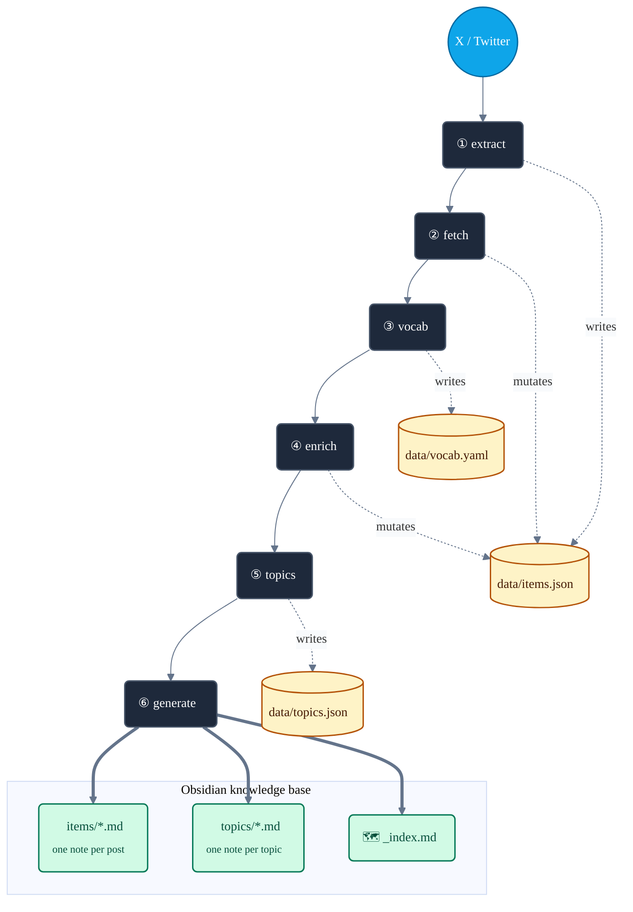
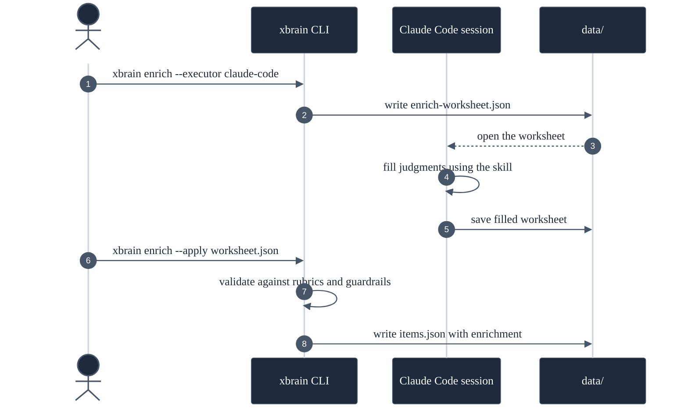
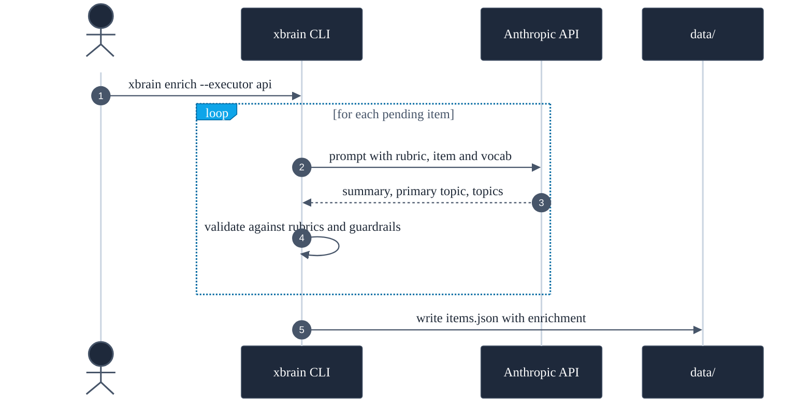
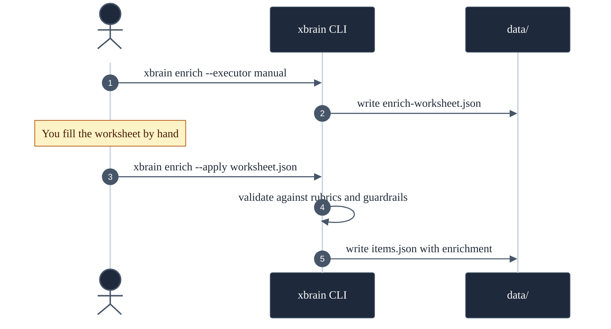

# XBrain (`xbrain`)


> Your X bookmarks and posts, turned into a second brain.

You bookmark a sharp thread, a research paper, a tool someone shipped over the
weekend — and a small part of your brain checks a box: *handled, I have that
now.* Then you never see it again. A bookmark folder is not a library; it is a
graveyard with good intentions.

XBrain digs it up. It extracts your X bookmarks and your own posts, stores them
as structured JSON, and generates a layered, cross-linked Obsidian wiki you can
actually navigate, search and think with — in the same vault, the same graph,
as the notes you already keep.

It runs locally. The LLM work needs **no paid API** — a Claude Code session does
it through a worksheet hand-off (see [Execution modes](#execution-modes)).

---

## Table of contents

- [Why XBrain](#why-xbrain)
- [What you get](#what-you-get)
- [Quick start](#quick-start)
- [Prerequisites](#prerequisites)
- [Installation](#installation)
- [Authentication](#authentication)
- [Configuration](#configuration)
- [The pipeline](#the-pipeline)
- [Commands](#commands)
- [Execution modes](#execution-modes)
- [Snapshots & safety](#snapshots--safety)
- [How it works](#how-it-works)
- [Project structure](#project-structure)
- [Development](#development)
- [Responsible use](#responsible-use)
- [Documentation](#documentation)

---

## Why XBrain

A personal knowledge base — a "second brain" — captures everything you
**produce**: your notes, your drafts, your decisions.

But it is worthless if it does not capture what you **consume** — the articles
you read, the threads you save, the posts you write on a platform that is not
your vault. That gap is real, and it is shaped exactly like everything you found
worth keeping.

Months of bookmarks are not noise. Every one was a decision that *this is worth
coming back to* — a quiet, honest signal about what you care about and how your
thinking moves. Left inside X, that signal is just a pile you walk away from.
XBrain pulls the consumption side of your brain into the same place as the
production side, so your bookmarks and your notes finally link to each other.

**Who it is for** — anyone who uses X as a feed of things worth keeping and
already thinks in a tool like Obsidian. If you have a bookmark graveyard of your
own, you already have the raw material.

---

## What you get

A **three-layer wiki** inside your Obsidian vault. Each layer is denser than the
one below it — read top-down for the map, or bottom-up for a single post.

All three layers are markdown notes inside a single Obsidian vault, under
`learnings/x-knowledge/`. Each layer is denser than the one below it: many
posts → fewer topics → one index.

**Example layout — three notes side by side, as they appear in the vault:**

<table>
<tr>
<th align="center" width="33%">📄 Items</th>
<th align="center" width="33%">📑 Topics</th>
<th align="center" width="34%">🗺️ Index</th>
</tr>
<tr>
<td align="center"><sub>one per saved post · scales with your X corpus</sub></td>
<td align="center"><sub>one per topic · ~30 by default (configurable)</sub></td>
<td align="center"><sub>one note · the map</sub></td>
</tr>
<tr>
<td valign="top">

```text
┌──────────────────┐
│ Code Is Cheap... │
│                  │
│ @codestirring    │
│ tags: ai-coding  │
│                  │
│ ▸ Summary        │
│ ▸ Tweet text     │
│ ▸ Linked article │
│   (fetched in    │
│    full)         │
│                  │
│ Topics:          │
│  [[ai-coding]]   │
│  [[software-..]] │
└──────────────────┘
```

</td>
<td valign="top">

```text
┌──────────────────┐
│ ai-coding (299)  │
│                  │
│ ▸ Overview       │
│   "The arc from  │
│    vibe coding   │
│    to agent      │
│    orchestration │
│    over 16 mo."  │
│                  │
│ ▸ Primary (103)  │
│   - [[post 1]]   │
│   - [[post 2]]   │
│                  │
│ ▸ Also relevant  │
│   (196)          │
└──────────────────┘
```

</td>
<td valign="top">

```text
┌──────────────────┐
│ XBrain           │
│                  │
│ ▸ Summary        │
│   1884 items     │
│   1123 bookmarks │
│   761 own tweets │
│                  │
│ ▸ Topics         │
│   [[ai-coding]]  │
│         (299)    │
│   [[ai-industry]]│
│         (225)    │
│   ...            │
└──────────────────┘
```

</td>
</tr>
<tr>
<td valign="top"><sub>The original post, the linked article fetched and stored inline, an LLM summary, and the topics it belongs to.</sub></td>
<td valign="top"><sub>A synthesised essay across every post in this theme — where your thinking started, how it moved — plus links back to every post.</sub></td>
<td valign="top"><sub>Every topic ranked by size, links to everything. Open this first.</sub></td>
</tr>
</table>

### Layer 1 — Items

One note per bookmark or own-tweet: the original text, the link, the **linked
article fetched and stored inline**, an LLM summary and its topics. A saved link
stops being a URL that will quietly rot and becomes a saved *article*. This now
includes an X long-form **Article you bookmarked directly** (not just one linked
inside a tweet): `extract` detects the Article and threads it into the same fetch
pipeline as any other x.com link. `fetch` then captures the Article as a
**structured, ordered body** — its paragraphs and inline images in the order the
author wrote them; if that structured capture can't be read, it **falls back to
text-only** extraction (no images), exactly as before. [`media`](#commands) then
**downloads those inline images** locally alongside the item's own photos (under
`data/media/<id>/article/`), and [`generate`](#commands) **renders the Article as
a blogpost** — the body prose with its inline images embedded in the author's
order (the text-only fallback still renders the article text).

A **bookmarked video** gets the same treatment: run [`digest-video`](#commands)
and its transcript is attached to the item, so the video flows through the *same*
`enrich → topics → generate` pipeline as an article. The note gains a real
`primary_topic` (video items used to show `—`, because enrich only ever saw the
2-line tweet), appears on its topic page(s), and renders a **`## Video digest`**
section with the talk's title and transcript — a 72-minute talk you never watched
becomes a readable, searchable, topic-linked note. A silent/no-speech clip
degrades gracefully to a one-line "silent video" note instead of an empty digest.

For **slide/screen/demo-heavy** talks, add the opt-in `--frames` flag: xbrain
extracts the key slides, describes each with an **external** vision model, and
embeds them into the digest section next to the transcript — so the visual
content is captured too, not just the audio. It is content-aware: an interview /
talking-head video is detected and its (camera-cut) frames are skipped, so you
never waste vision calls where the slides are noise.

*Example:*

```markdown
---
id: "2010040815176085621"
source: bookmark
author: codestirring
tags: [x-knowledge, ai-coding, software-engineering, ai-economy]
---

# Code Is Cheap Now. Software Isn't.

Links an article arguing that code itself has become cheap but software has
not: Claude Code and Opus 4.5 democratise software creation and open the era
of personal, throwaway software...

**Topics:** [[ai-coding]] · [[software-engineering]] · [[ai-economy]]

## Tweet
Code Is Cheap Now. Software Isn't.  https://t.co/J9m5RzQNbW

## Content: Code Is Cheap Now. Software Isn't.
<the full text of the linked article, fetched and stored inline>
```

Everything above the `xbrain:generated` marker is regenerated on every run;
anything *you* write below it is preserved.

> Set `[output] topic_style = "hashtag"` in `config.toml` to render the
> in-body `**Topics:**` line as `#ai-coding #software-engineering` instead of
> wikilinks — useful if you navigate primarily via Obsidian's tag pane. The
> frontmatter `tags:` are native Obsidian tags in either mode.

### Layer 2 — Topics

The layer that makes XBrain more than a tidy backup. **A topic page is not a
list of links — it is an essay.** XBrain reads every post filed under a theme
and writes one synthesis: where the thinking started, how it moved, what it kept
circling back to. Then it lists the posts — the ones the topic is *about*
(primary), and the ones that merely touch it (also-relevant).

*Example:*

```markdown
---
topic: ai-coding
posts: 299
primary_posts: 103
---

# ai-coding

> Building software with AI: vibe coding, the shift in how code gets written,
> and AI as a pair-programmer.

## Overview

The largest topic in the corpus, narrating — almost month by month — how the
craft of programming has been transformed under the pressure of AI. The arc
is sharp: from autocomplete and vibe coding in 2025 to agentic engineering
in 2026...

## Key notes
- ...

## Primary posts (103)
- `2026-01-10` · @codestirring · [[items/...|Code Is Cheap Now. Software Isn't.]]

## Also relevant (196)
- ...
```

The overview is plain prose — the LLM writes the synthesis, the *code* writes
every link (see [How it works](#how-it-works)), so regenerating never breaks one.

### Layer 3 — Index

`_index.md` is the map — the corpus counts and every topic ranked by size.
`log.md` is the full chronology.

*Example:*

```markdown
# XBrain

## Summary
- Total items: 1884
- Bookmarks: 1123 · Own tweets: 761
- Enriched: 1884

## Topics
- [[ai-coding]] (299)
- [[ai-industry]] (225)
- [[ai-and-work]] (220)
  ...
```

The markdown is **derived and disposable** — regenerate it any time. The source
of truth is `data/items.json`.

> The examples above are shown in English for clarity. Today the output language
> (summaries, overviews, section headers like "Topics" / "Content") is fixed by
> the rubrics in `src/xbrain/rubrics/` — Spanish on the live system; a config
> parameter to switch languages is on the roadmap ([#16](https://github.com/VGonPa/xbrain/issues/16)).

---

## Quick start

```bash
# 1. Install
uv venv
uv pip install -e ".[dev]" --index-url https://pypi.org/simple
uv run playwright install chromium

# 2. Configure
cp config.toml.example config.toml      # then edit: vault path + X handle

# 3. Authenticate (log in to X in Chrome first)
uv pip install browser-cookie3 --index-url https://pypi.org/simple
.venv/bin/python scripts/import_chrome_session.py
# → "auth_token: OK"  means you are ready

# 4. Build the wiki
uv run xbrain sync       # extract + fetch + generate
uv run xbrain status     # see the counts
```

`sync` builds the mechanical layers. The LLM layers (`vocab`, `enrich`,
`topics`) are run explicitly — see [The pipeline](#the-pipeline).

> **New to XBrain?** The [**Tutorial**](docs/tutorial.md) walks through the whole
> thing end-to-end — pull your posts, add topics, download + describe media, and
> digest a bookmarked talk — with the output you should see at each step.

---

## Prerequisites

| Requirement | Version | Notes |
|-------------|---------|-------|
| Python | 3.12+ | |
| [`uv`](https://docs.astral.sh/uv/) | latest | Package manager and runner. |
| Chromium | — | Installed via `uv run playwright install chromium`. |
| An Obsidian vault | — | Or any folder — XBrain just writes markdown. |
| An X account | — | Yours. XBrain reads *your* bookmarks and tweets. |
| `ANTHROPIC_API_KEY` | — | **Optional.** Only for the `api` execution mode. |
| `FIRECRAWL_API_KEY` | — | **Optional.** Fallback fetcher for JavaScript-heavy pages. |
| ffmpeg, `parakeet-mlx`, `mlx-vlm` | — | **Optional — only for `digest-video`** (video → transcript/slide digests). External, not pulled by `uv pip install`. See [Local models for `digest-video`](#local-models-for-digest-video-apple-silicon). |

Neither API key is required: the default execution mode uses a Claude Code
session and costs nothing.

---

## Installation

```bash
uv venv
uv pip install -e ".[dev]" --index-url https://pypi.org/simple
uv run playwright install chromium
```

The `[dev]` extra also installs the quality-gate tools (`poe`, `ruff`, `mypy`
and the rest). `--index-url https://pypi.org/simple` is only needed if your
machine has a private package index configured.

---

## Authentication

XBrain needs a logged-in X session, stored at `auth/storage_state.json` (Playwright
format, git-ignored). The reliable path is **importing cookies from a browser you
are already logged in to** — pick the one that matches your browser:

```bash
uv pip install browser-cookie3 --index-url https://pypi.org/simple

# You use Chrome — log in to x.com in Chrome, then:
.venv/bin/python scripts/import_chrome_session.py

# You use Safari — log in to x.com in Safari, then grant your terminal
# "Full Disk Access" (System Settings → Privacy & Security), then:
.venv/bin/python scripts/import_safari_session.py
```

A successful import prints `auth_token: OK`. Re-run it whenever the session
expires (X sessions are short-lived).

> `xbrain login` (an in-app Playwright login) also exists, but it is unreliable
> with accounts that sign in through Google/SSO — Google blocks the automated
> browser. The cookie import is the recommended path.

---

## Configuration

Copy `config.toml.example` to `config.toml` (git-ignored) and edit:

```toml
[paths]
vault = "/absolute/path/to/your/obsidian/vault"
output_subdir = "learnings/x-knowledge"   # wiki folder, relative to the vault
data_dir = "data"                         # JSON store, relative to the repo

[x]
handle = "your_handle"                    # without the @

[enrich]
executor = "claude-code"                  # claude-code | api | manual
model = "claude-haiku-4-5-20251001"        # used only by the `api` executor

[vocab]
target_count = 45                         # how many topics to induce

[topics]
resynth_threshold = 25                    # re-synthesise an overview after N new posts

[output]
language = "English"                      # English | Spanish
topic_style = "wikilink"                  # wikilink | hashtag (in-body Topics: line)

[transcribe]
command = "parakeet-mlx"                  # external transcriber for `digest-video`
# model = "parakeet-tdt-0.6b-v2"          # optional; omit for the tool default

[vision]
# command = "vlm-describe"                # external vision model for `digest-video --frames`
# model = "qwen2-vl-7b"                   # optional; omit for the tool default
```

| Section | Key | Default | Purpose |
|---------|-----|---------|---------|
| `[paths]` | `vault` | — | Absolute path to your Obsidian vault. |
| `[paths]` | `output_subdir` | — | Wiki folder inside the vault. |
| `[paths]` | `data_dir` | — | JSON store, relative to the repo. |
| `[x]` | `handle` | — | Your X handle, no `@`. |
| `[enrich]` | `executor` | `claude-code` | Default [execution mode](#execution-modes) for the LLM stages. |
| `[enrich]` | `model` | `claude-haiku-4-5` | Model for the `api` executor. |
| `[vocab]` | `target_count` | `30` | Number of topics the `vocab` stage induces. |
| `[topics]` | `resynth_threshold` | `25` | Post growth that marks a topic overview stale. |
| `[output]` | `language` | `English` | Output language for LLM summaries/overviews AND wiki section headers. `English` or `Spanish`. |
| `[output]` | `topic_style` | `wikilink` | How the in-body `**Topics:**` line is rendered: `wikilink` (`[[slug]] · [[slug]]`) or `hashtag` (`#slug #slug`). Frontmatter `tags:` are unaffected. |
| `[describe]` | `model` | `claude-sonnet-4-6` | Vision model for `xbrain describe`. Override per run with `--model`. |
| `[describe]` | `version` | `v1` | Tag persisted on every described photo. Bumping invalidates existing descriptions so the next `xbrain describe` re-describes stale entries. |
| `[transcribe]` | `command` | `parakeet-mlx` | External transcriber `xbrain digest-video` shells out to (the ASR lives outside xbrain core). May be a multi-token wrapper; whisper / faster-whisper is the portable fallback. |
| `[transcribe]` | `model` | — | Optional model id passed to the transcriber (`--model`). Omit for the tool default. |
| `[vision]` | `command` | — (unset) | External vision model `xbrain digest-video --frames` shells out to (describes key-frame slides; lives outside xbrain core). No bundled default — `--frames` errors until it is set. May be a multi-token wrapper. |
| `[vision]` | `model` | — | Optional model id passed to the vision command (`--model`). Omit for the tool default. |

Switching `[output].language` after the corpus is already enriched is supported
— but does not retroactively translate existing summaries. To convert the
whole corpus to the new language, run `xbrain vocab --regenerate` (it clears
every enrichment; the next `xbrain enrich` re-enriches in the new language) and
`xbrain topics --resynth` (both auto-snapshotted, see
[Snapshots & safety](#snapshots--safety)). Otherwise new items get the new
language while old summaries stay as they were.

Secrets (`ANTHROPIC_API_KEY`, `FIRECRAWL_API_KEY`) live in the **environment
only** — never in `config.toml`, never in the repo.

### Local models for `digest-video` (Apple Silicon)

`digest-video` shells out to external tools — xbrain core carries no ML or ffmpeg
dependency. None of this is needed unless you run `digest-video`. On an
Apple-Silicon Mac:

```bash
# 1. ffmpeg — frame extraction (--frames) + the transcribe wrapper's audio probe.
brew install ffmpeg                    # gives ffmpeg + ffprobe on your PATH

# 2. ASR (always needed for digest-video) — Parakeet TDT via mlx, isolated tool:
uv tool install parakeet-mlx           # gives `parakeet-mlx` on your PATH

# 3. Vision (only for --frames) — mlx-vlm powers the local backend of the selector:
uv tool install mlx-vlm

# 4. Point config.toml at the wrappers (absolute paths survive any PATH):
#    [transcribe]
#    command = "/path/to/xbrain/scripts/xbrain-transcribe"   # wraps parakeet-mlx
#    [vision]
#    command = "/path/to/xbrain/scripts/xbrain-vision"
#    model   = "qwen-7b"
```

Models download on first use and cache under `~/.cache/huggingface`: the ASR
model (`parakeet-tdt-0.6b`, ~600 MB) and, for `--frames`, the vision model you
select (`qwen-7b` ≈ 5 GB; `qwen-3b` ≈ 2 GB; `qwen-32b` ≈ 18 GB — needs ~20 GB
RAM). Pre-pull a large vision model once before a `--frames` run so the first
frame doesn't hit the per-frame timeout. Cloud vision (`--vision-model opus`)
needs only `ANTHROPIC_API_KEY`, no local install.

**Transcriber wrapper — `scripts/xbrain-transcribe`.** Points `[transcribe]` at a
thin parakeet-mlx wrapper: parakeet writes no file for a video with **no audio
track** (silent clips, GIFs, muted screencasts), which xbrain would otherwise
count as a failure. The wrapper checks with `ffprobe` and emits the empty-speech
JSON so such videos attach as `has_speech=false` ("silent video"), while a real
parakeet failure on an audio-bearing file still surfaces. You can point
`[transcribe].command` straight at `parakeet-mlx` if you don't need this.

**Vision model selector — `scripts/xbrain-vision`.** One `[vision].command`
serves both local and cloud models; the `--model` name is routed by a registry:

| Name | Backend | Runs on | Cost / privacy |
|------|---------|---------|----------------|
| `qwen-3b` (default), `qwen-7b`, `qwen-32b`, or any `hf/repo` | local (mlx-vlm) | your Mac's Neural Engine/GPU | free, fully offline |
| `opus`, `sonnet`, `haiku`, or any `claude-<id>` | cloud (Anthropic REST, stdlib — no SDK) | Anthropic API | needs `ANTHROPIC_API_KEY`; frames leave the machine |

Pick per run without editing config:

```bash
xbrain digest-video --all-pending --frames                       # default (qwen-3b, local)
xbrain digest-video --ids <slide-heavy-id> --frames --vision-model opus   # cloud, top quality
xbrain digest-video --topic ai-coding --frames --vision-model qwen-7b     # better local
```

`--vision-model` overrides `[vision].model` for that run only (and requires
`--frames`). Local mlx models download once and cache; the **local** backend
reads `XBRAIN_VISION_MLX_PYTHON` only if mlx-vlm is not at the uv-tool default
(`~/.local/share/uv/tools/mlx-vlm`). Pre-pull a **large** local model once before
a `--frames` run — a cold `qwen-32b` (~18 GB) download can exceed the 300 s
per-frame vision timeout and fail the first run (a re-run uses the cache).

---

## The pipeline

Six stages. `data/items.json` is the hub — every stage reads it, enriches it,
and writes it back. The wiki is generated from it at the end.



Six stages, top to bottom. The chain on the left is the order of execution;
the cylinders on the right are the `data/` files each stage writes; the box
at the bottom is what ends up inside your Obsidian vault — three kinds of
plain markdown notes.

- **`data/items.json`** is the hub. Three stages mutate it (`extract`,
  `fetch`, `enrich`); every later stage reads it.
- **`data/vocab.yaml`** is the closed taxonomy. Read by `enrich` (to assign
  topics from it), `topics` (to know which pages to synthesise) and
  `generate` (for the tags).
- **`data/topics.json`** is the synthesised topic overviews. Read by
  `generate`.

`⑥ generate` is the only stage that writes into the vault. It turns
`items.json` into `items/*.md`, `topics.json` into `topics/*.md`, and writes
the `_index.md`. Delete the whole vault and `xbrain generate` rebuilds it
bit-for-bit from `data/`.

| # | Stage | Mechanical / LLM | Writes to | What it does |
|---|-------|------------------|-----------|--------------|
| ① | `extract` | mechanical | `items.json` + `state.json` | Pulls new bookmarks + own tweets from X (incremental — stops at known ids). |
| ② | `fetch` | mechanical | `items.json` | Downloads linked article bodies, expands threads, fetches linked X content. Records structured evidence for broken links. |
| ③ | `vocab` | **LLM** | `vocab.yaml` | Induces the controlled topic taxonomy from the whole corpus. |
| ④ | `enrich` | **LLM** | `items.json` | Per item: a summary + a primary topic + 1-4 topics, all from the taxonomy. |
| ⑤ | `topics` | **LLM** | `topics.json` | Synthesises each topic page's overview; builds the mechanical post lists. |
| ⑥ | `generate` | mechanical | the Obsidian vault | Renders the three-layer wiki: `items/*.md`, `topics/*.md`, `_index.md`. |

Every stage is **idempotent and incremental** — re-running it only processes
what is new. `vocab --regenerate` is the deliberate exception: it re-induces the
taxonomy and marks every item for re-enrichment.

A typical full run:

```bash
uv run xbrain extract
uv run xbrain fetch
uv run xbrain vocab          # → fill the worksheet → xbrain vocab --apply
uv run xbrain enrich         # → fill the worksheet → xbrain enrich --apply
uv run xbrain topics         # → fill the worksheet → xbrain topics --apply
uv run xbrain generate
```

---

## Commands

```bash
uv run xbrain <command> [options]
```

| Command | Description |
|---------|-------------|
| `extract` | Extract bookmarks and/or own tweets from X. `--source bookmarks\|tweets\|all`. |
| `import-archive <zip>` | Backfill the full own-tweet history from the official X data archive. |
| `fetch` | Download linked article content, expand threads, fetch linked X content. By default, items whose only previous failures were transient (`timeout`, `dns_error`) are re-fetched automatically; terminal failures (`not_found`, `paywall`, `forbidden`, `js_required`, `empty_content`) stay skipped until `--force`. `--force` re-fetches every external_article source regardless of state. |
| `media` | Download X-post photos referenced in `Item.media` **and the inline images of a bookmarked X Article** (stored under `data/media/<id>/article/<n>`, separate from the item's own photos), reusing the one photo-download engine for both. `--limit` is a combined budget; the SUMMARY reports article images separately. Item photos and the downloaded Article images both render inline in the wiki — `generate` embeds each Article image in the author's order (see the blogpost render). `--force`, `--limit N`, `--items <a,b,c>`, `--verbose`. See [Local media storage](#local-media-storage). |
| `describe` | Describe downloaded photos with a vision LLM (Claude Sonnet 4.6 by default) and feed the prose into `enrich` + `topics`. `--force`, `--limit N`, `--items <a,b,c>`, `--model`, `--batch-size`, `--verbose`. Idempotent — re-runs skip already-described photos unless `[describe].version` is bumped in `config.toml`. |
| `refresh-media` | Re-capture X and backfill the **playable video URL + bitrate + duration** onto items whose video is still poster-era (incremental `extract` + non-overwriting merge never refresh existing videos). Video-only — photos and enrichment/description state are preserved, and a good video is never degraded back to its poster if X drifts. Scrolls the full history (slow); destructive → auto-snapshot; prints a download-size estimate. Does **not** download video (that is `download-videos`). Re-seeing 0 known items on a non-empty store (likely expired session / GraphQL drift) aborts without saving unless `--force`. `--source bookmarks\|tweets\|all`, `--force`. |
| `download-videos` | Download the actual **mp4 bytes** for backfilled videos and embed them inline in the wiki — the video counterpart to `media`. mp4 only: HLS (`.m3u8`) needs ffmpeg and is a deferred follow-up (skipped + counted); poster-era entries (run `refresh-media` first) are skipped too. Prints a `~X.X GB` size estimate and asks for confirmation **unless `--yes`**. `--max-size 500MB\|2GB` skips videos whose estimated size exceeds the cap. Validates the response is really a video (rejects HTML/JSON interstitials served as 200). Destructive → auto-snapshot; idempotent (re-runs skip downloaded videos unless `--force`). `--source bookmarks\|tweets\|all`, `--limit N`, `--items <a,b,c>`, `--max-size <size>`, `--force`, `--yes`. See [Local media storage](#local-media-storage). |
| `list-videos` | **Read-only** catalog of every video referenced in `items.json` — one row per video entry with its state (`downloaded` / `failed` / `pending` / `poster-era`), estimated size (exact once downloaded, `unknown` without bitrate/duration), the item's `primary_topic` and a text snippet. Filters: `--topic`, `--status`, `--max-size`, `--source`, `--limit`. Human table by default; `--json` emits a stable machine array (`id, url, state, topic, size_bytes\|null, mp4_url, text`) an agent can parse to choose which videos to fetch. Writes nothing, takes no snapshot. |
| `fetch-video` | **Ephemeral** download of the real mp4 for selected videos to `--to <dir>/<id>.mp4`, for agent-side processing (transcription/analysis is external — see below). Select with `--ids a,b` and/or `--topic <t>` (+ `--max-size`, `--limit`, `--source`). Reuses `download-videos`' content-validation, failure classification, atomic write and mp4/HLS/poster discriminator; HLS and poster-era are skipped + counted. **Deliberately non-persisting:** never mutates `items.json`, never snapshots, never touches `data/media/` — it writes only under `--to`. `--json` for machine output. |
| `digest-video` | Turn bookmarked videos into text: **ephemeral** fetch → **external** transcriber (`[transcribe].command`, default `parakeet-mlx` — the ASR is *not* bundled in xbrain) → attach the transcript to the item as an `x_video` content source → discard the bytes. **Dedups by video identity** (the stable `amplify_video`/`ext_tw_video`/`tweet_video` id from the mp4 path, not the signed URL): N bookmarks of one video → **one** fetch+transcribe, every item gets the transcript. No-speech / no-audio videos attach with empty text + `has_speech=false` (never a hard failure). Idempotent — skips items already carrying an `x_video` source unless `--force`. Destructive (rewrites `items.json`) → auto-snapshot. Select with `--ids a,b`, `--topic <t>`, or `--all-pending` (+ `--source`, `--limit`, `--language`). **`--frames`** (opt-in visual layer, needs `[vision].command`): for slide-heavy videos it extracts key slides (ffmpeg scene detection + interval sampling so the whole video is covered), describes each via the **external** vision model, records the descriptions on the `x_video` source, and embeds the slide images into the note like downloaded photos; talking-head videos are detected and skipped (logged). The transcript then flows through the normal `enrich → topics → generate` pipeline. |
| `vocab` | Induce the topic taxonomy. `--executor`, `--apply <file>`, `--regenerate`. |
| `enrich` | Enrich items with a summary + topics. `--executor`, `--apply <file>`. |
| `topics` | Synthesise topic pages. `--executor`, `--apply <file>`, `--resynth`. |
| `verify` | **Semantic verification** of the generated enrichment (an LLM-as-judge ensemble, mirroring `cv-guardrail`): scores each `summary` / `digest` / `topics` output for **faithfulness** (does it invent facts/numbers the source does not support?) and **rubric-adherence**, emitting a per-output verdict **PASS / REVIEW / FAIL** + cited flags (each tagged with its `axis`). **Report-only by default** — writes `data/verify-report.{json,md}`, worst-first, and never mutates the store. **Opt-in `--write-verdicts`** (valid only alongside `--apply`) additionally persists each verdict onto its item as a `VerificationVerdict` (keyed by target) together with a **sha256 fingerprint of the exact judged output** + `verified_at`, so `generate` can badge it. The fingerprint is **stamped at worksheet export** and threaded through the filled worksheet to the writer — never a recompute against the live store — so a regeneration in the export→judge→write window can't bind a verdict to output it never judged. This mutates `items.json`, auto-snapshots `data/` first (label `pre-verify-write-verdicts`), and echoes a written/skipped tally (a dropped verdict is never silent). Keyless worksheet flow: `xbrain verify --target summary\|digest\|topics\|all` exports a worksheet → copy it once per judge, fill `judgments` → `xbrain verify --apply ws1.json --apply ws2.json …` aggregates (worst-faithfulness wins, divergence flagged) into the report. **`--audit`** runs the judge≠party second pass over ONLY the consequential (FAIL/divergent) verdicts: `xbrain verify --audit` exports an audit worksheet (source + output + the judges' flags) for a single independent auditor to CONFIRM/REVOKE each flag with a `confidence` (0–1) and cited `reason`; `xbrain verify --audit --apply audit.json` merges it back and **deterministically re-verdicts** under one invariant — *a verdict lowers only when the specific cited evidence that produced it is explicitly revoked; guards only escalate*. Three code-enforced backstops: a **confidence gate** (a REVOKE applies only at `confidence ≥ 0.7`, else it is kept and surfaced), **axis scoping** (revoking an adherence note never clears a faithfulness FAIL), and a **mass-revocation guard** (if one run would clear a suspiciously high share of the FAILs, all such revocations are suppressed and kept FAIL). So a confirmed flag keeps the FAIL, an all-faithfulness-flags-revoked record drops to REVIEW (or PASS if no adherence issue remains), an added confirmed flag re-establishes a FAIL the auditor tried to clear, and a divergent tie is resolved by the auditor — with an `## Audit` report section listing every washed/gated/unmatched decision (and any invariant anomaly). The audit is a **single pass** over the full consequential set: a second `--audit --apply` on an already-audited report is refused (it would let split revocations bypass the mass-revocation guard) unless `--force`. `--executor manual\|claude-code`. |
| `generate` | Render the wiki into the vault. Renders a localized **verification badge** (❌ FAIL / ⚠️ REVIEW; a PASS is left unbadged) under a summary / topics / video-digest **only when its stored verdict is still current** — it recomputes the sha256 fingerprint of the item's current output and badges only on a match, silently skipping a **stale** verdict (the output was re-generated since it was judged). So a FAIL whose output was fixed afterwards never shows a ❌. |
| `sync` | `extract` + `fetch` + `generate`, in order. |
| `status` | Counts and last-run timestamps. |
| `snapshot` | Manage `data/` snapshots: `create`, `list`, `show`, `restore`, `prune`. See [Snapshots & safety](#snapshots--safety). |
| `diff` | Compare two snapshots (or one snapshot vs. the live `data/`). Surfaces reassigned items, topic growth, overview drift, vocab changes. `--format text\|json`. |
| `login` | Open a browser to log in to X (see [Authentication](#authentication) — prefer the cookie import). |

Every stage accepts `--since` / `--until` (ISO dates) to narrow the date window.
The window is inclusive at both ends: a date-only `--until 2025-12-31` covers the
whole of Dec 31 (up to `23:59:59.999999` UTC). Pass an explicit time
(`--until 2025-12-31T09:00:00`) to cut off mid-day instead.
Run `uv run xbrain <command> --help` for the full option list.

---

## Local media storage

`xbrain media` downloads X-post photos **and the inline images of a
bookmarked X Article** and persists the bytes locally. Item photos are then
shown inline in the generated wiki; the downloaded Article images are embedded
in the note by `generate`, in the author's order, as a blogpost.

**Layout**

```
data/
└── media/
    ├── 1234567890/        # one directory per item id
    │   ├── 0.jpg          # one file per photo, indexed by media position
    │   ├── 1.jpg
    │   ├── 2.png
    │   └── article/       # inline images of an X Article (#39), namespaced
    │       ├── 0.jpg      #   so they never collide with the item's photos
    │       └── 1.png
    └── ...
```

Item photos are stored under `data/media/<item-id>/<index>.<ext>` and Article
inline images under `data/media/<item-id>/article/<n>.<ext>` (both via the
same download engine); the extension matches the format the X CDN sent us
(`.jpg`, `.png`, or `.webp`). `data/` is gitignored — the bytes never enter
the repo.

**Vault rendering**

`xbrain generate` mirrors each downloaded photo from `data/media/` into
`<vault>/<output_subdir>/_media/<item-id>/<index>.<ext>` at render time
and emits Obsidian wikilink embeds (`![[_media/<id>/<n>.<ext>]]`) so the
vault is fully self-contained. No symlinks, no Obsidian config needed.

**Disk budget (approximate)**

X serves `name=orig` JPEGs typically in the 1-2 MP range, averaging
~300 KB per photo on our corpora. A library of ~2,000 items with roughly
one photo per item lands in the ballpark of 300-500 MB on disk —
comfortably within personal-machine scale. Use `--limit N` to throttle
the first backfill.

**Throttling**

The downloader sleeps 0.5 s between requests by default and uses a
browser-style User-Agent. pbs.twimg.com tolerates that pattern; bursting
from a fresh IP earns a 429.

**Failure handling**

Failures are categorised on the item itself
(`MediaPhotoFailed.failure_reason`):
- `http_4xx`, `format_error` — permanent; only `--force` retries.
- `http_5xx`, `timeout`, `unknown_error` — transient; auto-retried on
  the next `xbrain media` run.

Run `xbrain diff <snapshot>` after a media run to see how many photos
moved from `pending` / `failed` into `downloaded` (or, after `xbrain
describe`, into `described`).

**Vision descriptions**

Once `xbrain media` has the bytes on disk, `xbrain describe` runs every
photo through Claude vision and stores a short prose description on
the entry (transitioning `MediaPhotoDownloaded` → `MediaPhotoDescribed`).
Descriptions are 1-3 sentences, faithful, in the configured
`output_language`. Decorative photos (avatars, reaction memes,
abstract backgrounds) are classified as such and persisted with an
empty description so they introduce no topic noise downstream.

`xbrain enrich` and `xbrain topics` consume the descriptions
automatically, on **both** the API and the worksheet (`claude-code` /
`manual`) tracks: an item with content-bearing photos gets an
`Images in this post:` block in the API enrichment prompt and an
`image_descriptions` field in the worksheet; topic-page synthesis sees
the flat list of content image descriptions across the topic's posts on
either track. This is how a tweet that is mostly a screenshot of a
paper becomes searchable by what the screenshot was actually about —
even when the pipeline runs entirely on the Claude Code subscription.

These descriptions flow whenever `enrich` / `topics` next run for an
item. To back-fill items that were already enriched *before* the
describe pass (a one-time LLM cost), force the re-run: `xbrain vocab
--regenerate` (clears enrichments) then `xbrain enrich`, and `xbrain
topics --resynth`.

Describing the full corpus costs about $3-5 with the default model
(Sonnet 4.6, 5 images per call). Bump `[describe].version` in
`config.toml` to invalidate stored descriptions when you change the
rubric — the next `xbrain describe` run re-describes stale entries
automatically without `--force`.

**Video media**

A video entry carries the playable stream URL, the poster `thumbnail_url`, and
the chosen `bitrate` + `duration_millis` (so a download can estimate size
without fetching a byte). Getting a video's bytes onto disk is two steps:
`refresh-media` backfills the playable URL onto poster-era records, then
`download-videos` fetches the mp4 bytes.

Because `extract` is incremental and the store merge never overwrites,
videos captured before the playable-stream capability landed are
**poster-era**: their stored URL is the poster image and the bitrate /
duration are blank. They are never refreshed by a normal `xbrain extract`.
`xbrain refresh-media` is the backfill: it re-captures the full X history,
swaps each poster-era video entry for the freshly-parsed one (playable URL
+ bitrate + duration) **in place**, and leaves photos and enrichment
untouched. It only upgrades — if X has drifted and serves no usable stream
(a poster fallback), the existing record is kept, so a re-run never degrades
a good video back to its poster. It auto-snapshots `data/` first
(destructive) and prints a download-size estimate (`~X.X GB across N videos;
M with unknown size`) so you can size the video download.

If a run re-sees **0** known items against a non-empty store — the symptom of
an expired X session or a GraphQL parser drift, where the capture comes back
empty without raising — `refresh-media` treats that as a failed run: it warns
and aborts **without saving** (nothing was matched, so `data/` is untouched
and the pre-snapshot already exists). Pass `--force` to save anyway.

```bash
xbrain refresh-media                      # backfill bookmarks + own tweets
xbrain refresh-media --source bookmarks   # bookmarks only
xbrain refresh-media --force              # save even if 0 known items re-seen
```

**Downloading video**

Once `refresh-media` has populated the playable URLs, `xbrain download-videos`
fetches the actual bytes — the video counterpart to `xbrain media` for photos.
It downloads **mp4 only** this stage: a real progressive mp4 stream advances
`video_pending → video_downloaded` (bytes under `data/media/<id>/<n>.mp4`,
embedded as `![[_media/<id>/<n>.mp4]]` in the note, which Obsidian renders as an
inline player) or `video_failed` (categorised, with the same transient-retry
contract as `media`). HLS (`.m3u8`) manifests need ffmpeg to mux into a playable
file — they are **skipped and counted**, deferred to a follow-up. Poster-era
entries (not yet backfilled) are skipped too; run `refresh-media` first.

Video files are large, so `download-videos` prints a **size gate** before
fetching — e.g. `About to download ~1.2 GB across 8 videos (3 HLS skipped, 1
already downloaded).` — and asks for confirmation. Pass `--yes` to skip the
prompt (non-interactive runs). For a per-video cap, `--max-size` skips any video
whose **estimated** size exceeds it (accepts `500MB` / `2GB`; a bare number is
MB). With a cap set, videos of unknown size (no bitrate/duration) can't be
verified under it and are skipped too — without the cap they download normally.
The size estimate and the "N videos / ~X GB" line always reflect only the
under-cap set you're about to fetch.

Because a 200 status isn't trust — a CDN/captcha/auth-wall page can come back as
200 with an HTML or JSON body — the downloaded bytes are validated (a `video/*`
content-type or an mp4 `ftyp` signature; a body that starts with HTML/JSON markup
is rejected even under a `video/*` header) before being written. A non-video
response is recorded as a **transient** failure (no corrupt `.mp4` is written) so
the next run retries automatically once the rate-limit or session clears. A
mid-download connection drop or an out-of-memory body is likewise recorded and
the batch continues — one bad video never aborts the whole run.

The run is idempotent (already-downloaded videos are skipped unless `--force`),
auto-snapshots `data/` first (destructive), and a Ctrl-C between videos leaves
`items.json` coherent.

```bash
xbrain download-videos                     # size gate + confirm, then download
xbrain download-videos --yes               # non-interactive (CI / scripts)
xbrain download-videos --max-size 500MB    # skip videos estimated over 500 MB
xbrain download-videos --source bookmarks  # bookmarks only
xbrain download-videos --limit 5 --items 123,456   # scope the run
xbrain download-videos --force             # re-download + retry permanent failures
```

**Selecting and fetching video for agent-side processing**

`download-videos` keeps the mp4 in the store (`data/media/`) to embed inline. But
the whole corpus is far too large to keep on disk to *process* — the diagnostic
from the video-capture work was **225 mp4s ≈ 140 GB**. When the goal is to turn a
saved talk into a readable digest, the video is a means, not an end: you want the
*transcript*, not 140 GB of bytes. `list-videos` + `fetch-video` are the
**ephemeral, agent-driven** surface for exactly that — one video at a time, bytes
discarded after the text is extracted.

xbrain stays **mechanical**: it *lists* and *fetches*. The heavy ML — ASR
(transcription) and any vision — is **external / agent-side tooling**, not baked
into the CLI (no bundled MLX/CoreML/ML *library* in xbrain core — ffmpeg and the
vision model are shelled out as external subprocesses, used only by `--frames`).
The agent loop is
**list → fetch → analyze → discard**:

```bash
# 1. List — machine-readable catalog the agent picks from (read-only).
xbrain list-videos --topic ai --status pending --json
# → [{"id":"2068…","url":"https://x.com/…","state":"pending",
#     "topic":"ai","size_bytes":81600000,"mp4_url":"https://video.twimg.com/…",
#     "text":"a great talk on …"}, …]

# 2. Fetch — the chosen videos land as ephemeral files under --to (nothing else).
xbrain fetch-video --ids 2068…,2069… --to /tmp/xbrain-videos
# → /tmp/xbrain-videos/2068….mp4  (items.json untouched, no snapshot)

# 3. Analyze — the agent runs its own local transcriber (e.g. parakeet-mlx /
#    whisper) over each mp4. Transcription is EXTERNAL to xbrain by design.
# 4. Discard — delete /tmp/xbrain-videos when done; the store never grew.
```

`list-videos` writes nothing and takes no snapshot. `fetch-video` is deliberately
**non-persisting**: it never mutates `items.json`, never snapshots, and never
writes to `data/media/` — it only writes `<--to>/<id>.mp4`. That is *why*
`fetch-video` is intentionally **not** in the destructive auto-snapshot set: it
has nothing destructive to protect against.

**`digest-video` — the built-in transcript path.** `list-videos` + `fetch-video`
give an agent the raw surface; `digest-video` is the batteries-included command
that does the whole loop for you and *attaches* the result:

```bash
# One video, N bookmarks, one transcript — dedup handles the fan-out for you.
xbrain digest-video --ids 2068…,2069…      # both reference the same talk → fetched + transcribed once
xbrain digest-video --topic ai             # every ai-topic video
xbrain digest-video --all-pending          # every fetchable pending video
```

It fetches each video ephemerally, shells out to the **external** transcriber you
configure in `[transcribe]` (default `parakeet-mlx`; the ASR is *not* bundled —
xbrain core carries no MLX/CoreML dependency), attaches the transcript to the item
as an `x_video` content source, and discards the bytes — never more than one video
on disk. It **dedups by video identity** (the stable id in the mp4 path, not the
rotating signed URL), so N bookmarks of the same video are fetched + transcribed
**once** and all of them get the transcript. Silent / no-audio videos attach with
empty text + a `has_speech=false` marker (recorded, never a crash). It is
idempotent (skip items already carrying an `x_video` source unless `--force`)
and destructive (it rewrites `items.json`), so it **auto-snapshots** first. From
there the transcript flows through the normal `enrich → topics → generate`
pipeline, turning the once-unwatchable bookmark into a topic-linked note — see the
[digest module](https://github.com/VGonPa/xbrain/issues/44).

```bash
# Opt-in visual layer for slide-heavy talks (needs [vision].command configured):
xbrain digest-video --topic ai --frames    # describe + embed key slides where they carry content
```

**When `--frames` pays off.** For a slide/screen/demo talk the visual carries as
much as the audio, so `--frames` extracts the key slides (ffmpeg scene detection,
with interval sampling so a long static tail is still covered), describes each via
the **external** vision model you configure in `[vision].command` (like the
transcriber, *not* bundled — no vision/ML dependency in core), records the
descriptions on the `x_video` source, and embeds the slide images into the note
exactly like downloaded photos. It is **content-aware**: a talking-head / interview
video is detected and its visual layer is skipped (logged, never silently), so you
don't spend vision calls on camera-cut noise. `--frames` is fully opt-in — a normal
`digest-video` run never touches ffmpeg or the vision model.

---

## Snapshots & safety

Destructive commands (`vocab --regenerate`, `topics --resynth`, `fetch --force`)
**auto-snapshot** `data/` before they touch anything. The snapshot is a complete
copy of `items.json`, `state.json`, `vocab.yaml` and `topics.json` under
`data/snapshots/<UTC-timestamp>-pre-<command>/`, with a `snapshot.json` manifest
capturing counts and the running `xbrain` version. If a re-run produces worse
output, a single `xbrain snapshot restore <name>` brings the previous good
state back.

```bash
xbrain snapshot list                        # newest first
xbrain snapshot create --name pre-rubric-v2 # mark a known-good state
xbrain snapshot restore <name>              # roll back data/ (run `generate` next)
xbrain snapshot prune --keep-last 10        # cap disk use
```

The Obsidian vault is **not** snapshotted — it is fully derived from `data/`
via `xbrain generate`. `restore` rolls back `data/`; you run `xbrain generate`
to rebuild the wiki from it.

After a destructive run, `xbrain diff <pre-snapshot>` shows exactly what
moved — items whose `primary_topic` was reassigned, topic memberships that
grew or shrank, overview text that drifted, and vocab slugs added or
removed. The B side defaults to the live `data/`, so the common case is one
short command. Add `--format json` to pipe the report into `jq` or a CI
gate.

```bash
xbrain diff 2026-05-22T18-30-15Z-pre-vocab-regenerate    # vs. live data/
xbrain diff <snap-a> <snap-b>                            # two named snapshots
xbrain diff <snap-a> --format json | jq '.summary.reassigned_pct'
```

---

## Execution modes

`vocab`, `enrich` and `topics` need an LLM. XBrain never embeds a Claude
subscription token — instead the LLM work is **pluggable**, with three modes,
selected by `--executor` or `config.toml`'s `[enrich].executor`.

| Mode | Cost | When you reach for it |
|------|------|----------------------|
| **`claude-code`** *(default)* | None | You have Claude Code open. Day-to-day enrichment. |
| **`api`** | Pay per token (cheap on Haiku) | Unattended runs (cron, CI, future `/schedule`). No human in the loop. |
| **`manual`** | None | Spot fixes, hand-curating a few items, fallback when the others fail. |

All three modes end the same way — `xbrain` validates the judgments against the
rubrics and `guardrails.yaml`, then writes them into `data/items.json`. They
only differ in *how the LLM judgment gets produced*.

### Mode 1 — `claude-code` *(default)*

**What it does.** The CLI exports a worksheet (`data/enrich-worksheet.json`).
You open a Claude Code session, the `enriching-x-knowledge` skill (in
`.claude/skills/`) fills the worksheet's judgments using the rubrics. You run
`xbrain enrich --apply` to validate and persist.

**Why this mode exists.** Most XBrain users already have a Claude Code
subscription. Spending another budget on the Anthropic API to do the same
work is wasteful — this mode lets the existing subscription do the LLM work
at zero extra cost.

**When to use it.** Default for interactive runs. You are at your machine,
Claude Code is open, you want to enrich a batch.



### Mode 2 — `api`

**What it does.** The CLI loops over every pending item, calls the Anthropic
API once per item with the rubric, item content and vocab. Each judgment is
validated, then a single store write at the end persists everything.

**Why this mode exists.** The `claude-code` mode needs a human present. A
scheduled job, a cron, or a CI run cannot pop open a Claude Code session.
The `api` mode runs end-to-end with zero interaction — the trade is that
you pay per token.

**When to use it.** Unattended runs. The future `/schedule` integration
([#7](https://github.com/VGonPa/xbrain/issues/7)) builds on this mode.



### Mode 3 — `manual`

**What it does.** Identical worksheet plumbing as `claude-code`, but you fill
the judgments by hand instead of letting an LLM do it.

**Why this mode exists.** Two reasons. First, escape hatch: if the LLM keeps
producing wrong judgments for a corner of the corpus, you can fix those items
yourself without rewriting the rubric. Second, the same worksheet format means
the manual path is the lowest common denominator the system always supports —
no API, no Claude Code, just JSON in / JSON out.

**When to use it.** Spot fixes, corrections, hand-curating a handful of items
that need editorial judgment beyond what the rubric captures.



---

## How it works

> For the full picture — every stage, every artifact, the rubrics, the executors and the invariants — see [ARCHITECTURE.md](ARCHITECTURE.md). The summary below is the 5-minute version.

**One hard rule** runs through the whole design: the **LLM emits only judgment** —
a summary, a topic choice, an overview. It never produces a filename, a wikilink
or any structural identifier. The *code* generates every id and link; a
**mechanical validator** rejects any LLM output that is not pure judgment. This
is why regenerating the wiki never breaks a link.

- **`data/items.json`** is the single source of truth. The markdown wiki is
  derived — safe to delete and regenerate.
- **Your notes are preserved.** Anything you write below the `xbrain:generated`
  marker in an item note survives every regeneration.
- **Broken links are demonstrable.** A failed fetch records the HTTP status, a
  categorised reason and the attempt count — not a vague error.
- **`data/` is git-ignored.** Your bookmarks, tweets and session never leave
  your machine.

The data stores in `data/`:

| File | Role |
|------|------|
| `items.json` | Every item — the source of truth. |
| `state.json` | Extraction cursors (for incremental `extract`). |
| `vocab.yaml` | The induced topic taxonomy. Hand-editable. |
| `topics.json` | The synthesised topic-page overviews. |

---

## Project structure

```
xbrain/
├── src/xbrain/
│   ├── cli.py            # Typer CLI — every command
│   ├── config.py         # config.toml loading
│   ├── models.py         # pydantic data models (Item, Enrichment, Topic, ...)
│   ├── store.py          # JSON load/save for items + topic pages
│   ├── refresh.py        # refresh-media backfill: video media swap + size estimate
│   ├── video_media.py    # download-videos: mp4 byte download (reuses media.py)
│   ├── video_select.py   # list-videos: read-only video catalog (VideoRow)
│   ├── video_fetch.py    # fetch-video: ephemeral mp4 fetch, non-persisting
│   ├── transcribe.py     # digest-video: external transcriber subprocess (no ML in core)
│   ├── video_frames.py   # digest-video --frames: ffmpeg key-frame extraction + classify (no ML)
│   ├── vision.py         # digest-video --frames: external vision subprocess (no ML in core)
│   ├── digest.py         # digest-video: fetch → transcribe (+ optional frames) → attach x_video
│   ├── extract/          # X extraction (Playwright + GraphQL interception)
│   │   ├── browser.py    #   session / browser context
│   │   ├── graphql.py    #   parse X's internal GraphQL responses
│   │   ├── extractor.py  #   scroll + capture loop
│   │   └── threads.py    #   expand own-tweet threads
│   ├── fetch.py          # external article fetch + Firecrawl fallback
│   ├── fetch_x.py        # fetch linked X tweets / articles
│   ├── archive.py        # import the official X data archive
│   ├── vocab.py          # the `vocab` stage (taxonomy induction)
│   ├── enrich.py         # the `enrich` stage
│   ├── executors/        # the `api` executor (the LLM-judgment seam)
│   ├── worksheet.py      # the enrich worksheet hand-off
│   ├── topic_synth.py    # topic-overview synthesis (api + worksheet)
│   ├── topics.py         # topic-page computation + rendering
│   ├── validate.py       # the mechanical validator (guardrails)
│   ├── rubrics.py        # load the declarative rubrics + guardrails
│   ├── rubrics/          # rubric-*.md + guardrails.yaml (the processing rules)
│   ├── generate.py       # render item notes + index + log
│   └── notes_io.py       # shared markdown helpers
├── scripts/              # import_chrome_session.py / import_safari_session.py
├── tests/                # pytest suite (test-first; one test file per module)
├── config.toml.example   # configuration template
└── pyproject.toml        # deps, tooling, `poe` tasks
```

---

## Development

```bash
uv run pytest -v          # run the test suite
uv run poe check          # the full quality gate (run before any PR)
uv run poe test           # individual gate steps: test, lint, types, ...
```

`poe check` runs ten checks — ruff (lint + format), mypy, bandit, vulture,
interrogate, detect-secrets, deptry, and pytest with coverage. CI runs the same
gate on every pull request. The project is built test-first: every module has a
matching `tests/test_*.py`.

---

## Responsible use

XBrain reads X through X's internal (non-public) endpoints. Use it for personal
purposes, with **your own** X account and **your own** data, at your own risk.
It does not use a paid API by default and it does not redistribute anyone else's
content. The extractor scrolls slowly, with randomised pauses, to be a polite
client. Respect X's Terms of Service.

---

## Documentation

| Document | Description |
|----------|-------------|
| [docs/tutorial.md](docs/tutorial.md) | **Start here** — end-to-end walkthrough from install to a searchable wiki. |
| [docs/digest-video.md](docs/digest-video.md) | Worked example: turn a bookmarked talk into transcript + slide notes. |
| [docs/troubleshooting.md](docs/troubleshooting.md) | Common failures & fixes (auth, PATH, digest-video, iCloud). |
| [ARCHITECTURE.md](ARCHITECTURE.md) | How XBrain is shaped: pipeline stages, artifacts, rubrics, executors, invariants. |
| [CONTRIBUTING.md](CONTRIBUTING.md) | How to contribute — including PRs written with AI agents. |
| [LICENSE](LICENSE) | MIT. |

PRs written with AI agents are welcome, at the same quality bar as any other
code. See [CONTRIBUTING.md](CONTRIBUTING.md).

---

*Last updated: 2026-05-19*
