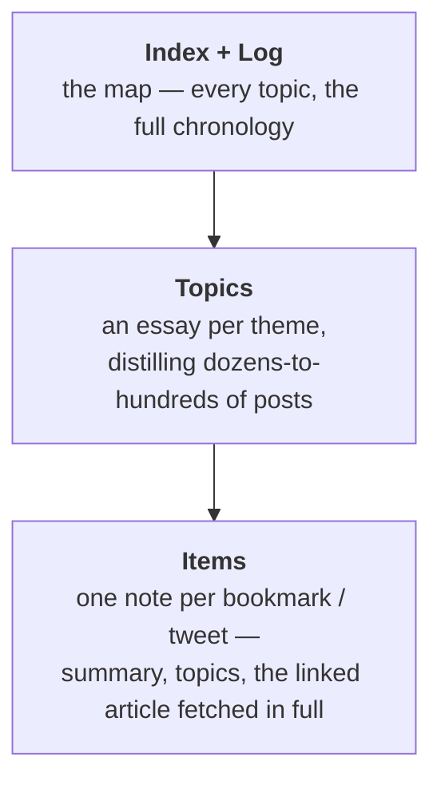
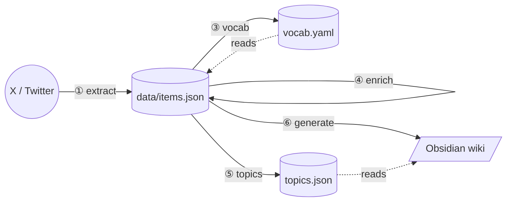
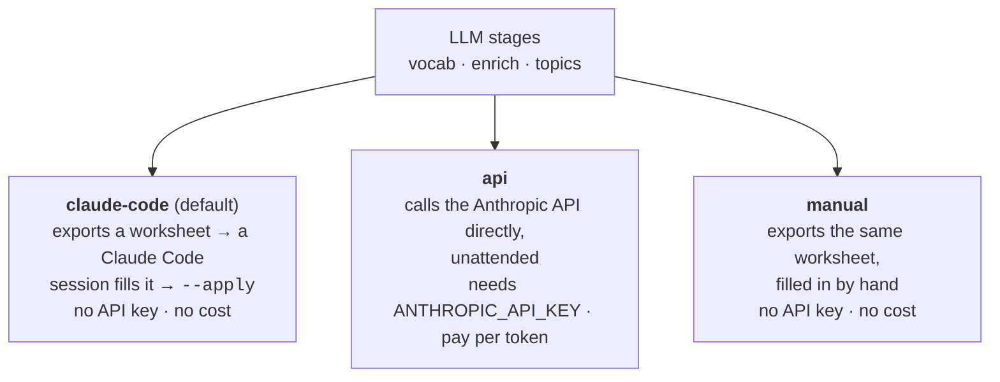

# XBrain (`xbrain`)


> Your X bookmarks and posts, turned into a second brain.

You bookmark a sharp thread, a research paper, a tool someone shipped over the
weekend — and a small part of your brain checks a box: *handled, I have that
now.* Then you never see it again. A bookmark folder is not a library; it is a
graveyard with good intentions.

XBrain digs it up. It extracts your X bookmarks and your own posts, stores them
as structured JSON, and generates a layered, cross-linked Obsidian wiki you can
actually navigate, search and think with — in the same vault, the same graph,
as the notes you already keep.

It runs locally. The LLM work needs **no paid API** — a Claude Code session does
it through a worksheet hand-off (see [Execution modes](#execution-modes)).

---

## Table of contents

- [Why XBrain](#why-xbrain)
- [What you get](#what-you-get)
- [Quick start](#quick-start)
- [Prerequisites](#prerequisites)
- [Installation](#installation)
- [Authentication](#authentication)
- [Configuration](#configuration)
- [The pipeline](#the-pipeline)
- [Commands](#commands)
- [Execution modes](#execution-modes)
- [How it works](#how-it-works)
- [Project structure](#project-structure)
- [Development](#development)
- [Responsible use](#responsible-use)
- [Documentation](#documentation)

---

## Why XBrain

A personal knowledge base — a "second brain" — captures everything you
**produce**: your notes, your drafts, your decisions.

But it is worthless if it does not capture what you **consume** — the articles
you read, the threads you save, the posts you write on a platform that is not
your vault. That gap is real, and it is shaped exactly like everything you found
worth keeping.

Months of bookmarks are not noise. Every one was a decision that *this is worth
coming back to* — a quiet, honest signal about what you care about and how your
thinking moves. Left inside X, that signal is just a pile you walk away from.
XBrain pulls the consumption side of your brain into the same place as the
production side, so your bookmarks and your notes finally link to each other.

**Who it is for** — anyone who uses X as a feed of things worth keeping and
already thinks in a tool like Obsidian. If you have a bookmark graveyard of your
own, you already have the raw material.

---

## What you get

A **three-layer wiki** inside your Obsidian vault. Each layer is denser than the
one below it — read top-down for the map, or bottom-up for a single post.



### Layer 1 — Items

One note per bookmark or own-tweet: the original text, the link, the **linked
article fetched and stored inline**, an LLM summary and its topics. A saved link
stops being a URL that will quietly rot and becomes a saved *article*.

```markdown
---
id: "2010040815176085621"
source: bookmark
author: codestirring
tags: [x-knowledge, ai-coding, software-engineering, ai-economy]
---

# Code Is Cheap Now. Software Isn't.

Enlaza un artículo que sostiene que el código se ha abaratado pero el software
no: Claude Code y Opus 4.5 democratizan la creación de software y abren la era
del software personal y desechable...

**Temas:** [[ai-coding]] · [[software-engineering]] · [[ai-economy]]

## Tweet
Code Is Cheap Now. Software Isn't.  https://t.co/J9m5RzQNbW

## Contenido: Code Is Cheap Now. Software Isn't.
<the full text of the linked article, fetched and stored inline>
```

Everything above the `xbrain:generated` marker is regenerated on every run;
anything *you* write below it is preserved.

### Layer 2 — Topics

The layer that makes XBrain more than a tidy backup. **A topic page is not a
list of links — it is an essay.** XBrain reads every post filed under a theme
and writes one synthesis: where the thinking started, how it moved, what it kept
circling back to. Then it lists the posts — the ones the topic is *about*
(primary), and the ones that merely touch it (also-relevant).

```markdown
---
topic: ai-coding
posts: 299
primary_posts: 103
---

# ai-coding

> Construir software con IA: vibe coding, el cambio en cómo se escribe el
> código y la IA como pair-programmer.

## Overview

Es el tema más voluminoso del corpus y narra, casi mes a mes, la transformación
del oficio de programar bajo la presión de la IA. El arco es muy nítido: del
autocompletado y el vibe coding de 2025 se pasa a la ingeniería agéntica de
2026...

## Notas importantes
- ...

## Posts primarios (103)
- `2026-01-10` · @codestirring · [[items/...|Code Is Cheap Now. Software Isn't.]]

## También relevante (196)
- ...
```

The overview is plain prose — the LLM writes the synthesis, the *code* writes
every link (see [How it works](#how-it-works)), so regenerating never breaks one.

### Layer 3 — Index

`_index.md` is the map — the corpus counts and every topic ranked by size.
`log.md` is the full chronology.

```markdown
# XBrain

## Resumen
- Items totales: 1884
- Bookmarks: 1123 · Tweets propios: 761
- Enriquecidos: 1884

## Temas
- [[ai-coding]] (299)
- [[ai-industry]] (225)
- [[ai-and-work]] (220)
  ...
```

The markdown is **derived and disposable** — regenerate it any time. The source
of truth is `data/items.json`.

> The example notes are in Spanish because the summary and overview language is
> set by the rubrics in `src/xbrain/rubrics/` — plain markdown you can edit.

---

## Quick start

```bash
# 1. Install
uv venv
uv pip install -e ".[dev]" --index-url https://pypi.org/simple
uv run playwright install chromium

# 2. Configure
cp config.toml.example config.toml      # then edit: vault path + X handle

# 3. Authenticate (log in to X in Chrome first)
uv pip install browser-cookie3 --index-url https://pypi.org/simple
.venv/bin/python scripts/import_chrome_session.py
# → "auth_token: OK"  means you are ready

# 4. Build the wiki
uv run xbrain sync       # extract + fetch + generate
uv run xbrain status     # see the counts
```

`sync` builds the mechanical layers. The LLM layers (`vocab`, `enrich`,
`topics`) are run explicitly — see [The pipeline](#the-pipeline).

---

## Prerequisites

| Requirement | Version | Notes |
|-------------|---------|-------|
| Python | 3.12+ | |
| [`uv`](https://docs.astral.sh/uv/) | latest | Package manager and runner. |
| Chromium | — | Installed via `uv run playwright install chromium`. |
| An Obsidian vault | — | Or any folder — XBrain just writes markdown. |
| An X account | — | Yours. XBrain reads *your* bookmarks and tweets. |
| `ANTHROPIC_API_KEY` | — | **Optional.** Only for the `api` execution mode. |
| `FIRECRAWL_API_KEY` | — | **Optional.** Fallback fetcher for JavaScript-heavy pages. |

Neither API key is required: the default execution mode uses a Claude Code
session and costs nothing.

---

## Installation

```bash
uv venv
uv pip install -e ".[dev]" --index-url https://pypi.org/simple
uv run playwright install chromium
```

The `[dev]` extra also installs the quality-gate tools (`poe`, `ruff`, `mypy`
and the rest). `--index-url https://pypi.org/simple` is only needed if your
machine has a private package index configured.

---

## Authentication

XBrain needs a logged-in X session, stored at `auth/storage_state.json` (Playwright
format, git-ignored). The reliable path is **importing cookies from a browser you
are already logged in to** — pick the one that matches your browser:

```bash
uv pip install browser-cookie3 --index-url https://pypi.org/simple

# You use Chrome — log in to x.com in Chrome, then:
.venv/bin/python scripts/import_chrome_session.py

# You use Safari — log in to x.com in Safari, then grant your terminal
# "Full Disk Access" (System Settings → Privacy & Security), then:
.venv/bin/python scripts/import_safari_session.py
```

A successful import prints `auth_token: OK`. Re-run it whenever the session
expires (X sessions are short-lived).

> `xbrain login` (an in-app Playwright login) also exists, but it is unreliable
> with accounts that sign in through Google/SSO — Google blocks the automated
> browser. The cookie import is the recommended path.

---

## Configuration

Copy `config.toml.example` to `config.toml` (git-ignored) and edit:

```toml
[paths]
vault = "/absolute/path/to/your/obsidian/vault"
output_subdir = "learnings/x-knowledge"   # wiki folder, relative to the vault
data_dir = "data"                         # JSON store, relative to the repo

[x]
handle = "your_handle"                    # without the @

[enrich]
executor = "claude-code"                  # claude-code | api | manual
model = "claude-haiku-4-5-20251001"        # used only by the `api` executor

[vocab]
target_count = 45                         # how many topics to induce

[topics]
resynth_threshold = 25                    # re-synthesise an overview after N new posts
```

| Section | Key | Default | Purpose |
|---------|-----|---------|---------|
| `[paths]` | `vault` | — | Absolute path to your Obsidian vault. |
| `[paths]` | `output_subdir` | — | Wiki folder inside the vault. |
| `[paths]` | `data_dir` | — | JSON store, relative to the repo. |
| `[x]` | `handle` | — | Your X handle, no `@`. |
| `[enrich]` | `executor` | `claude-code` | Default [execution mode](#execution-modes) for the LLM stages. |
| `[enrich]` | `model` | `claude-haiku-4-5` | Model for the `api` executor. |
| `[vocab]` | `target_count` | `30` | Number of topics the `vocab` stage induces. |
| `[topics]` | `resynth_threshold` | `25` | Post growth that marks a topic overview stale. |

Secrets (`ANTHROPIC_API_KEY`, `FIRECRAWL_API_KEY`) live in the **environment
only** — never in `config.toml`, never in the repo.

---

## The pipeline

Six stages. `data/items.json` is the hub — every stage reads it, enriches it,
and writes it back. The wiki is generated from it at the end.



| # | Stage | Mechanical / LLM | What it does |
|---|-------|------------------|--------------|
| ① | `extract` | mechanical | Pulls new bookmarks + own tweets from X (incremental — stops at known ids). |
| ② | `fetch` | mechanical | Downloads linked article bodies, expands threads, fetches linked X content. Records structured evidence for broken links. |
| ③ | `vocab` | **LLM** | Induces the controlled topic taxonomy from the whole corpus → `vocab.yaml`. |
| ④ | `enrich` | **LLM** | Per item: a summary + a primary topic + 1-4 topics, all from the taxonomy. |
| ⑤ | `topics` | **LLM** | Synthesises each topic page's overview; builds the mechanical post lists. |
| ⑥ | `generate` | mechanical | Renders the three-layer wiki into your vault. |

Every stage is **idempotent and incremental** — re-running it only processes
what is new. `vocab --regenerate` is the deliberate exception: it re-induces the
taxonomy and marks every item for re-enrichment.

A typical full run:

```bash
uv run xbrain extract
uv run xbrain fetch
uv run xbrain vocab          # → fill the worksheet → xbrain vocab --apply
uv run xbrain enrich         # → fill the worksheet → xbrain enrich --apply
uv run xbrain topics         # → fill the worksheet → xbrain topics --apply
uv run xbrain generate
```

---

## Commands

```bash
uv run xbrain <command> [options]
```

| Command | Description |
|---------|-------------|
| `extract` | Extract bookmarks and/or own tweets from X. `--source bookmarks\|tweets\|all`. |
| `import-archive <zip>` | Backfill the full own-tweet history from the official X data archive. |
| `fetch` | Download linked article content, expand threads, fetch linked X content. `--force` re-fetches everything. |
| `vocab` | Induce the topic taxonomy. `--executor`, `--apply <file>`, `--regenerate`. |
| `enrich` | Enrich items with a summary + topics. `--executor`, `--apply <file>`. |
| `topics` | Synthesise topic pages. `--executor`, `--apply <file>`, `--resynth`. |
| `generate` | Render the wiki into the vault. |
| `sync` | `extract` + `fetch` + `generate`, in order. |
| `status` | Counts and last-run timestamps. |
| `login` | Open a browser to log in to X (see [Authentication](#authentication) — prefer the cookie import). |

Every stage accepts `--since` / `--until` (ISO dates) to narrow the date window.
Run `uv run xbrain <command> --help` for the full option list.

---

## Execution modes

`vocab`, `enrich` and `topics` need an LLM. XBrain never embeds a Claude
subscription token — instead the LLM work is **pluggable**, with three modes,
selected by `--executor` or `config.toml`'s `[enrich].executor`:



| Mode | How | Cost | When |
|------|-----|------|------|
| `claude-code` | `xbrain enrich` writes a JSON worksheet; a Claude Code session reads it, fills the `judgments` array, then `xbrain enrich --apply <file>` validates and applies it. | None | Default. You have Claude Code open. |
| `api` | `xbrain enrich --executor api` calls the Anthropic API and applies the result in one shot. | Pay per token (cheap on Haiku). | Unattended runs, CI, no session. |
| `manual` | Same worksheet as `claude-code`, filled by a person. | None | Fallback / spot fixes. |

The worksheet flow, end-to-end:

```bash
uv run xbrain enrich --executor claude-code   # writes data/enrich-worksheet.json
# → a Claude Code session fills the `judgments` array
uv run xbrain enrich --apply data/enrich-worksheet.json
```

The `enriching-x-knowledge` Claude Code skill (in `.claude/skills/`) drives this
flow for all three stages.

---

## How it works

> For the full picture — every stage, every artifact, the rubrics, the executors and the invariants — see [ARCHITECTURE.md](ARCHITECTURE.md). The summary below is the 5-minute version.

**One hard rule** runs through the whole design: the **LLM emits only judgment** —
a summary, a topic choice, an overview. It never produces a filename, a wikilink
or any structural identifier. The *code* generates every id and link; a
**mechanical validator** rejects any LLM output that is not pure judgment. This
is why regenerating the wiki never breaks a link.

- **`data/items.json`** is the single source of truth. The markdown wiki is
  derived — safe to delete and regenerate.
- **Your notes are preserved.** Anything you write below the `xbrain:generated`
  marker in an item note survives every regeneration.
- **Broken links are demonstrable.** A failed fetch records the HTTP status, a
  categorised reason and the attempt count — not a vague error.
- **`data/` is git-ignored.** Your bookmarks, tweets and session never leave
  your machine.

The data stores in `data/`:

| File | Role |
|------|------|
| `items.json` | Every item — the source of truth. |
| `state.json` | Extraction cursors (for incremental `extract`). |
| `vocab.yaml` | The induced topic taxonomy. Hand-editable. |
| `topics.json` | The synthesised topic-page overviews. |

---

## Project structure

```
xbrain/
├── src/xbrain/
│   ├── cli.py            # Typer CLI — every command
│   ├── config.py         # config.toml loading
│   ├── models.py         # pydantic data models (Item, Enrichment, Topic, ...)
│   ├── store.py          # JSON load/save for items + topic pages
│   ├── extract/          # X extraction (Playwright + GraphQL interception)
│   │   ├── browser.py    #   session / browser context
│   │   ├── graphql.py    #   parse X's internal GraphQL responses
│   │   ├── extractor.py  #   scroll + capture loop
│   │   └── threads.py    #   expand own-tweet threads
│   ├── fetch.py          # external article fetch + Firecrawl fallback
│   ├── fetch_x.py        # fetch linked X tweets / articles
│   ├── archive.py        # import the official X data archive
│   ├── vocab.py          # the `vocab` stage (taxonomy induction)
│   ├── enrich.py         # the `enrich` stage
│   ├── executors/        # the `api` executor (the LLM-judgment seam)
│   ├── worksheet.py      # the enrich worksheet hand-off
│   ├── topic_synth.py    # topic-overview synthesis (api + worksheet)
│   ├── topics.py         # topic-page computation + rendering
│   ├── validate.py       # the mechanical validator (guardrails)
│   ├── rubrics.py        # load the declarative rubrics + guardrails
│   ├── rubrics/          # rubric-*.md + guardrails.yaml (the processing rules)
│   ├── generate.py       # render item notes + index + log
│   └── notes_io.py       # shared markdown helpers
├── scripts/              # import_chrome_session.py / import_safari_session.py
├── tests/                # pytest suite (test-first; one test file per module)
├── config.toml.example   # configuration template
└── pyproject.toml        # deps, tooling, `poe` tasks
```

---

## Development

```bash
uv run pytest -v          # run the test suite
uv run poe check          # the full quality gate (run before any PR)
uv run poe test           # individual gate steps: test, lint, types, ...
```

`poe check` runs ten checks — ruff (lint + format), mypy, bandit, vulture,
interrogate, detect-secrets, deptry, and pytest with coverage. CI runs the same
gate on every pull request. The project is built test-first: every module has a
matching `tests/test_*.py`.

---

## Responsible use

XBrain reads X through X's internal (non-public) endpoints. Use it for personal
purposes, with **your own** X account and **your own** data, at your own risk.
It does not use a paid API by default and it does not redistribute anyone else's
content. The extractor scrolls slowly, with randomised pauses, to be a polite
client. Respect X's Terms of Service.

---

## Documentation

| Document | Description |
|----------|-------------|
| [ARCHITECTURE.md](ARCHITECTURE.md) | How XBrain is shaped: pipeline stages, artifacts, rubrics, executors, invariants. |
| [CONTRIBUTING.md](CONTRIBUTING.md) | How to contribute — including PRs written with AI agents. |
| [LICENSE](LICENSE) | MIT. |

PRs written with AI agents are welcome, at the same quality bar as any other
code. See [CONTRIBUTING.md](CONTRIBUTING.md).

---

*Last updated: 2026-05-19*
