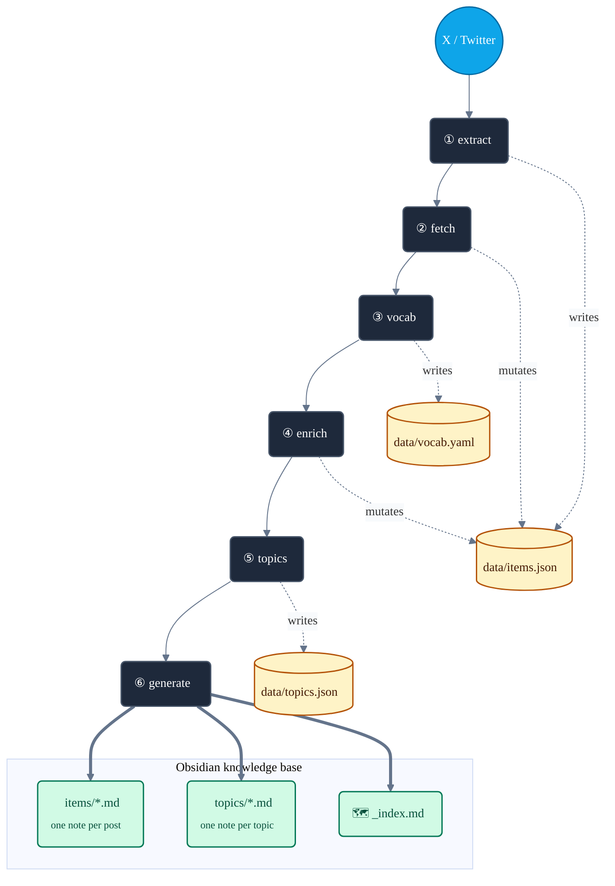
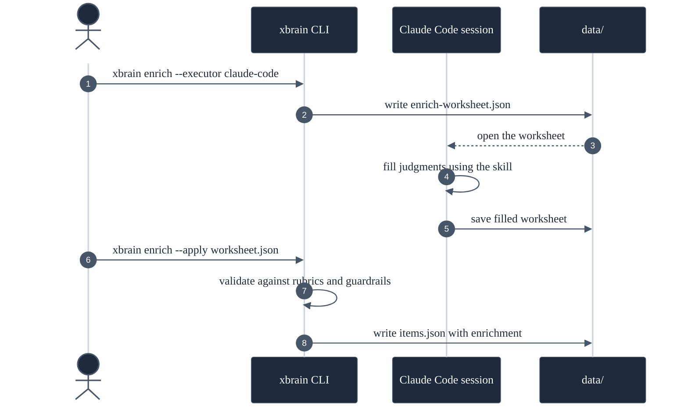
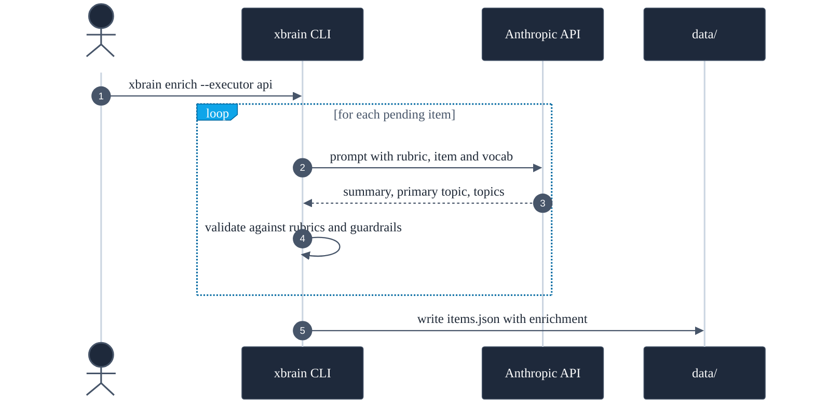
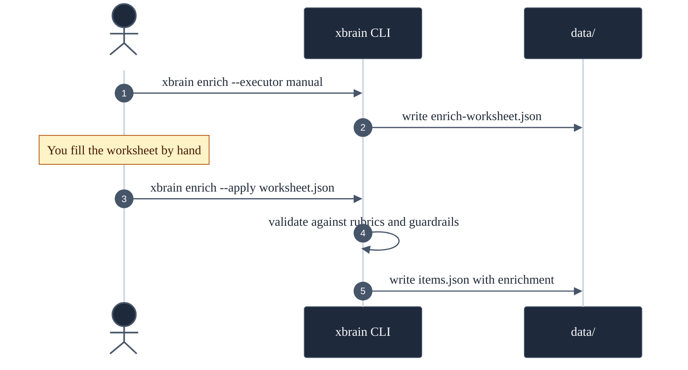

# XBrain (`xbrain`)


> Your X bookmarks and posts, turned into a second brain.

You bookmark a sharp thread, a research paper, a tool someone shipped over the
weekend — and a small part of your brain checks a box: *handled, I have that
now.* Then you never see it again. A bookmark folder is not a library; it is a
graveyard with good intentions.

XBrain digs it up. It extracts your X bookmarks and your own posts, stores them
as structured JSON, and generates a layered, cross-linked Obsidian wiki you can
actually navigate, search and think with — in the same vault, the same graph,
as the notes you already keep.

It runs locally. The LLM work needs **no paid API** — a Claude Code session does
it through a worksheet hand-off (see [Execution modes](#execution-modes)).

---

## Table of contents

- [Why XBrain](#why-xbrain)
- [What you get](#what-you-get)
- [Quick start](#quick-start)
- [Prerequisites](#prerequisites)
- [Installation](#installation)
- [Authentication](#authentication)
- [Configuration](#configuration)
- [The pipeline](#the-pipeline)
- [Commands](#commands)
- [Execution modes](#execution-modes)
- [Snapshots & safety](#snapshots--safety)
- [How it works](#how-it-works)
- [Project structure](#project-structure)
- [Development](#development)
- [Responsible use](#responsible-use)
- [Documentation](#documentation)

---

## Why XBrain

A personal knowledge base — a "second brain" — captures everything you
**produce**: your notes, your drafts, your decisions.

But it is worthless if it does not capture what you **consume** — the articles
you read, the threads you save, the posts you write on a platform that is not
your vault. That gap is real, and it is shaped exactly like everything you found
worth keeping.

Months of bookmarks are not noise. Every one was a decision that *this is worth
coming back to* — a quiet, honest signal about what you care about and how your
thinking moves. Left inside X, that signal is just a pile you walk away from.
XBrain pulls the consumption side of your brain into the same place as the
production side, so your bookmarks and your notes finally link to each other.

**Who it is for** — anyone who uses X as a feed of things worth keeping and
already thinks in a tool like Obsidian. If you have a bookmark graveyard of your
own, you already have the raw material.

---

## What you get

A **three-layer wiki** inside your Obsidian vault. Each layer is denser than the
one below it — read top-down for the map, or bottom-up for a single post.

All three layers are markdown notes inside a single Obsidian vault, under
`learnings/x-knowledge/`. Each layer is denser than the one below it: many
posts → fewer topics → one index.

**Example layout — three notes side by side, as they appear in the vault:**

<table>
<tr>
<th align="center" width="33%">📄 Items</th>
<th align="center" width="33%">📑 Topics</th>
<th align="center" width="34%">🗺️ Index</th>
</tr>
<tr>
<td align="center"><sub>one per saved post · scales with your X corpus</sub></td>
<td align="center"><sub>one per topic · ~30 by default (configurable)</sub></td>
<td align="center"><sub>one note · the map</sub></td>
</tr>
<tr>
<td valign="top">

```text
┌──────────────────┐
│ Code Is Cheap... │
│                  │
│ @codestirring    │
│ tags: ai-coding  │
│                  │
│ ▸ Summary        │
│ ▸ Tweet text     │
│ ▸ Linked article │
│   (fetched in    │
│    full)         │
│                  │
│ Topics:          │
│  [[ai-coding]]   │
│  [[software-..]] │
└──────────────────┘
```

</td>
<td valign="top">

```text
┌──────────────────┐
│ ai-coding (299)  │
│                  │
│ ▸ Overview       │
│   "The arc from  │
│    vibe coding   │
│    to agent      │
│    orchestration │
│    over 16 mo."  │
│                  │
│ ▸ Primary (103)  │
│   - [[post 1]]   │
│   - [[post 2]]   │
│                  │
│ ▸ Also relevant  │
│   (196)          │
└──────────────────┘
```

</td>
<td valign="top">

```text
┌──────────────────┐
│ XBrain           │
│                  │
│ ▸ Summary        │
│   1884 items     │
│   1123 bookmarks │
│   761 own tweets │
│                  │
│ ▸ Topics         │
│   [[ai-coding]]  │
│         (299)    │
│   [[ai-industry]]│
│         (225)    │
│   ...            │
└──────────────────┘
```

</td>
</tr>
<tr>
<td valign="top"><sub>The original post, the linked article fetched and stored inline, an LLM summary, and the topics it belongs to.</sub></td>
<td valign="top"><sub>A synthesised essay across every post in this theme — where your thinking started, how it moved — plus links back to every post.</sub></td>
<td valign="top"><sub>Every topic ranked by size, links to everything. Open this first.</sub></td>
</tr>
</table>

### Layer 1 — Items

One note per bookmark or own-tweet: the original text, the link, the **linked
article fetched and stored inline**, an LLM summary and its topics. A saved link
stops being a URL that will quietly rot and becomes a saved *article*.

*Example:*

```markdown
---
id: "2010040815176085621"
source: bookmark
author: codestirring
tags: [x-knowledge, ai-coding, software-engineering, ai-economy]
---

# Code Is Cheap Now. Software Isn't.

Links an article arguing that code itself has become cheap but software has
not: Claude Code and Opus 4.5 democratise software creation and open the era
of personal, throwaway software...

**Topics:** [[ai-coding]] · [[software-engineering]] · [[ai-economy]]

## Tweet
Code Is Cheap Now. Software Isn't.  https://t.co/J9m5RzQNbW

## Content: Code Is Cheap Now. Software Isn't.
<the full text of the linked article, fetched and stored inline>
```

Everything above the `xbrain:generated` marker is regenerated on every run;
anything *you* write below it is preserved.

### Layer 2 — Topics

The layer that makes XBrain more than a tidy backup. **A topic page is not a
list of links — it is an essay.** XBrain reads every post filed under a theme
and writes one synthesis: where the thinking started, how it moved, what it kept
circling back to. Then it lists the posts — the ones the topic is *about*
(primary), and the ones that merely touch it (also-relevant).

*Example:*

```markdown
---
topic: ai-coding
posts: 299
primary_posts: 103
---

# ai-coding

> Building software with AI: vibe coding, the shift in how code gets written,
> and AI as a pair-programmer.

## Overview

The largest topic in the corpus, narrating — almost month by month — how the
craft of programming has been transformed under the pressure of AI. The arc
is sharp: from autocomplete and vibe coding in 2025 to agentic engineering
in 2026...

## Key notes
- ...

## Primary posts (103)
- `2026-01-10` · @codestirring · [[items/...|Code Is Cheap Now. Software Isn't.]]

## Also relevant (196)
- ...
```

The overview is plain prose — the LLM writes the synthesis, the *code* writes
every link (see [How it works](#how-it-works)), so regenerating never breaks one.

### Layer 3 — Index

`_index.md` is the map — the corpus counts and every topic ranked by size.
`log.md` is the full chronology.

*Example:*

```markdown
# XBrain

## Summary
- Total items: 1884
- Bookmarks: 1123 · Own tweets: 761
- Enriched: 1884

## Topics
- [[ai-coding]] (299)
- [[ai-industry]] (225)
- [[ai-and-work]] (220)
  ...
```

The markdown is **derived and disposable** — regenerate it any time. The source
of truth is `data/items.json`.

> The examples above are shown in English for clarity. Today the output language
> (summaries, overviews, section headers like "Topics" / "Content") is fixed by
> the rubrics in `src/xbrain/rubrics/` — Spanish on the live system; a config
> parameter to switch languages is on the roadmap ([#16](https://github.com/VGonPa/xbrain/issues/16)).

---

## Quick start

```bash
# 1. Install
uv venv
uv pip install -e ".[dev]" --index-url https://pypi.org/simple
uv run playwright install chromium

# 2. Configure
cp config.toml.example config.toml      # then edit: vault path + X handle

# 3. Authenticate (log in to X in Chrome first)
uv pip install browser-cookie3 --index-url https://pypi.org/simple
.venv/bin/python scripts/import_chrome_session.py
# → "auth_token: OK"  means you are ready

# 4. Build the wiki
uv run xbrain sync       # extract + fetch + generate
uv run xbrain status     # see the counts
```

`sync` builds the mechanical layers. The LLM layers (`vocab`, `enrich`,
`topics`) are run explicitly — see [The pipeline](#the-pipeline).

---

## Prerequisites

| Requirement | Version | Notes |
|-------------|---------|-------|
| Python | 3.12+ | |
| [`uv`](https://docs.astral.sh/uv/) | latest | Package manager and runner. |
| Chromium | — | Installed via `uv run playwright install chromium`. |
| An Obsidian vault | — | Or any folder — XBrain just writes markdown. |
| An X account | — | Yours. XBrain reads *your* bookmarks and tweets. |
| `ANTHROPIC_API_KEY` | — | **Optional.** Only for the `api` execution mode. |
| `FIRECRAWL_API_KEY` | — | **Optional.** Fallback fetcher for JavaScript-heavy pages. |

Neither API key is required: the default execution mode uses a Claude Code
session and costs nothing.

---

## Installation

```bash
uv venv
uv pip install -e ".[dev]" --index-url https://pypi.org/simple
uv run playwright install chromium
```

The `[dev]` extra also installs the quality-gate tools (`poe`, `ruff`, `mypy`
and the rest). `--index-url https://pypi.org/simple` is only needed if your
machine has a private package index configured.

---

## Authentication

XBrain needs a logged-in X session, stored at `auth/storage_state.json` (Playwright
format, git-ignored). The reliable path is **importing cookies from a browser you
are already logged in to** — pick the one that matches your browser:

```bash
uv pip install browser-cookie3 --index-url https://pypi.org/simple

# You use Chrome — log in to x.com in Chrome, then:
.venv/bin/python scripts/import_chrome_session.py

# You use Safari — log in to x.com in Safari, then grant your terminal
# "Full Disk Access" (System Settings → Privacy & Security), then:
.venv/bin/python scripts/import_safari_session.py
```

A successful import prints `auth_token: OK`. Re-run it whenever the session
expires (X sessions are short-lived).

> `xbrain login` (an in-app Playwright login) also exists, but it is unreliable
> with accounts that sign in through Google/SSO — Google blocks the automated
> browser. The cookie import is the recommended path.

---

## Configuration

Copy `config.toml.example` to `config.toml` (git-ignored) and edit:

```toml
[paths]
vault = "/absolute/path/to/your/obsidian/vault"
output_subdir = "learnings/x-knowledge"   # wiki folder, relative to the vault
data_dir = "data"                         # JSON store, relative to the repo

[x]
handle = "your_handle"                    # without the @

[enrich]
executor = "claude-code"                  # claude-code | api | manual
model = "claude-haiku-4-5-20251001"        # used only by the `api` executor

[vocab]
target_count = 45                         # how many topics to induce

[topics]
resynth_threshold = 25                    # re-synthesise an overview after N new posts

[output]
language = "English"                      # English | Spanish
```

| Section | Key | Default | Purpose |
|---------|-----|---------|---------|
| `[paths]` | `vault` | — | Absolute path to your Obsidian vault. |
| `[paths]` | `output_subdir` | — | Wiki folder inside the vault. |
| `[paths]` | `data_dir` | — | JSON store, relative to the repo. |
| `[x]` | `handle` | — | Your X handle, no `@`. |
| `[enrich]` | `executor` | `claude-code` | Default [execution mode](#execution-modes) for the LLM stages. |
| `[enrich]` | `model` | `claude-haiku-4-5` | Model for the `api` executor. |
| `[vocab]` | `target_count` | `30` | Number of topics the `vocab` stage induces. |
| `[topics]` | `resynth_threshold` | `25` | Post growth that marks a topic overview stale. |
| `[output]` | `language` | `English` | Output language for LLM summaries/overviews AND wiki section headers. `English` or `Spanish`. |

Switching `[output].language` after the corpus is already enriched is supported
— but does not retroactively translate existing summaries. To convert the
whole corpus to the new language, run `xbrain enrich --regenerate` and
`xbrain topics --resynth` (both auto-snapshotted, see
[Snapshots & safety](#snapshots--safety)). Otherwise new items get the new
language while old summaries stay as they were.

Secrets (`ANTHROPIC_API_KEY`, `FIRECRAWL_API_KEY`) live in the **environment
only** — never in `config.toml`, never in the repo.

---

## The pipeline

Six stages. `data/items.json` is the hub — every stage reads it, enriches it,
and writes it back. The wiki is generated from it at the end.



Six stages, top to bottom. The chain on the left is the order of execution;
the cylinders on the right are the `data/` files each stage writes; the box
at the bottom is what ends up inside your Obsidian vault — three kinds of
plain markdown notes.

- **`data/items.json`** is the hub. Three stages mutate it (`extract`,
  `fetch`, `enrich`); every later stage reads it.
- **`data/vocab.yaml`** is the closed taxonomy. Read by `enrich` (to assign
  topics from it), `topics` (to know which pages to synthesise) and
  `generate` (for the tags).
- **`data/topics.json`** is the synthesised topic overviews. Read by
  `generate`.

`⑥ generate` is the only stage that writes into the vault. It turns
`items.json` into `items/*.md`, `topics.json` into `topics/*.md`, and writes
the `_index.md`. Delete the whole vault and `xbrain generate` rebuilds it
bit-for-bit from `data/`.

| # | Stage | Mechanical / LLM | Writes to | What it does |
|---|-------|------------------|-----------|--------------|
| ① | `extract` | mechanical | `items.json` + `state.json` | Pulls new bookmarks + own tweets from X (incremental — stops at known ids). |
| ② | `fetch` | mechanical | `items.json` | Downloads linked article bodies, expands threads, fetches linked X content. Records structured evidence for broken links. |
| ③ | `vocab` | **LLM** | `vocab.yaml` | Induces the controlled topic taxonomy from the whole corpus. |
| ④ | `enrich` | **LLM** | `items.json` | Per item: a summary + a primary topic + 1-4 topics, all from the taxonomy. |
| ⑤ | `topics` | **LLM** | `topics.json` | Synthesises each topic page's overview; builds the mechanical post lists. |
| ⑥ | `generate` | mechanical | the Obsidian vault | Renders the three-layer wiki: `items/*.md`, `topics/*.md`, `_index.md`. |

Every stage is **idempotent and incremental** — re-running it only processes
what is new. `vocab --regenerate` is the deliberate exception: it re-induces the
taxonomy and marks every item for re-enrichment.

A typical full run:

```bash
uv run xbrain extract
uv run xbrain fetch
uv run xbrain vocab          # → fill the worksheet → xbrain vocab --apply
uv run xbrain enrich         # → fill the worksheet → xbrain enrich --apply
uv run xbrain topics         # → fill the worksheet → xbrain topics --apply
uv run xbrain generate
```

---

## Commands

```bash
uv run xbrain <command> [options]
```

| Command | Description |
|---------|-------------|
| `extract` | Extract bookmarks and/or own tweets from X. `--source bookmarks\|tweets\|all`. |
| `import-archive <zip>` | Backfill the full own-tweet history from the official X data archive. |
| `fetch` | Download linked article content, expand threads, fetch linked X content. `--force` re-fetches everything. |
| `vocab` | Induce the topic taxonomy. `--executor`, `--apply <file>`, `--regenerate`. |
| `enrich` | Enrich items with a summary + topics. `--executor`, `--apply <file>`. |
| `topics` | Synthesise topic pages. `--executor`, `--apply <file>`, `--resynth`. |
| `generate` | Render the wiki into the vault. |
| `sync` | `extract` + `fetch` + `generate`, in order. |
| `status` | Counts and last-run timestamps. |
| `snapshot` | Manage `data/` snapshots: `create`, `list`, `show`, `restore`, `prune`. See [Snapshots & safety](#snapshots--safety). |
| `login` | Open a browser to log in to X (see [Authentication](#authentication) — prefer the cookie import). |

Every stage accepts `--since` / `--until` (ISO dates) to narrow the date window.
Run `uv run xbrain <command> --help` for the full option list.

---

## Snapshots & safety

Destructive commands (`vocab --regenerate`, `topics --resynth`, `fetch --force`)
**auto-snapshot** `data/` before they touch anything. The snapshot is a complete
copy of `items.json`, `state.json`, `vocab.yaml` and `topics.json` under
`data/snapshots/<UTC-timestamp>-pre-<command>/`, with a `snapshot.json` manifest
capturing counts and the running `xbrain` version. If a re-run produces worse
output, a single `xbrain snapshot restore <name>` brings the previous good
state back.

```bash
xbrain snapshot list                        # newest first
xbrain snapshot create --name pre-rubric-v2 # mark a known-good state
xbrain snapshot restore <name>              # roll back data/ (run `generate` next)
xbrain snapshot prune --keep-last 10        # cap disk use
```

The Obsidian vault is **not** snapshotted — it is fully derived from `data/`
via `xbrain generate`. `restore` rolls back `data/`; you run `xbrain generate`
to rebuild the wiki from it.

---

## Execution modes

`vocab`, `enrich` and `topics` need an LLM. XBrain never embeds a Claude
subscription token — instead the LLM work is **pluggable**, with three modes,
selected by `--executor` or `config.toml`'s `[enrich].executor`.

| Mode | Cost | When you reach for it |
|------|------|----------------------|
| **`claude-code`** *(default)* | None | You have Claude Code open. Day-to-day enrichment. |
| **`api`** | Pay per token (cheap on Haiku) | Unattended runs (cron, CI, future `/schedule`). No human in the loop. |
| **`manual`** | None | Spot fixes, hand-curating a few items, fallback when the others fail. |

All three modes end the same way — `xbrain` validates the judgments against the
rubrics and `guardrails.yaml`, then writes them into `data/items.json`. They
only differ in *how the LLM judgment gets produced*.

### Mode 1 — `claude-code` *(default)*

**What it does.** The CLI exports a worksheet (`data/enrich-worksheet.json`).
You open a Claude Code session, the `enriching-x-knowledge` skill (in
`.claude/skills/`) fills the worksheet's judgments using the rubrics. You run
`xbrain enrich --apply` to validate and persist.

**Why this mode exists.** Most XBrain users already have a Claude Code
subscription. Spending another budget on the Anthropic API to do the same
work is wasteful — this mode lets the existing subscription do the LLM work
at zero extra cost.

**When to use it.** Default for interactive runs. You are at your machine,
Claude Code is open, you want to enrich a batch.



### Mode 2 — `api`

**What it does.** The CLI loops over every pending item, calls the Anthropic
API once per item with the rubric, item content and vocab. Each judgment is
validated, then a single store write at the end persists everything.

**Why this mode exists.** The `claude-code` mode needs a human present. A
scheduled job, a cron, or a CI run cannot pop open a Claude Code session.
The `api` mode runs end-to-end with zero interaction — the trade is that
you pay per token.

**When to use it.** Unattended runs. The future `/schedule` integration
([#7](https://github.com/VGonPa/xbrain/issues/7)) builds on this mode.



### Mode 3 — `manual`

**What it does.** Identical worksheet plumbing as `claude-code`, but you fill
the judgments by hand instead of letting an LLM do it.

**Why this mode exists.** Two reasons. First, escape hatch: if the LLM keeps
producing wrong judgments for a corner of the corpus, you can fix those items
yourself without rewriting the rubric. Second, the same worksheet format means
the manual path is the lowest common denominator the system always supports —
no API, no Claude Code, just JSON in / JSON out.

**When to use it.** Spot fixes, corrections, hand-curating a handful of items
that need editorial judgment beyond what the rubric captures.



---

## How it works

> For the full picture — every stage, every artifact, the rubrics, the executors and the invariants — see [ARCHITECTURE.md](ARCHITECTURE.md). The summary below is the 5-minute version.

**One hard rule** runs through the whole design: the **LLM emits only judgment** —
a summary, a topic choice, an overview. It never produces a filename, a wikilink
or any structural identifier. The *code* generates every id and link; a
**mechanical validator** rejects any LLM output that is not pure judgment. This
is why regenerating the wiki never breaks a link.

- **`data/items.json`** is the single source of truth. The markdown wiki is
  derived — safe to delete and regenerate.
- **Your notes are preserved.** Anything you write below the `xbrain:generated`
  marker in an item note survives every regeneration.
- **Broken links are demonstrable.** A failed fetch records the HTTP status, a
  categorised reason and the attempt count — not a vague error.
- **`data/` is git-ignored.** Your bookmarks, tweets and session never leave
  your machine.

The data stores in `data/`:

| File | Role |
|------|------|
| `items.json` | Every item — the source of truth. |
| `state.json` | Extraction cursors (for incremental `extract`). |
| `vocab.yaml` | The induced topic taxonomy. Hand-editable. |
| `topics.json` | The synthesised topic-page overviews. |

---

## Project structure

```
xbrain/
├── src/xbrain/
│   ├── cli.py            # Typer CLI — every command
│   ├── config.py         # config.toml loading
│   ├── models.py         # pydantic data models (Item, Enrichment, Topic, ...)
│   ├── store.py          # JSON load/save for items + topic pages
│   ├── extract/          # X extraction (Playwright + GraphQL interception)
│   │   ├── browser.py    #   session / browser context
│   │   ├── graphql.py    #   parse X's internal GraphQL responses
│   │   ├── extractor.py  #   scroll + capture loop
│   │   └── threads.py    #   expand own-tweet threads
│   ├── fetch.py          # external article fetch + Firecrawl fallback
│   ├── fetch_x.py        # fetch linked X tweets / articles
│   ├── archive.py        # import the official X data archive
│   ├── vocab.py          # the `vocab` stage (taxonomy induction)
│   ├── enrich.py         # the `enrich` stage
│   ├── executors/        # the `api` executor (the LLM-judgment seam)
│   ├── worksheet.py      # the enrich worksheet hand-off
│   ├── topic_synth.py    # topic-overview synthesis (api + worksheet)
│   ├── topics.py         # topic-page computation + rendering
│   ├── validate.py       # the mechanical validator (guardrails)
│   ├── rubrics.py        # load the declarative rubrics + guardrails
│   ├── rubrics/          # rubric-*.md + guardrails.yaml (the processing rules)
│   ├── generate.py       # render item notes + index + log
│   └── notes_io.py       # shared markdown helpers
├── scripts/              # import_chrome_session.py / import_safari_session.py
├── tests/                # pytest suite (test-first; one test file per module)
├── config.toml.example   # configuration template
└── pyproject.toml        # deps, tooling, `poe` tasks
```

---

## Development

```bash
uv run pytest -v          # run the test suite
uv run poe check          # the full quality gate (run before any PR)
uv run poe test           # individual gate steps: test, lint, types, ...
```

`poe check` runs ten checks — ruff (lint + format), mypy, bandit, vulture,
interrogate, detect-secrets, deptry, and pytest with coverage. CI runs the same
gate on every pull request. The project is built test-first: every module has a
matching `tests/test_*.py`.

---

## Responsible use

XBrain reads X through X's internal (non-public) endpoints. Use it for personal
purposes, with **your own** X account and **your own** data, at your own risk.
It does not use a paid API by default and it does not redistribute anyone else's
content. The extractor scrolls slowly, with randomised pauses, to be a polite
client. Respect X's Terms of Service.

---

## Documentation

| Document | Description |
|----------|-------------|
| [ARCHITECTURE.md](ARCHITECTURE.md) | How XBrain is shaped: pipeline stages, artifacts, rubrics, executors, invariants. |
| [CONTRIBUTING.md](CONTRIBUTING.md) | How to contribute — including PRs written with AI agents. |
| [LICENSE](LICENSE) | MIT. |

PRs written with AI agents are welcome, at the same quality bar as any other
code. See [CONTRIBUTING.md](CONTRIBUTING.md).

---

*Last updated: 2026-05-19*
